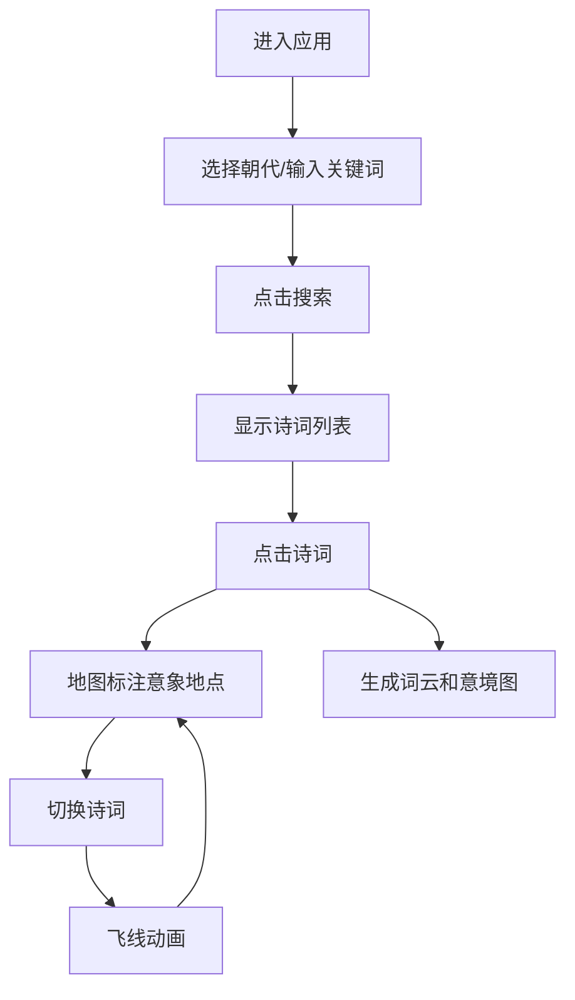

## 1. 产品概述

古诗词意象生成与可视化地图应用，将唐诗宋词中的地理意象通过地图可视化呈现，让用户直观感受古典诗词中的地理空间与意象美学。

- 核心价值：将抽象的诗词意象转化为可视化的地图标记和词云，帮助用户深入理解古诗词的地理空间分布与意象美学
- 目标用户：古诗词爱好者、学生、文化研究者

## 2. 核心功能

### 2.1 功能模块
1. **诗词搜索模块**：支持按朝代、词牌名、意象关键词搜索诗词
2. **地图可视化模块**：在地图上标注诗词中的地理意象点位，支持热力图和飞线动画
3. **意境可视化模块**：生成词云和粒子动画背景，呈现诗词意境

### 2.2 页面详情
| 页面名称 | 模块名称 | 功能描述 |
|-----------|-------------|---------------------|
| 主页面 | 搜索栏 | 朝代选择下拉框、意象关键词输入、搜索按钮 |
| 主页面 | 诗词结果列表 | 显示匹配诗词，高亮意象关键词，点击可查看详情 |
| 主页面 | 地图模块 | Leaflet地图，标注意象地点，微光脉冲图钉，朝代区分颜色 |
| 主页面 | 意境可视化区域 | 词云展示，粒子飘落动画，渐变背景 |

## 3. 核心流程

用户进入应用 → 选择朝代/输入意象关键词 → 点击搜索 → 显示诗词列表 → 点击某首诗词 → 地图标注意象地点 → 生成词云和意境氛围图 → 切换诗词时显示飞线动画

## 4. 用户界面设计

### 4.1 设计风格
- **主色调**：古卷黄 #F5E6CA
- **强调色**：朱砂红 #C62828，暖金 #D4AF37（唐代），青瓷 #5D8AA8（宋代）
- **背景渐变**：深黛色 #1A237E 到 霞光橙 #FF6F00
- **字体**：思源宋体（Google Fonts）
- **布局**：左右两栏（60%地图，40%可视化），移动端上下堆叠
- **搜索栏**：毛玻璃效果，半透明白色背景，圆角8px

### 4.2 页面设计概述
| 页面名称 | 模块名称 | UI 元素 |
|-----------|-------------|-------------|
| 主页面 | 搜索栏 | 朝代下拉框、意象输入框、搜索按钮（朱砂红） |
| 主页面 | 诗词列表 | 卡片式布局，高亮关键词（朱砂红），悬停效果 |
| 主页面 | 地图模块 | Leaflet地图，脉冲动画图钉，热力图开关，飞线动画 |
| 主页面 | 意境可视化 | 词云（wordcloud2），粒子飘落动画，渐变背景 |

### 4.3 响应式
- 桌面端：左右两栏布局，地图60%，可视化40%
- 移动端（<768px）：上下堆叠，地图60vh，可视化区域自适应
- 触摸优化：点击区域放大，滑动流畅

### 4.4 交互动效
- 图钉标记：微光脉冲动画，悬停放大1.2倍并显示光晕
- 飞线动画：贝塞尔曲线路径，光点沿路径移动，淡入淡出效果
- 粒子效果：40-60个花瓣/落叶粒子，下落速度2-4s
- 搜索结果：关键词高亮显示（朱砂红 #C62828）
