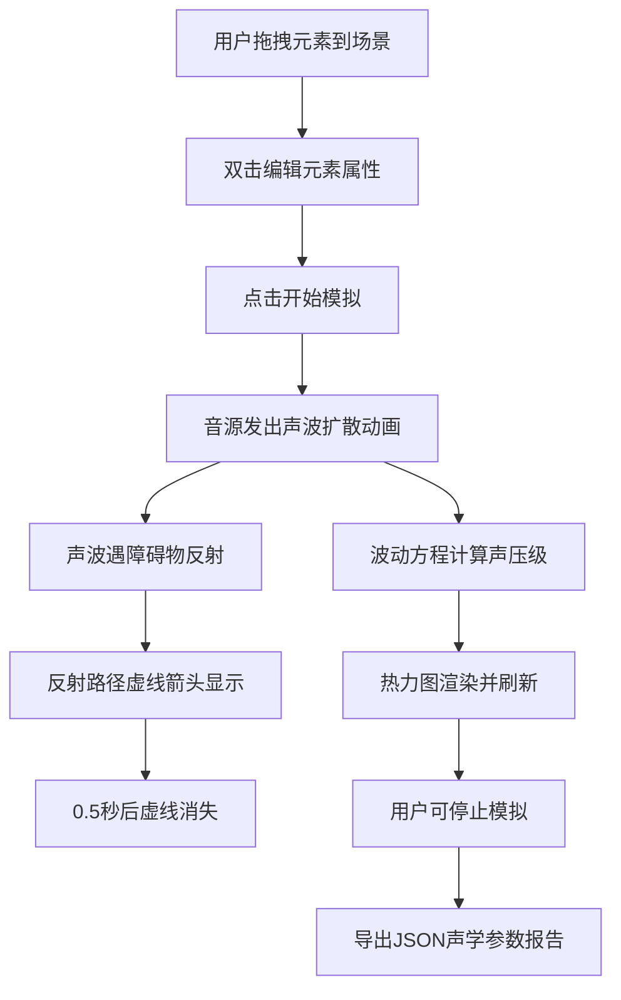

## 1. 产品概述

数字孪生风格的交互式光影与声场模拟工具，面向声学设计师和音乐教师，提供浏览器内拖拽式音源、障碍物和吸音材料放置，实时可视化声波反射路径和声压级热力图分布。
- 核心价值：让非专业声学工程师也能直观理解室内声场行为，快速验证声学设计方案
- 目标用户：声学设计师、音乐教师、录音棚规划人员

## 2. 核心功能

### 2.1 用户角色
| 角色 | 使用方式 | 核心权限 |
|------|----------|----------|
| 声学设计师 | 直接访问 | 创建场景、运行模拟、导出报告 |
| 音乐教师 | 直接访问 | 创建场景、运行模拟、导出报告 |

### 2.2 功能模块
1. **主模拟页面**：三栏布局 — 左侧参数面板、中间3D俯视场景、右侧声场热力图

### 2.3 页面详情
| 页面名称 | 模块名称 | 功能描述 |
|----------|----------|----------|
| 主模拟页面 | 参数面板 | 拖拽图标（音源/障碍物/吸音棉）到场景，双击编辑元素属性，启动/停止模拟，导出JSON报告 |
| 主模拟页面 | 3D俯视场景 | Three.js渲染深色网格房间，放置和管理声学元素，显示声波扩散动画和反射路径虚线箭头 |
| 主模拟页面 | 声场热力图 | Canvas 2D绘制蓝→红色阶声压级分布，半透明叠加，每0.3秒刷新，平滑渐变过渡 |

## 3. 核心流程

用户从左侧面板拖拽音源/障碍物/吸音棉图标放入中间3D场景 → 双击场景元素编辑属性（位置、频率、吸音系数）→ 点击"开始模拟"按钮 → 音源发出圆形声波扩散动画 → 声波遇障碍物反射并显示虚线箭头 → 右侧热力图根据波动方程实时更新声压级分布 → 点击"导出报告"生成JSON文件

## 4. 用户界面设计

### 4.1 设计风格
- 主色调：深灰#2A2A2A（面板背景）、深色#1A1A1A（场景地面）、#333333（网格线）
- 强调色：青绿色#00BFA5（高亮交互元素）、#FFA726（声波颜色）
- 元素颜色：音源=#FF9800（橙）、障碍物=#607D8B（蓝灰）、吸音棉=#8BC34A（绿）
- 热力图色阶：蓝#0000FF → 红#FF0000
- 按钮样式：圆角、青绿色高亮、悬停放大1.1倍、点击缩放0.95并变色
- 字体：系统无衬线字体，白色#E0E0E0
- 布局：三栏水平布局，左侧320px固定宽度

### 4.2 页面设计概览
| 页面名称 | 模块名称 | UI元素 |
|----------|----------|--------|
| 主模拟页面 | 参数面板 | 深灰背景，拖拽图标区（圆形音源/三角障碍物/方形吸音棉），频率滑块，吸音系数滑块，开始/停止模拟按钮，导出报告按钮 |
| 主模拟页面 | 3D俯视场景 | Three.js Canvas，深色网格地面，拖入的3D元素，声波扩散波纹圈，反射虚线箭头 |
| 主模拟页面 | 声场热力图 | Canvas 2D，蓝→红渐变色阶，半透明叠加，0.3秒平滑刷新 |

### 4.3 响应式
- 桌面优先设计，适配宽度1024px到1920px
- 左侧面板固定320px，中间场景和右侧热力图按剩余空间比例分配
- 低于1024px时面板可折叠

### 4.4 3D场景指南
- 环境：深色室内空间，俯视45度角
- 灯光：环境光+方向光，营造科技感
- 相机：正交或透视俯视，支持缩放和平移
- 交互：拖拽放置元素，双击编辑，鼠标滚轮缩放
- 动画：声波扩散波纹、反射虚线箭头、热力图渐变
- 性能：模拟计算+热力图渲染每帧<50ms，动画≥30fps
