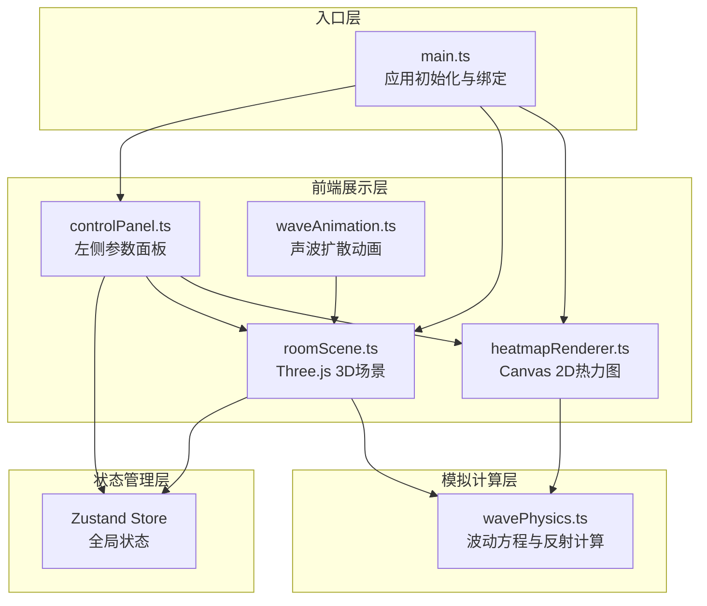
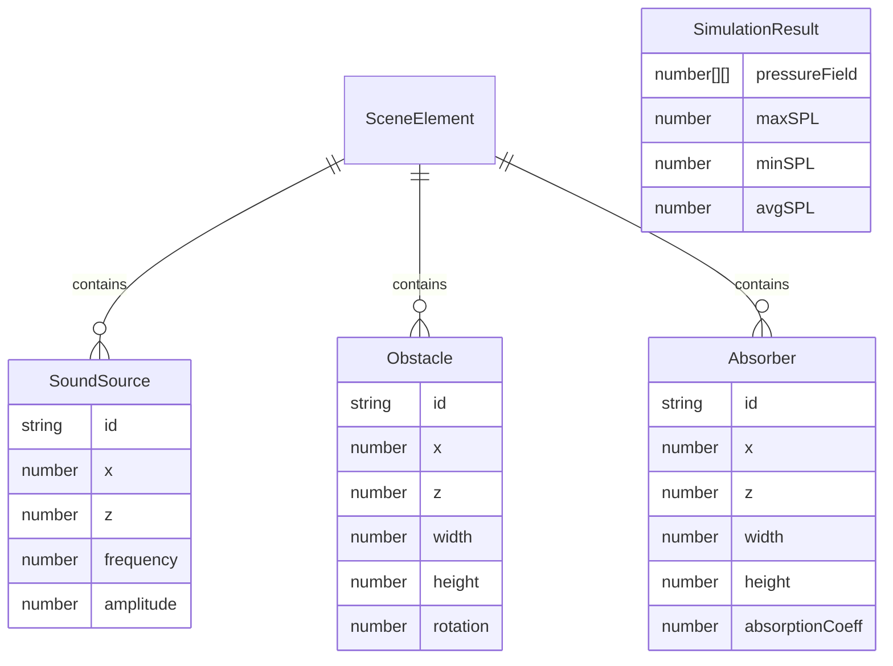

## 1. 架构设计



## 2. 技术说明
- 前端：TypeScript + Three.js + Canvas 2D + Zustand
- 构建工具：Vite（支持TypeScript）
- 状态管理：Zustand（管理元素列表、模拟状态等全局状态）
- 3D渲染：Three.js（场景初始化、元素管理、声波动画）
- 2D渲染：Canvas 2D API（热力图色阶映射与渲染）
- 依赖：three, @types/three, typescript, vite, zustand, uuid, lil-gui
- 无后端服务

## 3. 路由定义
| 路由 | 用途 |
|------|------|
| / | 单页面应用，所有功能在主页面完成 |

## 4. API定义
无后端API，所有计算在客户端完成。

## 5. 数据模型

### 5.1 数据模型定义



### 5.2 数据定义

**全局状态（Zustand Store）**：
- `elements`: 场景元素数组（音源、障碍物、吸音棉）
- `isSimulating`: 模拟运行状态
- `simulationResult`: 当前模拟结果（声压场数据）

**元素类型**：
- `SoundSource`: { id, type:'source', x, z, frequency, amplitude }
- `Obstacle`: { id, type:'obstacle', x, z, width, depth, rotation }
- `Absorber`: { id, type:'absorber', x, z, width, depth, absorptionCoeff }

**模拟结果**：
- `pressureField`: 二维数组（声压级网格）
- `maxSPL`, `minSPL`, `avgSPL`: 统计摘要

**导出JSON格式**：
```json
{
  "timestamp": "ISO时间戳",
  "elements": [...],
  "simulationResult": {
    "pressureField": [[...]],
    "maxSPL": number,
    "minSPL": number,
    "avgSPL": number
  }
}
```
