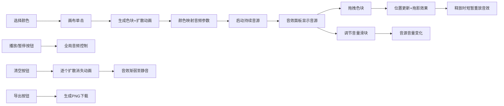

## 1. 产品概述

情绪色彩声音画布是一款浏览器端的交互式艺术创作工具，通过用户在画布上生成色彩区域来触发对应的环境音效，创造沉浸式的视觉与听觉联动体验。目标用户为交互设计师、艺术创作者和音乐爱好者，旨在探索色彩与声音之间的情感映射关系。

## 2. 核心功能

### 2.1 用户角色

| 角色 | 注册方式 | 核心权限 |
|------|----------|----------|
| 普通用户 | 无需注册，直接使用 | 创建色块、调节音频、导出作品 |

### 2.2 功能模块

1. **主画布区域**：Canvas 2D 渲染，色块生成、拖拽、动画效果
2. **左侧调色板模块**：HSV色环选择器，饱和度/明度调节，颜色预览
3. **右侧音效面板模块**：活跃音源列表、音量调节、分页显示
4. **音频引擎模块**：Web Audio API 合成、颜色映射音频参数、多音源混合
5. **全局控制模块**：播放/暂停、清空画布、导出图片

### 2.3 功能详情

| 页面/模块 | 子模块 | 功能描述 |
|-----------|--------|----------|
| 主画布区域 | 色块生成 | 单击画布生成圆形色块（直径60-120px随机），扩散动画0.3秒 |
| 主画布区域 | 色块拖拽 | 拖拽色块移动位置，带半透明拖影效果 |
| 主画布区域 | 鼠标悬停 | 显示半透明十字准星跟随鼠标（24px线条） |
| 左侧调色板 | HSV色环 | 直径200px圆形色环，可旋转选择色相 |
| 左侧调色板 | 饱和度/明度 | 中心30x30px圆形选择器，拖拽调节 |
| 左侧调色板 | 颜色预览 | 显示当前选取颜色和HEX值 |
| 右侧音效面板 | 音源列表 | 展示所有激活音源，圆点显示颜色匹配色块 |
| 右侧音效面板 | 音量滑块 | 每个音源独立调节音量（0-100，默认80） |
| 右侧音效面板 | 分页显示 | 超过5个条目时分页展示 |
| 全局控制 | 播放/暂停 | 右上角按钮，全局控制音频，暂停时色块变灰 |
| 全局控制 | 清空画布 | 左上角按钮，逐个扩散消失动画（0.5秒间隔），音效渐弱 |
| 全局控制 | 导出图片 | 导出PNG格式图片下载 |

## 3. 核心流程

用户从调色板选择颜色 → 在画布上单击生成色块 → 色块触发对应频率的持续音 → 用户可拖拽色块调整位置 → 色块拖影和位置更新 → 音效面板实时显示音源状态 → 用户可调节各音源音量 → 点击播放/暂停控制全局 → 点击清空画布移除所有色块 → 点击导出保存为图片

## 4. 用户界面设计

### 4.1 设计风格

- **主色调**：深色主题背景 #1E1E1E，面板背景 #2D2D2D，文字 #E0E0E0
- **辅助色**：交互高亮 #4A4A4A（悬停态），边框/分割线微妙内阴影
- **按钮样式**：圆角6px，悬停背景变亮，点击scale(0.95)按压效果
- **动画曲线**：统一使用 cubic-bezier(0.25, 0.46, 0.45, 0.94)
- **布局风格**：三栏式布局（左280px + 画布自适应 + 右320px）
- **字体**：现代无衬线字体，标题/正文/辅助信息三级字号体系

### 4.2 界面布局详情

| 模块 | 位置 | 尺寸 | UI元素 |
|------|------|------|--------|
| 左侧调色板 | 左侧固定 | 280px宽，100%高 | HSV色环200px、选择器30px、HEX值显示 |
| 中央画布 | 中央自适应 | 剩余宽度 | Canvas画布、十字准星、播放暂停按钮（右上）、清空按钮（左上）、导出按钮 |
| 右侧音效面板 | 右侧固定 | 320px宽，100%高 | 音源列表（圆角8px，渐变背景）、音量滑块、分页按钮 |
| 顶部工具栏 | 画布顶部 | — | 清空（左上）、播放/暂停（右上）、导出按钮 |

### 4.3 响应式适配

桌面端优先（>1024px）：三栏固定布局
窗口宽度<1024px：左右面板折叠为可拖动浮动面板，带关闭/展开按钮，最小宽度120px，画布占满剩余宽度

### 4.4 视觉与动效细节

- 色块：径向渐变填充 + 发光动画，生成时从0扩展至目标尺寸（0.3s）
- 拖拽拖影：0.2秒延迟，透明度0.3
- 清空动画：逐个向外扩散消失，间隔0.5秒
- 音源条目：渐变背景（色块颜色→20%透明），16px色块圆点
- 色环：直径200px，中心选择器30x30px圆形带2px白色边框
