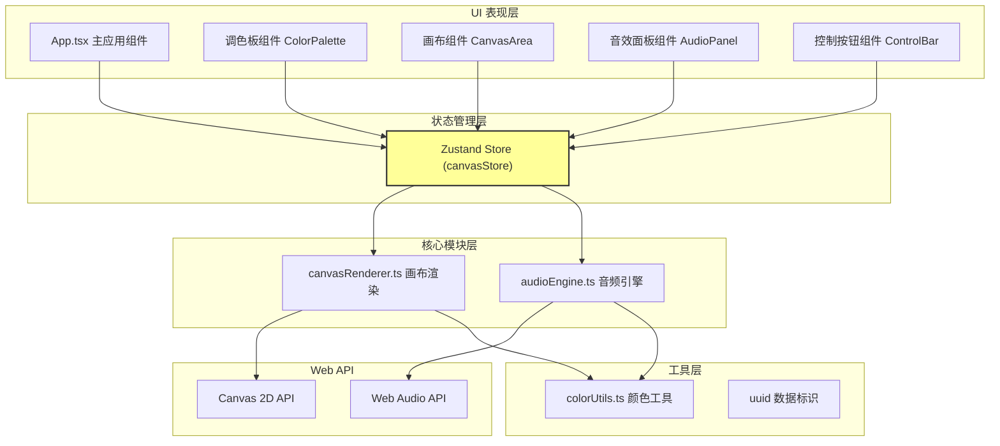

## 1. 架构设计



## 2. 技术说明

- **前端框架**：React@18 + TypeScript@5（target ES2020，strict模式）
- **构建工具**：Vite@5 + @vitejs/plugin-react
- **状态管理**：Zustand@4（集中式store，组件按需订阅）
- **音频处理**：原生 Web Audio API（OscillatorNode + GainNode + 混音）
- **图形渲染**：原生 Canvas 2D Context（逐帧 requestAnimationFrame）
- **工具库**：uuid（色块唯一标识）
- **样式方案**：原生 CSS Modules / CSS-in-JS（内联样式为主）

## 3. 文件结构与调用关系

```
项目根目录
├── package.json              # 依赖声明与启动脚本
├── vite.config.js            # Vite构建配置（React + TS）
├── tsconfig.json             # TypeScript严格配置
├── index.html                # 入口HTML（全屏深色背景）
└── src/
    ├── components/
    │   └── App.tsx           # 主应用组件（布局：左-中-右三栏）
    ├── store/
    │   └── canvasStore.ts    # Zustand状态管理（被App/Canvas/AudioPanel读写）
    ├── modules/
    │   ├── canvasRenderer.ts # Canvas渲染模块（读store → 输出到canvas元素）
    │   └── audioEngine.ts    # 音频引擎（读store → 调用Web Audio API）
    └── utils/
        └── colorUtils.ts     # 颜色/音频映射工具（被canvasRenderer/audioEngine调用）
```

**数据流向**：
1. 用户交互（App/子组件）→ dispatch action 到 canvasStore
2. canvasStore 更新 colorBlocks / selectedColor / isPlaying / volumes
3. canvasRenderer 订阅 store 变化 → 重新绘制画布
4. audioEngine 订阅 store 变化 → 创建/更新/销毁 OscillatorNode
5. colorUtils 提供 RGB→HSV、RGB→频率/谐波/音量 等纯函数转换

## 4. 数据模型定义

### 4.1 核心类型

```typescript
interface RGB { r: number; g: number; b: number }
interface HSV { h: number; s: number; v: number }

interface ColorBlock {
  id: string;                 // uuid
  x: number;                  // 画布坐标X
  y: number;                  // 画布坐标Y
  radius: number;             // 直径60-120px的一半
  color: RGB;                 // RGB颜色值
  createdAt: number;          // 创建时间戳（用于动画）
  isDragging: boolean;        // 是否正在被拖拽
  animationState: 'appearing' | 'stable' | 'disappearing';
  disappearStartTime?: number;
}

interface AudioSource {
  blockId: string;
  oscillator: OscillatorNode;
  gainNode: GainNode;
  baseVolume: number;         // 用户调节的音量 0-100
}

interface CanvasStore {
  colorBlocks: ColorBlock[];
  selectedColor: HSV;        // 默认 h: 任意, s: 0.8, v: 0.8
  isPlaying: boolean;
  userVolumes: Record<string, number>; // blockId -> 0-100
  currentPage: number;        // 音效面板分页
  isGrayscale: boolean;       // 暂停时变灰状态
  // Actions
  addBlock(x: number, y: number): void;
  updateBlockPosition(id: string, x: number, y: number): void;
  setDragging(id: string, flag: boolean): void;
  removeBlock(id: string): void;
  clearAllBlocks(): void;     // 触发逐个消失动画
  hardClear(): void;          // 动画结束后真正清空
  setSelectedColor(hsv: HSV): void;
  togglePlay(): void;
  setVolume(id: string, value: number): void;
  setCurrentPage(page: number): void;
}
```

### 4.2 颜色-音频映射规则（colorUtils.ts）

| 颜色属性 | 音频参数 | 映射方式 |
|---------|---------|----------|
| 色相 H (0-360°) | 基频 (0-2000Hz) | 线性映射 H/360 * 2000 |
| 饱和度 S (0-1) | 谐波数量 (1-8) | 线性映射 S * 7 + 1 取整 |
| 明度 V (0-1) | 音量增益 (0-0.5) | 指数曲线 V^2 * 0.5 |
| 色块面积 (πr²) | 泛音衰减率 | 面积越大衰减越慢 |

## 5. 性能保障策略

### 5.1 画布渲染

- 最多30个色块限制（addBlock时判断，超过30拒绝新增）
- requestAnimationFrame 循环，脏检查仅在 colorBlocks 变化时重绘
- 拖拽节流：mousemove 高频事件使用 rAF 合并到下一帧绘制

### 5.2 音频引擎

- 音源复用：相同 blockId 不重复创建 OscillatorNode
- 批量混音：所有 GainNode 连接到主 Bus GainNode，避免多次连接
- 淡出处理：使用 exponentialRampToValueAtTime 避免爆破音

### 5.3 帧频目标

| 场景 | 目标FPS | 保障手段 |
|------|---------|----------|
| 新增色块时 | ≥50 | 扩散动画仅重绘目标色块的局部区域 |
| 拖拽色块时 | ≥24 | mousemove 节流 + 拖影延迟计算 |
| 静态画布 | 60 | 空闲时暂停 rAF 循环，事件驱动重绘 |

## 6. 模块边界与职责

| 模块文件 | 依赖 | 对外暴露 | 禁止包含 |
|---------|------|----------|----------|
| canvasStore.ts | zustand, uuid, colorUtils(rgb转换) | useCanvasStore Hook | 禁止直接操作 DOM/Canvas/Web Audio |
| canvasRenderer.ts | colorUtils, canvasStore | init(canvasEl), render() | 禁止修改 store（只读），禁止音频逻辑 |
| audioEngine.ts | colorUtils, canvasStore | start()/stop(), triggerReplay(id) | 禁止 DOM 操作，禁止修改 store 非音量字段 |
| colorUtils.ts | 无 | rgbToHsv, hsvToRgb, rgbToAudioParams | 纯函数，禁止副作用 |
| App.tsx | 所有模块 | Root 组件 | 禁止直接调用 Web API，委托给子模块 |
