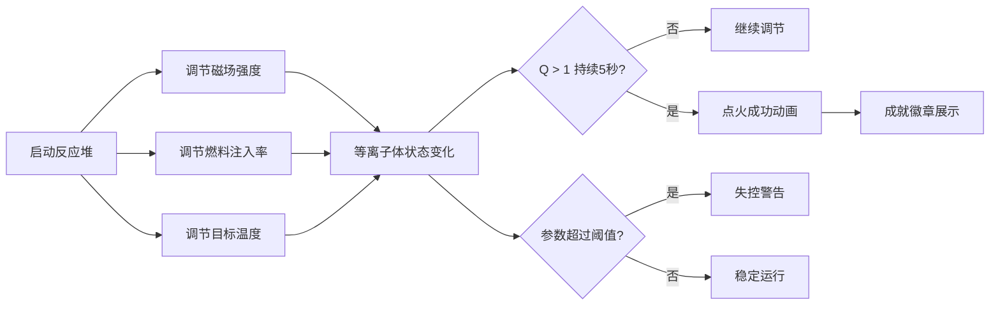

## 1. 产品概述

像素风可控核聚变反应堆堆芯模拟器，玩家通过拖拽和点击调整磁场约束、燃料注入和等离子体温度，观察堆芯内部等离子体状态变化和能量输出。

- 主要用途：科普教育、交互式演示、游戏化学习
- 目标用户：科学爱好者、学生、对核聚变感兴趣的公众
- 产品价值：以直观有趣的方式展示核聚变反应堆的工作原理

## 2. 核心功能

### 2.1 功能模块
1. **堆芯可视化模块**：Canvas 2D绘制的等离子体粒子系统，动态展示堆芯状态
2. **控制面板模块**：磁场强度、燃料注入率、目标温度三个滑块，启动/停止按钮，紧急停机按钮
3. **数据监测模块**：实时显示温度、密度、约束时间、Q值等关键参数
4. **状态系统模块**：低功率/稳定/高功率/失控四个阶段的状态切换与警告
5. **成就系统模块**：点火成功动画与成就徽章展示

### 2.2 页面详情

| 页面名称 | 模块名称 | 功能描述 |
|---------|---------|---------|
| 主控制台 | 堆芯视图 | 圆形堆芯截面，等离子体粒子模拟，磁场线圈动画 |
| 主控制台 | 左侧控制面板 | 三个参数滑块，启动/停止按钮，紧急停机按钮 |
| 主控制台 | 右侧数据面板 | 温度、密度、约束时间、Q值实时数据卡片 |
| 主控制台 | 警告系统 | 顶部滚动警告文字，边缘红色闪烁 |
| 主控制台 | 点火特效 | 亮白闪光、金色粒子爆裂、成就徽章 |

## 3. 核心流程

用户启动反应堆 → 调节参数（磁场/燃料/温度） → 观察等离子体状态变化 → 尝试达到点火条件 → Q值持续大于1 → 点火成功动画

## 4. 用户界面设计

### 4.1 设计风格
- **主色调**：深色背景 #0D1117，科幻控制台风格
- **强调色**：青色 #00BCD4（磁场）、粉红 #FF4081（燃料）、金色 #FFD740（温度）、绿色 #00E676（能量）、红色 #FF1744（警告）
- **按钮样式**：圆角矩形，悬停亮度提升20%，按下有弹起动画
- **字体**：等宽字体 'Courier New', monospace
- **布局风格**：三栏布局，中央堆芯 + 左侧控制 + 右侧数据
- **背景纹理**：微弱六边形网格纹理

### 4.2 页面设计概览

| 页面名称 | 模块名称 | UI元素 |
|---------|---------|--------|
| 主控制台 | 堆芯视图 | 圆形区域、粒子系统、三层磁场线圈、能量数值 |
| 主控制台 | 控制面板 | 滑块组件、启动按钮、紧急停机按钮 |
| 主控制台 | 数据面板 | 数据卡片、分割线、Q值高亮 |
| 主控制台 | 警告系统 | 顶部滚动文字、边缘红光闪烁 |
| 主控制台 | 点火特效 | 白色闪光、金色粒子、六边形徽章 |

### 4.3 响应式
- 桌面端：三栏布局（控制面板 + 堆芯 + 数据面板）
- 移动端（< 768px）：上下布局，控制面板和数据面板合并到堆芯下方

### 4.4 动画效果
- 粒子运动：等离子体粒子随温度变化速度和颜色
- 磁场线圈：脉动呼吸动画
- 数值变化：平滑过渡动画（easeOutCubic，0.3s）
- 按钮交互：悬停亮度提升，按下弹起动画
- 警告闪烁：红色光晕警告动画
- 点火特效：亮白闪光 + 金色粒子爆裂 + 成就徽章放大缩小

## 5. 性能要求

- 粒子模拟保持60FPS
- 低功率状态：至少500粒子流畅运行
- 高功率状态：1500粒子时帧率不低于30FPS
