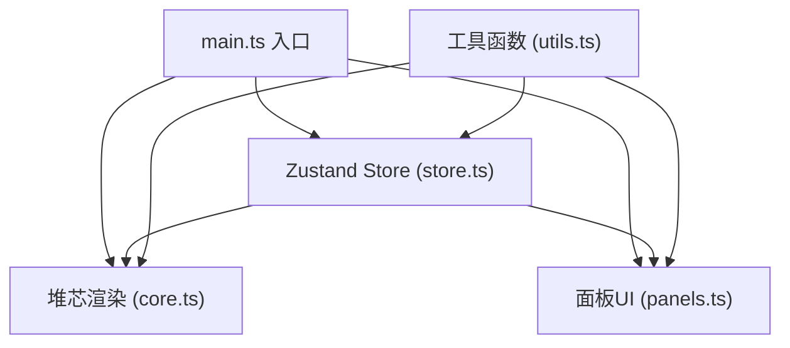

## 1. 架构设计



## 2. 技术描述

- **前端框架**：原生 TypeScript + Canvas 2D
- **构建工具**：Vite
- **状态管理**：Zustand
- **辅助库**：uuid
- **渲染方式**：Canvas 2D 粒子系统
- **动画驱动**：requestAnimationFrame

## 3. 项目结构

| 文件路径 | 用途 |
|---------|------|
| package.json | 项目依赖与脚本 |
| index.html | 入口HTML |
| tsconfig.json | TypeScript配置 |
| vite.config.js | Vite构建配置 |
| src/main.ts | 应用入口，初始化组件 |
| src/store.ts | Zustand状态管理，物理计算 |
| src/core.ts | 堆芯Canvas渲染模块 |
| src/panels.ts | 控制面板与数据面板DOM构建 |
| src/utils.ts | 工具函数集合 |

## 4. 数据模型

### 4.1 Store 状态

```typescript
interface ReactorState {
  // 控制参数
  magneticField: number      // 磁场强度 0-100
  fuelInjection: number      // 燃料注入率 0-100
  targetTemperature: number  // 目标温度 0-100
  
  // 运行状态
  isRunning: boolean         // 是否运行中
  isEmergencyStop: boolean   // 是否紧急停机
  
  // 堆芯状态
  coreStatus: 'low' | 'stable' | 'high' | 'outOfControl'
  
  // 能量数据
  temperature: number        // 当前温度 (MK)
  density: number           // 等离子体密度 (10^20/m³)
  confinementTime: number    // 约束时间 (s)
  energyOutput: number       // 能量输出
  qFactor: number           // 能量增益因子
  
  // 点火状态
  ignitionStartTime: number | null  // Q>1开始时间
  isIgnited: boolean               // 是否点火成功
  
  // 粒子数据
  particles: Particle[]
}
```

### 4.2 粒子数据

```typescript
interface Particle {
  id: string
  x: number
  y: number
  vx: number
  vy: number
  size: number
}
```

## 5. 核心物理模型

- **温度变化**：受燃料注入率和目标温度影响，磁场强度影响约束效率
- **密度变化**：受燃料注入率直接影响
- **约束时间**：与磁场强度正相关，与温度负相关
- **能量输出**：温度 × 密度 × 约束时间 的函数
- **Q值**：输出能量 / 输入能量
- **失控条件**：温度或密度超过阈值，约束时间过低

## 6. 性能优化策略

1. **粒子池管理**：根据功率动态调整粒子数量，避免频繁创建销毁
2. **批量渲染**：使用 Canvas 2D 批量绘制粒子
3. **空间分区**：粒子碰撞检测使用简单边界约束
4. **requestAnimationFrame**：统一动画循环，保证帧率稳定
5. **状态节流**：UI数据更新与物理计算解耦
