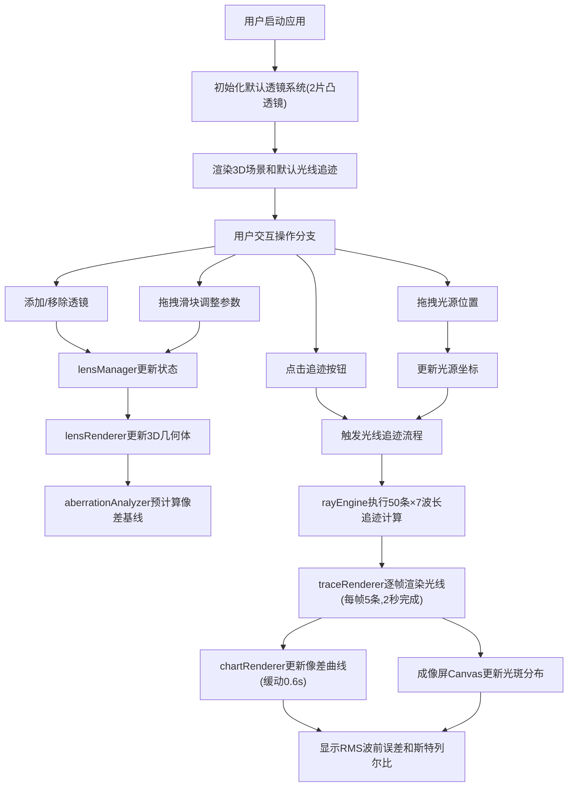

## 1. 产品概述

光学透镜系统成像模拟器是一款面向光学设计师的专业Web应用，解决传统光学模拟软件（如Zemax）无法实时展示光路动态调整结果、无法直观对比不同透镜组合对像差和色散影响的痛点。用户可在浏览器中实时构建透镜系统、追迹多波长光线、分析像差特性，实现"所见即所得"的光学设计体验。

- **目标用户**：光学工程师、科研人员、光学专业学生
- **核心价值**：降低光学设计门槛，提供实时可视化反馈，加速透镜系统迭代优化

## 2. 核心功能

### 2.1 功能模块

1. **透镜参数管理面板**：添加/移除透镜、调整曲率半径/厚度/折射率、选择透镜类型
2. **3D光学场景渲染**：透镜三维可视化、光源位置拖拽、主光轴参考线
3. **光线追迹引擎**：50+条多波长光线（400-700nm）逐帧追迹、球面折射计算、色散模拟
4. **成像屏与光斑分析**：Canvas 2D光斑强度分布、弥散斑直径标注
5. **像差分析面板**：球差/彗差/色差曲线、RMS波前误差、斯特列尔比指标
6. **响应式布局系统**：1400px断点自动折叠侧边栏

### 2.2 页面详情

| 页面名称 | 模块名称 | 功能描述 |
|----------|----------|----------|
| 主工作台 | 左侧参数面板 | 透镜列表管理（凸透镜/凹透镜/双胶合）、参数滑块输入、光源拖拽区域、追迹触发按钮 |
| 主工作台 | 中央3D场景 | Three.js渲染透镜几何体、光源球体、光轴线、光线轨迹LineSegments、相机自动对焦 |
| 主工作台 | 右侧成像屏 | Canvas绘制光斑强度热图、弥散斑圆和直径文字标注 |
| 主工作台 | 像差分析面板 | Chart.js三色折线图（球差红/彗差绿/色差蓝）、RMS和斯特列尔比数值卡片 |
| 主工作台 | 全局导航栏 | 应用标题、帮助提示、重置按钮 |

## 3. 核心流程

## 4. 用户界面设计

### 4.1 设计风格
- **主色调**：深空蓝背景 `#1E1E2E`，深灰面板 `#2A2A35`，专业科技感
- **交互高亮色**：青柠滑块 `#A6E22E`，青色按钮 `#66D9EF`，白色文字 `#E0E0E0`
- **光学元素色**：透镜半透明浅蓝 `#87CEEB` + 白边 `#FFFFFF`，光源金黄 `#FFD700`
- **像差曲线色**：球差红 `#FF6B6B`、彗差绿 `#4ECDC4`、色差蓝 `#45B7D1`
- **按钮风格**：扁平圆角矩形 `border-radius:6px`，hover时2px发光描边
- **字体**：标题使用 "JetBrains Mono" 等宽字体体现专业感，正文 "Segoe UI" 清晰易读
- **布局风格**：三栏固定式布局，中央3D区域最大，左右侧边栏带阴影分隔

### 4.2 页面设计概览

| 页面名称 | 模块名称 | UI 元素 |
|----------|----------|---------|
| 主工作台 | 左侧参数面板(380px) | 透镜卡片列表、滑块组(带数值显示)、添加按钮组、光源拖拽手柄、追迹主按钮 |
| 主工作台 | 中央3D场景 | 网格地面、XYZ坐标轴、透镜阵列(半透明+边框)、黄色光源球、彩色光线束 |
| 主工作台 | 右侧成像屏(420px) | 光斑Canvas(带十字准线)、弥散斑直径标注框、像差折线图、指标数据卡 |
| 主工作台 | 响应式折叠 | <1400px时侧边栏变为左侧50px图标条，hover展开，点击图标切换面板 |

### 4.3 响应式策略
- **桌面端（≥1400px）**：三栏全展开，左380px / 中央自适应 / 右420px
- **中端（1024-1399px）**：左右面板折叠为图标抽屉，点击展开覆盖层，中央3D区域最大化
- **移动端（<1024px）**：纵向堆叠布局，顶部3D场景、中部参数面板、底部分析面板

### 4.4 3D场景指南
- **环境**：纯黑背景 `#0D0D15` + 雾效 `FogExp2(0x1E1E2E, 0.008)` 营造深空氛围
- **光照**：AmbientLight(0x404060, 0.6) 基础环境光 + 2盏PointLight分别放置透镜两侧突出曲率
- **相机**：PerspectiveCamera(50°, aspect, 0.1, 2000)，初始位置(0, 60, 180)看向透镜组中心
- **相机运动**：OrbitControls支持环绕观察，添加透镜后自动tween到包含所有透镜的视野范围
- **材质选择**：透镜使用MeshPhysicalMaterial(transmission:0.7, thickness:1.5, roughness:0.1)模拟玻璃质感
- **后处理**：BloomEffect(threshold:0.3, intensity:0.4)为光源和焦斑添加辉光
- **性能预算**：单透镜几何体面数<2000三角面，总场景Draw Call<60，目标帧率≥50FPS

### 4.5 动画细节
- **透镜参数调整**：`transition: transform 0.3s ease, opacity 0.3s ease` 几何体平滑变形
- **光线追迹动画**：逐帧添加模式，每帧5条光线，使用TWEEN.js控制2秒完成进度
- **像差曲线更新**：Chart.js `animation.duration: 600`，easing: `easeInOutCubic`
- **面板折叠**：侧边栏`transform: translateX(-100%)`过渡0.35s cubic-bezier(0.4,0,0.2,1)
