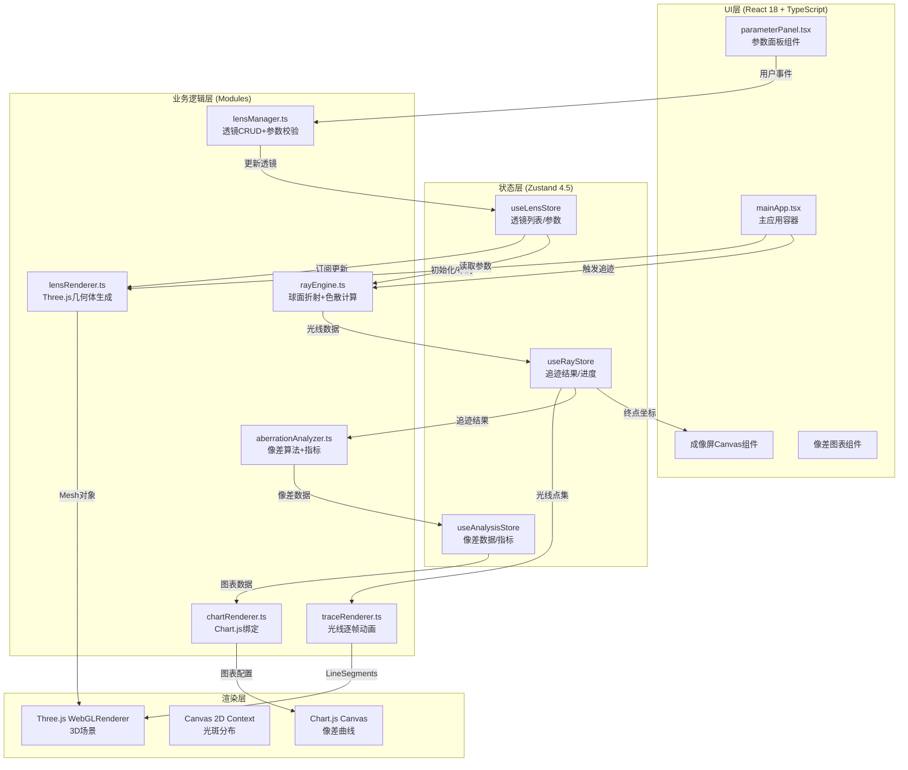

## 1. 架构设计



## 2. 技术选型说明

| 层级 | 技术 | 版本 | 选择理由 |
|------|------|------|----------|
| 构建工具 | Vite | ^5.0 | 冷启动快、HMR即时、原生ESM支持Three.js |
| 语言 | TypeScript | ^5.3 | 严格模式、光学公式类型安全、IDE智能提示 |
| UI框架 | React | ^18.2 | Hooks化状态管理、组件化UI、Concurrent Mode |
| 状态管理 | Zustand | ^4.5 | 轻量无Provider、切片模式管理多模块状态、支持订阅 |
| 3D渲染 | Three.js | ^0.160 | LatheGeometry构建旋转曲面、MeshPhysicalMaterial玻璃材质 |
| 图表 | Chart.js | ^4.4 | 折线图动画、dataset级颜色配置、轻量无依赖 |
| 工具函数 | uuid | ^9.0 | 透镜实例唯一ID、光线分组标识 |
| CSS方案 | 原生CSS + CSS变量 | - | 无需额外依赖、性能最优、主题切换便捷 |

## 3. 文件目录结构

```
src/
├── main.tsx                          # 应用入口挂载
├── App.tsx                           # 根组件
├── index.css                         # 全局样式+CSS变量
├── types/
│   └── optical.ts                    # 透镜/光线/像差类型定义
├── store/
│   └── useAppStore.ts                # Zustand全局Store
├── utils/
│   ├── opticsFormulas.ts             # 折射公式/色散公式工具函数
│   └── colorUtils.ts                 # 波长到RGB转换工具
├── modules/
│   ├── lensSystem/
│   │   ├── lensManager.ts            # 透镜增删改查+参数校验
│   │   └── lensRenderer.ts           # Three.js透镜几何体+场景相机
│   ├── rayTracing/
│   │   ├── rayEngine.ts              # 光线追迹核心算法
│   │   └── traceRenderer.ts          # 光线渲染+逐帧动画
│   ├── analysis/
│   │   ├── aberrationAnalyzer.ts     # 像差计算+评价指标
│   │   └── chartRenderer.ts          # Chart.js实例管理
│   └── ui/
│       ├── parameterPanel.tsx        # 左侧参数面板组件
│       ├── imagingScreen.tsx         # 右侧成像屏Canvas
│       ├── aberrationPanel.tsx       # 像差图表+指标
│       └── mainApp.tsx               # 主布局+三栏容器
└── vite-env.d.ts
```

## 4. 核心数据模型

```typescript
// 透镜类型
type LensType = 'convex' | 'concave' | 'doublet';

interface LensSurface {
  radius: number;       // 曲率半径 mm (-100 ~ 100)
  thickness: number;    // 到下一面间距 mm (1 ~ 20)
  refractiveIndex: number; // 折射率 (1.4 ~ 2.0)
}

interface Lens {
  id: string;           // uuid
  type: LensType;
  positionZ: number;    // 光轴Z方向位置 mm
  aperture: number;     // 通光孔径 mm (默认 30)
  surfaces: LensSurface[]; // 1~2个表面
}

interface LightSource {
  position: { x: number; y: number; z: number };
  wavelengths: number[]; // [400, 450, 500, 550, 600, 650, 700] nm
  rayCount: number;     // 50条
}

interface RaySegment {
  start: [number, number, number];
  end: [number, number, number];
  wavelength: number;
}

interface TraceResult {
  raySegments: RaySegment[];
  focalPoints: { wavelength: number; x: number; y: number; z: number }[];
  screenHits: { wavelength: number; x: number; y: number; intensity: number }[];
}

interface AberrationData {
  spherical: { field: number; aberration: number }[];  // 球差曲线
  coma: { field: number; aberration: number }[];       // 彗差曲线
  chromatic: { field: number; aberration: number }[];   // 色差曲线
  rmsWavefrontError: number;       // RMS波前误差 λ
  strehlRatio: number;             // 斯特列尔比 0~1
}
```

## 5. 关键算法实现要点

### 5.1 球面折射公式 (rayEngine.ts核心)
```
给定入射点P、入射方向向量L、表面曲率中心C、曲率半径r、折射率n1/n2：
1. 法线 N = normalize(P - C)
2. 入射角余弦 cosI1 = -dot(L, N)
3. 折射定律: n1·sinI1 = n2·sinI2 → sinI2 = n1/n2 · sqrt(1-cosI1²)
4. 全反射判断: 若sinI2 > 1则终止该光线
5. 折射方向: L' = (n1/n2)·L + (n1/n2·cosI1 - sqrt(1-sinI2²))·N
6. 传递到下一面: 沿L'方向计算与下一球面交点P'
```

### 5.2 色散模型 (柯西公式)
```
n(λ) = A + B/λ² + C/λ⁴   其中λ单位μm
取默认: A=1.5, B=0.005, C=0.0002 模拟BK7玻璃
各波长(400~700nm)折射率差异 ~0.01 量级
```

### 5.3 斯特列尔比近似计算
```
当RMS波前误差σ < λ/14时:
Strehl ≈ exp(-(2πσ)²)   (马雷夏尔判据)
否则使用更精确近似保证范围[0,1]
```

## 6. 性能优化策略

| 优化点 | 方案 |
|--------|------|
| 光线追迹计算 | 使用TypedArray(Float32Array)存储光线点，Web Worker可选项，目标单帧<10ms |
| 3D渲染 | LineSegments合并渲染50条光线为单一BufferGeometry，避免多次Draw Call |
| 光斑Canvas | OffscreenCanvas离屏计算强度直方图，主Canvas只做最终绘制 |
| 状态更新 | Zustand selector精确订阅，避免全组件重渲染；透镜参数debounce 50ms后重追迹 |
| 几何体复用 | 透镜参数变化时只更新LatheGeometry顶点position属性，不重建Mesh |
