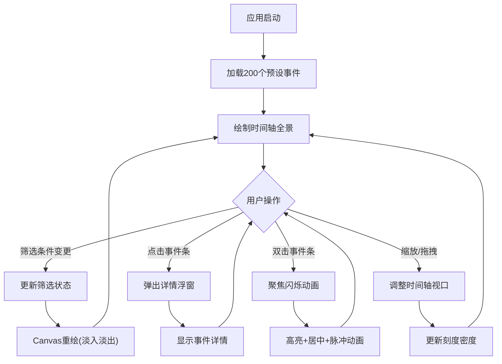

## 1. 产品概述

文明时空脉络年表——一个交互式历史事件可视化工具，帮助历史爱好者直观理解不同文明在千年间的平行发展与交汇碰撞。通过水平时间轴、文明分组着色、多维度筛选和事件聚焦等功能，将复杂的历史时空关系呈现为可探索的视觉图谱。

- 目标用户：历史爱好者、教育工作者、学生
- 核心价值：将抽象的历史年表转化为可交互、可筛选、可聚焦的视觉体验

## 2. 核心功能

### 2.1 功能模块

1. **主时间轴页面**：左侧筛选面板 + 右侧Canvas时间轴画布

### 2.2 页面详情

| 页面名称 | 模块名称 | 功能描述 |
|---------|---------|---------|
| 主时间轴页面 | 筛选面板 | 文明多选下拉框（8个文明，带颜色圆点）、时间范围滑块（公元前3000-公元2000年）、事件类型过滤标签组（战争/文化/科技/王朝更迭/建筑/灾难）、筛选结果计数 |
| 主时间轴页面 | 时间轴画布 | 水平时间轴绘制、文明分组着色事件条、刻度线（10年/50年/100年/500年自适应）、事件详情浮窗、缩放滑块、拖拽平移、双击聚焦闪烁 |
| 主时间轴页面 | 事件详情浮窗 | 事件标题、年份、文明、类型标签（颜色编码）、80字摘要、点击外部关闭 |

## 3. 核心流程

用户打开应用 → 看到预设200个历史事件的时间轴全景 → 通过左侧面板筛选感兴趣的文明/时段/事件类型 → Canvas即时重绘过滤结果 → 点击事件条查看详情 → 双击聚焦单个事件（闪烁高亮+视口居中） → 通过缩放和拖拽探索不同时间尺度

## 4. 用户界面设计

### 4.1 设计风格

- **整体风格**：浅色羊皮纸复古风格，温暖米色基调，如同展开一卷古老的文明年表
- **主色调**：主背景 #F5F0E8，面板背景 #E8E0D0，画布背景 #FDF5E6
- **强调色**：8个文明各自独立颜色，事件类型6种标签色
- **字体**：标题使用衬线字体（如 Playfair Display），正文使用易读的无衬线字体
- **布局**：左右分栏，左320px筛选面板 + 右弹性Canvas区域
- **过渡动画**：hover放大1.05倍 transition 0.2s ease，筛选重绘0.3秒淡入淡出

### 4.2 页面设计概述

| 页面名称 | 模块名称 | UI元素 |
|---------|---------|--------|
| 主时间轴页面 | 筛选面板 | 固定宽度320px，背景#E8E0D0，1px右边框#D7CCC8；文明多选下拉框（选项前带颜色圆点）；时间范围双端滑块；事件类型标签按钮组（选中时填充对应类型色块） |
| 主时间轴页面 | 时间轴画布 | 背景#FDF5E6；事件条24px高，文明颜色透明度0.3-0.5；刻度线#BDBDBD，主刻度#757575；左上角半透明深灰#333333背景白色文字"显示X个事件"；底部缩放滑块0.5x-3x |
| 主时间轴页面 | 事件详情浮窗 | 圆角8px，阴影0 4px 20px rgba(0,0,0,0.3)，背景#FFFFFF，最大宽度320px；类型标签用不同色块背景 |
| 主时间轴页面 | 聚焦闪烁 | 被聚焦事件3px纯色边框，其他事件透明度降至0.1，2秒脉冲动画（透明度0.6-1.0循环） |

### 4.3 响应式设计

- **桌面端（1280px-1920px）**：左右分栏布局正常显示
- **平板端（768px-1280px）**：左侧面板缩窄至260px
- **移动端（<768px）**：左侧面板折叠为顶部汉堡菜单，可收起展开
- 触控优化：事件条点击区域适当扩大，拖拽支持触摸手势

## 5. 性能要求

- 初始加载200个预设事件，Canvas渲染 < 300ms
- 筛选重绘 < 150ms
- 帧率维持在50fps以上
- 事件条命中检测使用空间索引优化，避免全量遍历
