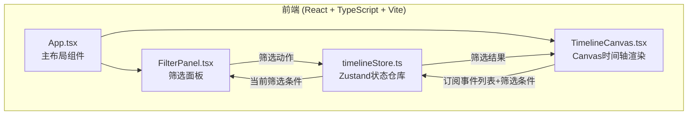
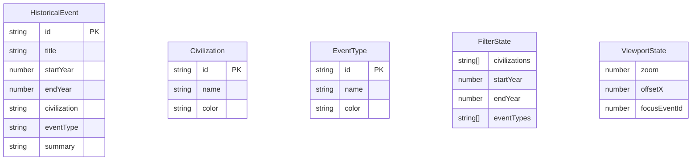

## 1. 架构设计



数据流向：用户在FilterPanel中操作 → 调用store的筛选动作更新全局状态 → TimelineCanvas从store订阅变更 → Canvas重绘

## 2. 技术说明

- **前端框架**：React 18 + TypeScript（严格模式）
- **构建工具**：Vite + @vitejs/plugin-react
- **状态管理**：Zustand（轻量级全局状态）
- **渲染引擎**：Canvas 2D API（高性能时间轴绘制）
- **唯一标识**：uuid（事件ID生成）
- **CSS方案**：CSS Modules + CSS Variables（羊皮纸主题变量）
- **初始化工具**：Vite

## 3. 路由定义

单页面应用，无路由。所有功能在一个页面内完成。

| 路径 | 用途 |
|------|------|
| / | 主时间轴页面，含筛选面板和Canvas画布 |

## 4. 文件结构与调用关系

```
├── package.json                    # 依赖声明，启动脚本
├── vite.config.js                  # Vite构建配置
├── tsconfig.json                   # TypeScript严格模式配置
├── index.html                      # 入口HTML
└── src/
    ├── main.tsx                     # React应用入口 → 渲染App组件
    ├── App.tsx                      # 主布局组件 → 管理左右分栏
    ├── store/
    │   └── timelineStore.ts         # Zustand状态仓库 → 被App/FilterPanel/TimelineCanvas引用
    ├── components/
    │   ├── FilterPanel.tsx          # 筛选面板 → 调用store筛选动作
    │   └── TimelineCanvas.tsx       # Canvas渲染 → 订阅store事件数据
    ├── types/
    │   └── index.ts                 # TypeScript类型定义
    └── data/
        └── presetEvents.ts          # 200个预设历史事件数据
```

### 调用关系

- `main.tsx` → 渲染 `App.tsx`
- `App.tsx` → 引用 `FilterPanel.tsx` + `TimelineCanvas.tsx`
- `FilterPanel.tsx` → 调用 `timelineStore.ts` 的筛选动作（setCivilizations, setTimeRange, setEventTypes）
- `TimelineCanvas.tsx` → 订阅 `timelineStore.ts` 的状态（filteredEvents, timeRange, zoom, focusEvent）
- `timelineStore.ts` → 引用 `types/index.ts` 类型定义 + `data/presetEvents.ts` 预设数据

## 5. 核心数据模型



### 5.1 核心类型定义

```typescript
interface HistoricalEvent {
  id: string;
  title: string;
  startYear: number;
  endYear: number;
  civilization: CivilizationId;
  eventType: EventTypeId;
  summary: string;
}

type CivilizationId = 'china' | 'egypt' | 'greece' | 'rome' | 'india' | 'maya' | 'persia' | 'japan';

type EventTypeId = 'war' | 'culture' | 'tech' | 'dynasty' | 'architecture' | 'disaster';

interface FilterState {
  civilizations: CivilizationId[];
  startYear: number;
  endYear: number;
  eventTypes: EventTypeId[];
}

interface TimelineState {
  events: HistoricalEvent[];
  filter: FilterState;
  zoom: number;
  offsetX: number;
  focusEventId: string | null;
}
```

## 6. Canvas渲染策略

### 6.1 空间索引优化

使用基于年份区间的一维空间哈希表，将事件按50年分桶存储，命中检测时仅检查鼠标位置对应年份桶内的事件，避免遍历全部200个事件。

### 6.2 渲染层次

1. **底层**：背景 + 刻度线 + 年份标注
2. **中层**：事件条（按文明分组，错开排列）
3. **顶层**：聚焦高亮 + 事件计数标签

### 6.3 刻度密度规则

| 缩放倍率 | 显示刻度 |
|---------|---------|
| 0.5x-1x | 每500年主刻度 |
| 1x-1.5x | 每100年刻度 |
| 1.5x-2x | 每50年刻度 |
| 2x-3x | 每10年刻度 |

### 6.4 帧率保障

- 使用 `requestAnimationFrame` 驱动渲染循环
- 仅在状态变更时触发重绘，不持续循环
- 筛选变更时使用0.3秒淡入淡出过渡，通过alpha插值实现
