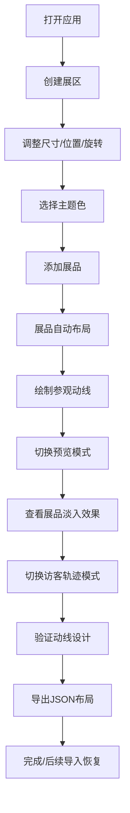

## 1. 产品概述

虚拟展厅策展工具是一款面向小型博物馆策展人的数字化展览布局搭建与预览应用，通过可视化画布操作实现展区规划、展品布置和参观动线设计，解决传统实物布展成本高、调整不灵活及远程协作困难的问题。

- 核心目标：为策展人提供零门槛、高效率的虚拟展览设计工具
- 目标用户：小型博物馆策展人、展览设计师、文化机构工作人员
- 市场价值：降低布展成本，提升方案迭代效率，支持远程协作决策

## 2. 核心功能

### 2.1 用户角色

| 角色 | 注册方式 | 核心权限 |
|------|----------|----------|
| 策展人 | 无需注册，本地使用 | 创建展区、添加展品、绘制动线、导出布局、导入恢复、预览展览、模拟访客轨迹 |

### 2.2 功能模块

1. **编辑模式（主画布）**：展区创建与编辑、展品管理、贝塞尔曲线路径绘制、画布缩放平移
2. **预览模式**：全屏覆盖展示、展品淡入动画、手动翻页控制
3. **访客轨迹模拟模式**：动线自动行走、速度调节、交叉点闪烁提示
4. **工具栏**：展区创建按钮、色板选择、动线开关、视图切换、数据导入导出

### 2.3 页面详情

| 页面名称 | 模块名称 | 功能描述 |
|----------|----------|----------|
| 编辑页 | 左侧工具栏 | 展区创建（矩形/圆形）、8色主题色板、动线绘制开关、视图模式切换、导出/导入按钮 |
| 编辑页 | 中央画布 | 展区渲染与交互（拖拽、缩放、旋转、层级）、展品自动布局、贝塞尔路径连接、像素标尺、滚轮缩放、中键平移 |
| 编辑页 | 展区浮层卡片 | 半透明信息卡片显示：展区标题、策展人备注、展品数量 |
| 编辑页 | 展品操作 | URL上传或素材库选取、0.5x-2x缩放、文字标签、自动居中/网格排列 |
| 预览页 | 全屏覆盖层 | 隐藏编辑控件、展品按序淡入（0.3s间隔）、前进/后退翻页、返回编辑按钮 |
| 访客轨迹模拟 | 画布叠加层 | 半透明圆点沿路径行走、1x-3x速度调节、视角跟随、路径交叉点光晕闪烁 |

## 3. 核心流程

策展人打开应用 → 创建矩形/圆形展区 → 拖拽调整大小与位置 → 选择主题背景色 → 添加展品图片（URL或素材库） → 展品自动布局 → 绘制贝塞尔参观动线 → 切换预览模式查看展品淡入效果 → 切换访客轨迹模式验证动线 → 导出JSON布局文件 → 后续可导入JSON恢复编辑

## 4. 用户界面设计

### 4.1 设计风格

- **主背景色**：#1A1A2E（深邃藏蓝）
- **辅助面板色**：#16213E（暗蓝灰）
- **操作栏色**：#0F3460（宝石蓝）
- **文字主色**：#E0E0E0（浅灰白）
- **高亮/选中色**：#E94560（胭脂红）
- **动线/加载色**：#8E44AD（紫罗兰）
- **8种艺术主题色板**：
  - 古典米色 #F5E6D3
  - 深邃蓝灰 #2C3E50
  - 勃艮第红 #8B2635
  - 森系墨绿 #2D5A27
  - 沙漠琥珀 #D4A574
  - 莫兰迪紫 #8D87A8
  - 青金石蓝 #1D4E89
  - 暖金褐 #8B6914

- **按钮风格**：圆角6px，悬停微放大1.05倍，0.2s过渡
- **字体**：使用 Google Fonts - "Playfair Display"（展示字体）+ "Noto Sans SC"（正文字体）
- **布局风格**：三栏式布局（左侧工具栏 280px 固定宽 + 中央画布自适应 + 右侧可选属性面板预留）
- **动画风格**：0.2s基础过渡、展品0.3s淡入、弹性拖拽跟随、选中虚框闪烁

### 4.2 页面设计概述

| 页面名称 | 模块名称 | UI元素 |
|----------|----------|--------|
| 编辑页 | 工具栏 | 深色卡片、按钮组、色板网格、下拉菜单、文件操作按钮 |
| 编辑页 | 画布区域 | 深紫背景、像素标尺、网格辅助线、可交互展区元素 |
| 编辑页 | 展区元素 | 选中态2px虚框#E94560、旋转控制柄、缩放拖拽控制点 |
| 编辑页 | 展区信息卡 | 半透明深色毛玻璃、右上角浮动、文字简洁 |
| 预览页 | 全屏覆盖 | 居中展区展示、模糊背景遮罩、展品层叠淡入、左右导航箭头 |
| 访客轨迹 | 画布叠加 | 半透明圆形行走点、路径高亮、交叉点脉冲光晕 |

### 4.3 响应式设计

- 桌面优先设计，适配屏幕宽度 1024px - 2560px
- 画布区域宽度自动伸缩，保持 16:9 或全屏比例
- 工具栏固定 280px 宽度，小屏（<1200px）可折叠为抽屉式
- 字体大小基于 clamp() 函数自适应

### 4.4 性能要求

- 20个展区 × 5件展品 = 100个UI元素场景下，编辑操作延迟 ≤ 50ms
- 预览模式展品淡入动画帧率 ≥ 60fps
- 使用 CSS transform / will-change 提升渲染性能
- 画布渲染采用按需更新策略，避免全量重绘
