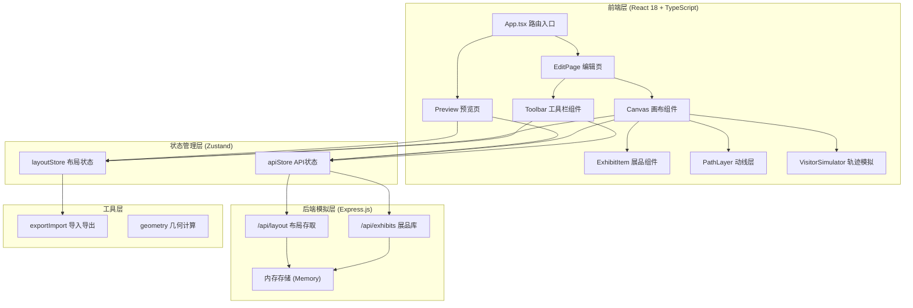
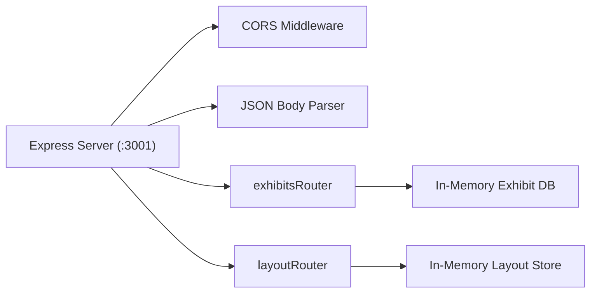
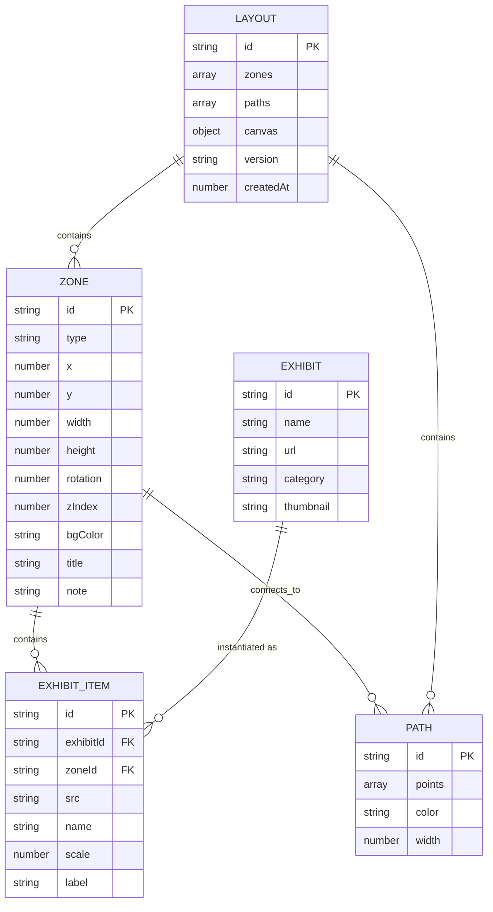

## 1. 架构设计



## 2. 技术选型说明

- **前端框架**：React 18 + TypeScript 5
- **构建工具**：Vite 5 + @vitejs/plugin-react
- **状态管理**：Zustand 4（轻量、基于hooks、TS友好）
- **路由**：react-router-dom 6
- **后端模拟**：Express.js 4 + CORS中间件
- **唯一ID**：uuid
- **并行启动**：concurrently
- **图标库**：lucide-react

## 3. 路由定义

| 路由路径 | 页面组件 | 用途说明 |
|----------|----------|----------|
| `/` | EditPage | 编辑模式主页面（默认视图） |
| `/preview` | PreviewPage | 预览模式页面（展品淡入展示） |

## 4. API接口定义

### 4.1 展品库接口

```typescript
// GET /api/exhibits
interface Exhibit {
  id: string;
  name: string;
  url: string;
  category: string;
  thumbnail: string;
}

// Response: Exhibit[] - 返回内置展品素材库列表
```

### 4.2 布局保存接口

```typescript
// POST /api/layout
interface SaveLayoutRequest {
  id?: string;
  data: LayoutData;
}

// Response: { id: string; success: boolean }
```

### 4.3 布局加载接口

```typescript
// GET /api/layout/:id
// Response: { id: string; data: LayoutData } | 404
```

### 4.4 核心数据类型

```typescript
interface Zone {
  id: string;
  type: 'rect' | 'circle';
  x: number;
  y: number;
  width: number;
  height: number;
  rotation: number; // 度数，步进15
  zIndex: number;
  bgColor: string;
  title: string;
  note: string;
  exhibits: ExhibitItem[];
}

interface ExhibitItem {
  id: string;
  src: string;
  name: string;
  scale: number; // 0.5 - 2
  label?: string;
}

interface PathPoint {
  x: number;
  y: number;
  bezier?: { cp1x: number; cp1y: number; cp2x: number; cp2y: number };
}

interface Path {
  id: string;
  points: PathPoint[];
  color: string;
  width: number;
}

interface LayoutData {
  zones: Zone[];
  paths: Path[];
  canvas: { zoom: number; offsetX: number; offsetY: number };
  version: string;
  createdAt: number;
}
```

## 5. 后端架构



- 服务端采用内存存储（Map），重启后数据清空
- 提供 CORS 支持，允许前端 Vite 开发服务器跨域访问
- 提供 20+ 内置展品素材（使用 placehold.co 或 picsum.photos 占位图）

## 6. 数据模型

### 6.1 实体关系



## 7. 项目文件结构

```
auto167/
├── package.json
├── vite.config.js
├── tsconfig.json
├── index.html
├── server/
│   └── index.js          # Express模拟后端
└── src/
    ├── main.tsx          # React入口
    ├── App.tsx           # 主组件+路由
    ├── store/
    │   ├── layoutStore.ts   # 布局状态管理
    │   └── apiStore.ts      # API状态管理
    ├── components/
    │   ├── Toolbar.tsx      # 左侧工具栏
    │   ├── Canvas.tsx       # 中间画布
    │   ├── Preview.tsx      # 预览模式
    │   ├── Zone.tsx         # 展区组件
    │   ├── Exhibit.tsx      # 展品组件
    │   ├── Ruler.tsx        # 标尺组件
    │   └── VisitorSim.tsx   # 访客轨迹模拟
    ├── utils/
    │   └── exportImport.ts  # 导入导出工具
    └── types/
        └── index.ts         # 类型定义
```
