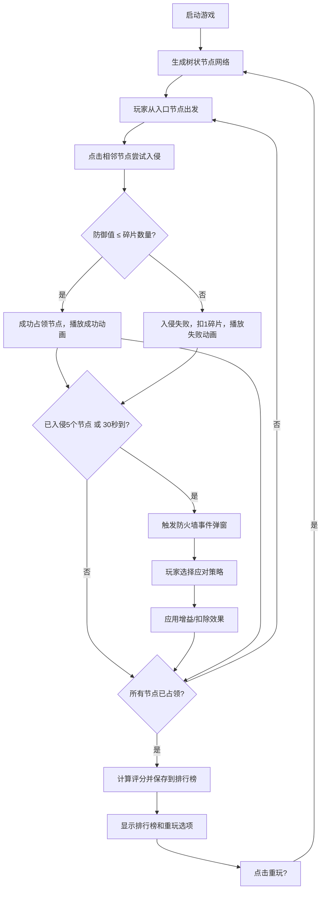

## 1. 产品概述
赛博朋克黑客入侵模拟器是一款迷你策略模拟游戏，玩家扮演黑客通过拼接代码模块和绕开防火墙来入侵虚构的网络节点。每次入侵后获得评分并解锁更复杂的目标。
- 目标用户：独立游戏爱好者、对黑客文化感兴趣的休闲玩家
- 产品价值：提供沉浸式赛博朋克视觉体验与策略性玩法的结合

## 2. 核心特性

### 2.1 功能模块
1. **游戏主界面**: Canvas绘制的树状网络图、节点入侵交互、防火墙事件弹窗
2. **状态面板**: 评分显示、代码碎片进度环、入侵进度条、操作日志
3. **排行榜系统**: 本地存储评分记录、Top10排行展示
4. **音频系统**: Web Audio API生成背景音乐和音效反馈

### 2.2 页面详情
| 页面名称 | 模块名称 | 功能描述 |
|---------|---------|---------|
| 游戏主页 | 网络节点图 | 6-10个节点的树状网络图，支持点击相邻节点入侵 |
| 游戏主页 | 状态面板 | 显示评分、代码碎片、进度条、操作日志、重玩按钮 |
| 游戏主页 | 防火墙弹窗 | 终端风格选择框，提供三种应对选项 |
| 游戏主页 | 排行榜 | 游戏完成后弹出Top10历史记录 |

## 3. 核心流程
玩家从左上角绿色入口节点出发，点击相邻节点消耗代码碎片尝试入侵。防御值>碎片时失败扣1碎片，防御值≤碎片时成功占领。每入侵5个节点或每隔30秒触发防火墙事件。占领所有节点后完成入侵，根据用时、剩余碎片、占领节点数计算评分，存入本地排行榜。可点击重玩重新生成节点网络。

## 4. 用户界面设计

### 4.1 设计风格
- **主色调**: 暗黑背景(#0A0A0A) + 青色霓虹(#00FFFF) + 绿色代码流(#00FF41)
- **节点颜色**: 低防御(#00FF88)、中防御(#FFAA00)、高防御(#FF3355)、已占领(#B388FF)、入口(#00FF00)
- **按钮风格**: 圆角8px、背景#00BCD4、白色文字、悬停亮度提升1.2倍
- **字体**: 主要使用'Courier New'营造终端风格，评分和节点名加粗
- **布局**: 左侧80% Canvas游戏区 + 右侧280px状态面板；<768px时面板折叠到底部180px

### 4.2 页面设计概述
| 页面模块 | UI元素 | 描述 |
|---------|--------|------|
| Canvas游戏区 | 动态网格背景 | 深色背景+浮动网格线+随机十六进制代码流 |
| Canvas游戏区 | 节点与连线 | 不同颜色圆形节点+发光青色渐变连线 |
| Canvas游戏区 | 动画效果 | 入侵成功脉冲波纹、失败红色闪烁、拦截文字 |
| 状态面板 | 发光边框 | box-shadow: 0 0 8px #00FFFF |
| 状态面板 | 评分显示 | 32px青色字体 |
| 状态面板 | 碎片进度环 | 圆形SVG，颜色从绿(#00FF88)渐变到红(#FF3355) |
| 状态面板 | 进度条 | 水平填充，#FFAA00 |
| 状态面板 | 操作日志 | 滚动列表，白色时间戳+描述 |
| 防火墙弹窗 | 终端风格 | 背景#0D1117，文字#00FF41，Courier New字体 |

### 4.3 响应式设计
- **桌面端(≥768px)**: 左侧80% Canvas游戏区，右侧固定280px状态面板
- **移动端(<768px)**: 状态面板折叠到底部，高度180px，Canvas区域占据上方剩余空间
- 触摸优化：节点点击区域扩大，确保手指操作精度

## 5. 性能目标
- 帧率：≥45FPS
- 入侵动画响应：≤100ms
- 音效延迟：≤50ms
