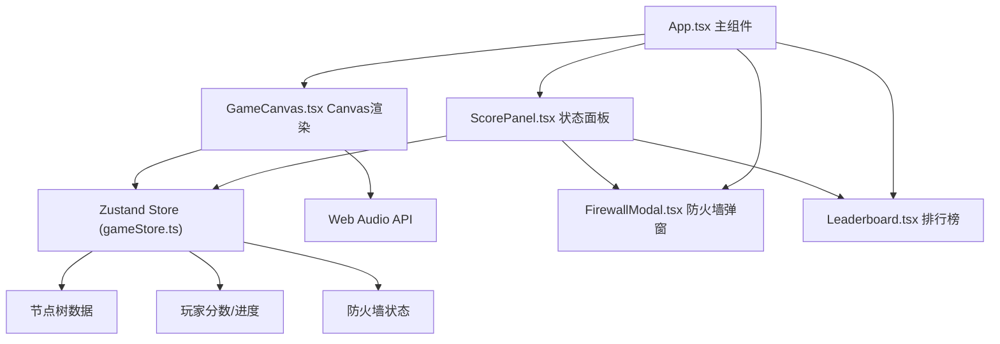

## 1. 架构设计



## 2. 技术选型
- **前端框架**: React 18 + TypeScript
- **构建工具**: Vite 5 + @vitejs/plugin-react
- **状态管理**: Zustand 4
- **图形渲染**: Canvas 2D API
- **音频**: Web Audio API（程序化生成）
- **数据持久化**: localStorage
- **工具库**: uuid（节点ID生成）

## 3. 文件结构与调用关系

```
src/
├── App.tsx              # 主入口，布局容器，管理弹窗显示
│   ├── GameCanvas.tsx   # ← 调用，传递事件回调
│   ├── ScorePanel.tsx   # ← 调用
│   ├── FirewallModal.tsx# ← 调用
│   └── Leaderboard.tsx  # ← 调用
├── GameCanvas.tsx       # Canvas 2D渲染，读取store，通过回调更新store
│   └── gameStore.ts     # ← 读取节点状态/分数/碎片
├── ScorePanel.tsx       # 右侧面板，从store读取展示数据
│   └── gameStore.ts     # ← 读取分数/进度/日志
├── store/
│   └── gameStore.ts     # Zustand核心状态管理
├── types/
│   └── index.ts         # 全局TypeScript类型定义
├── utils/
│   ├── audio.ts         # Web Audio API音效生成器
│   ├── nodeGenerator.ts # 节点网络生成算法
│   └── scoring.ts       # 评分计算工具
└── main.tsx             # React入口
```

### 数据流向
1. **初始化**: App启动 → gameStore.generateNetwork() → nodeGenerator生成节点树 → store保存
2. **入侵流程**: GameCanvas点击事件 → store.hackNode() → 更新节点状态/碎片/分数 → GameCanvas/ScorePanel重渲染
3. **防火墙事件**: store检测触发条件 → FirewallModal显示 → 玩家选择 → store.applyFirewallChoice()
4. **完成流程**: store检测全部占领 → scoring计算分数 → Leaderboard展示 → localStorage持久化

## 4. 核心数据模型

```typescript
// 节点类型
interface NetworkNode {
  id: string;           // uuid
  name: string;         // 节点名称
  x: number;            // Canvas X坐标
  y: number;            // Canvas Y坐标
  defense: number;      // 防御值 20-100
  parentId: string | null;
  childrenIds: string[];
  status: 'locked' | 'captured' | 'entry'; // 节点状态
  defenseLevel: 'low' | 'medium' | 'high';
}

// 游戏状态
interface GameState {
  nodes: Map<string, NetworkNode>;
  entryNodeId: string;
  targetNodeId: string;
  codeFragments: number;    // 当前代码碎片
  maxFragments: number;     // 最大碎片数
  score: number;            // 当前评分
  capturedCount: number;    // 已占领节点数
  totalNodes: number;
  startTime: number;        // 开始时间戳
  elapsedTime: number;      // 已用秒数
  hackCount: number;        // 累计入侵次数（用于防火墙触发）
  lastFirewallTime: number; // 上次防火墙时间
  firewallActive: boolean;
  halfDefenseUntil: number; // 相邻节点防御减半截止时间
  operationLogs: LogEntry[];
  gameStatus: 'playing' | 'completed';
  leaderboard: LeaderboardEntry[];
}
```

## 5. Zustand Store 核心Action

```typescript
interface GameActions {
  generateNetwork: () => void;           // 生成新节点网络
  hackNode: (nodeId: string) => HackResult; // 尝试入侵节点
  applyFirewallChoice: (choiceId: string) => void; // 应用防火墙选择
  closeFirewallModal: () => void;
  resetGame: () => void;                  // 重置游戏
  regenerateFragments: () => void;        // 每10秒恢复1碎片
  checkFirewallTrigger: () => void;       // 检查防火墙触发
  tickTime: () => void;                   // 更新计时
  saveToLeaderboard: () => void;          // 保存到排行榜
  addLog: (message: string) => void;      // 添加操作日志
}
```
