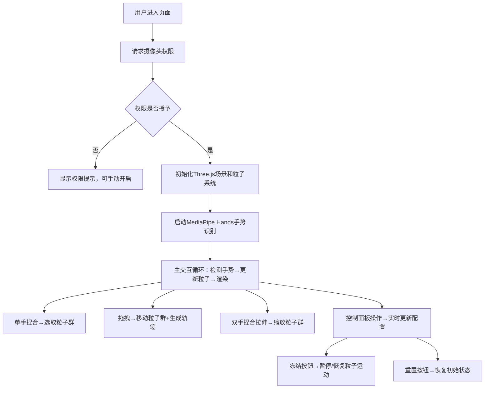

## 1. 产品概述
基于手势控制的3D粒子雕塑生成工具，用户通过摄像头捕捉手部动作，在虚拟空间中捏合、拉伸和旋转粒子团，形成类似粘土或星云状的立体雕塑。
- 目标用户：艺术家、设计师、创意爱好者、教育工作者
- 核心价值：提供沉浸式、直观的3D创作体验，降低数字雕塑的技术门槛

## 2. 核心功能

### 2.1 功能模块
1. **主场景页面**：Three.js 3D粒子场景、摄像头预览、手势识别
2. **控制面板模块**：粒子数量调节、颜色主题切换、重置/冻结按钮

### 2.2 页面详情
| 页面名称 | 模块名称 | 功能描述 |
|---------|---------|---------|
| 主场景页面 | Three.js粒子系统 | 创建可交互的3D粒子云，支持粒子群选取、拖拽、缩放、旋转 |
| 主场景页面 | 摄像头预览窗 | 左上角半透明小窗显示摄像头画面，方便用户观察手势 |
| 主场景页面 | 手势识别模块 | 使用MediaPipe Hands检测食指和拇指指尖，识别捏合、拖拽、双手拉伸动作 |
| 主场景页面 | 粒子轨迹效果 | 拖拽时生成192条半透明粒子轨迹，颜色从青蓝渐变为紫罗兰 |
| 控制面板 | 粒子数量滑块 | 调节粒子数量（500-5000，步长100），实时更新 |
| 控制面板 | 颜色主题切换 | 4种预设主题：星云紫、火焰橙、冰霜蓝、极光绿（后三种为渐变） |
| 控制面板 | 重置按钮 | 重置粒子系统到初始状态 |
| 控制面板 | 冻结按钮 | 冻结/解冻粒子运动状态，保持当前姿态 |

## 3. 核心流程
用户进入页面后，系统自动请求摄像头权限并启动手势识别。用户可以：
1. 单手捏合（食指拇指接触）选取最近的粒子群
2. 保持捏合状态拖拽移动粒子群
3. 双手同时捏合后拉伸/靠拢来缩放粒子群
4. 使用右上角控制面板调节参数
5. 点击冻结按钮保存当前雕塑姿态

## 4. 用户界面设计

### 4.1 设计风格
- **主色调**：纯黑背景 #000000，科技感深色调
- **高亮色**：亮青色 #18FFFF，青蓝色 #00E5FF，紫罗兰 #7C4DFF
- **文字颜色**：白色 #E0E0E0
- **控件样式**：圆角设计，毛玻璃效果 backdrop-filter: blur(8px)
- **整体风格**：赛博朋克/科幻感，沉浸式黑暗主题，霓虹光效

### 4.2 页面设计概述
| 模块名称 | UI元素 | 样式描述 |
|---------|--------|---------|
| 3D场景 | 全屏Canvas | 黑色背景 #000000，Three.js渲染 |
| 摄像头预览 | 左上角视频窗 | 200x150px，圆角10px，半透明，柔光边框 box-shadow: 0 0 10px rgba(0,150,255,0.5) |
| 控制面板 | 右侧浮层 | 宽度280px，深灰半透明 rgba(30,30,30,0.85)，毛玻璃效果，亮青色高亮边框/控件 |
| 粒子数量滑块 | 滑块控件 | 500-5000范围，步长100，亮青色滑轨和滑块 |
| 颜色主题 | 按钮组 | 4个主题色按钮，选中状态高亮 |
| 重置按钮 | 操作按钮 | 圆角8px，半透明背景，悬停亮青色背景白色文字 |
| 冻结按钮 | 切换按钮 | 圆角8px，半透明背景，悬停亮青色背景白色文字，激活状态特殊样式 |
| 选中粒子 | 视觉效果 | 青蓝色 #00E5FF，放大1.2倍，轻微脉动动画 |
| 拖拽轨迹 | 粒子尾迹 | 192条半透明轨迹线，青蓝→紫罗兰渐变 |

### 4.3 响应式设计
- 桌面端优先设计，支持全屏沉浸式体验
- 控制面板固定在右上角，不随滚动移动
- 摄像头预览窗固定在左上角，不遮挡核心交互区域
- 最小支持分辨率：1280x720

### 4.4 3D场景指导
- **环境**：纯黑背景，无外部光源，粒子自发光
- **光照设置**：使用粒子材质的自发光属性，不需要场景光源
- **相机设置**：PerspectiveCamera，初始距离适当，支持自动适配窗口大小
- **粒子构成**：使用BufferGeometry + PointsMaterial，GPU加速渲染
- **粒子群交互**：基于空间距离的最近邻搜索选取粒子群
- **粒子动画**：未选中粒子有轻微悬浮漂移效果，选中粒子有脉动缩放动画
- **性能优化**：使用BufferGeometry减少draw call，轨迹使用环形缓冲区复用
