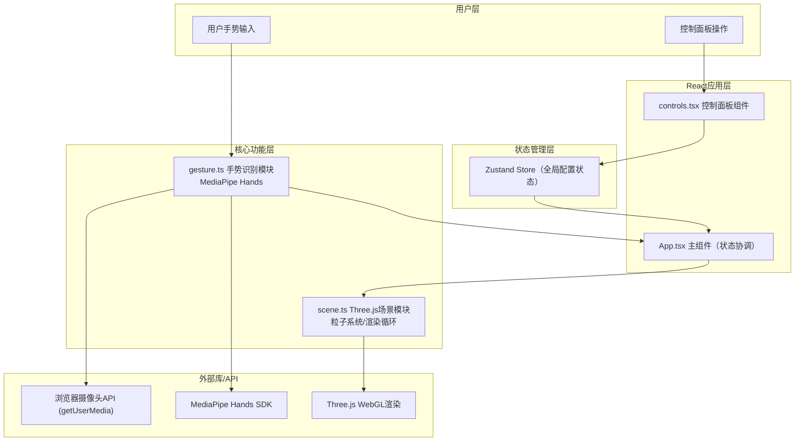

## 1. 架构设计
项目采用模块化前端架构，无后端服务，纯浏览器端运行。



## 2. 技术说明
- **前端框架**：React 18 + TypeScript
- **构建工具**：Vite 5.x
- **3D渲染**：Three.js 0.160+，使用原生Three.js而非react-three-fiber（用户明确要求）
- **手势识别**：@mediapipe/hands + @mediapipe/camera_utils
- **状态管理**：Zustand（轻量级，适合小型全局状态）
- **辅助工具**：uuid（生成唯一ID）
- **样式方案**：内联样式 + CSS（毛玻璃效果、圆角等）

## 3. 项目文件结构
```
auto169/
├── .trae/documents/           # 项目文档
│   ├── PRD-粒子雕塑生成工具.md
│   └── 技术架构-粒子雕塑生成工具.md
├── index.html                  # 入口HTML
├── package.json                # 依赖配置
├── vite.config.js              # Vite构建配置
├── tsconfig.json               # TypeScript配置
└── src/
    ├── main.tsx                # React入口
    ├── App.tsx                 # 主组件，状态协调
    ├── scene.ts                # Three.js场景管理
    ├── gesture.ts              # MediaPipe手势识别
    └── controls.tsx            # 控制面板UI组件
```

## 4. 模块详细设计

### 4.1 Zustand 状态管理 (Store)
```typescript
interface SculptureState {
  // 配置参数
  particleCount: number;       // 500-5000
  colorTheme: 'nebula' | 'fire' | 'frost' | 'aurora';
  isFrozen: boolean;
  
  // Actions
  setParticleCount: (n: number) => void;
  setColorTheme: (t: string) => void;
  toggleFrozen: () => void;
  reset: () => void;
}
```

### 4.2 scene.ts Three.js场景模块
- `ParticleScene` 类：封装Three.js场景、相机、渲染器
- 粒子系统：使用 `BufferGeometry` + `PointsMaterial`，位置/颜色存储在BufferAttribute中
- 粒子群管理：基于空间索引的选取算法，根据指尖坐标找到最近的N个粒子
- 拖拽轨迹：环形缓冲区（Ring Buffer）存储192条轨迹点，渐变透明度和颜色
- 方法接口：
  - `init(canvas: HTMLCanvasElement)` - 初始化场景
  - `setParticleCount(count: number)` - 更新粒子数量
  - `setColorTheme(theme: string)` - 更新颜色主题
  - `selectParticles(fingerPos: Vector3)` - 选取最近粒子群
  - `dragParticles(targetPos: Vector3)` - 拖拽移动
  - `scaleParticles(scaleFactor: number)` - 缩放
  - `setFrozen(frozen: boolean)` - 冻结/解冻
  - `reset()` - 重置
  - `dispose()` - 清理资源

### 4.3 gesture.ts 手势识别模块
- `GestureDetector` 类：封装MediaPipe Hands
- 指尖检测：landmark[4]拇指指尖，landmark[8]食指指尖
- 捏合检测：两指尖距离小于阈值（如30px）→ 捏合状态
- 双手检测：同时检测两只手，识别缩放手势
- 坐标转换：将图像坐标(0-1)归一化转换为Three.js场景坐标
- 事件回调：
  - `onPinchStart: (handIndex, scenePos) => void`
  - `onPinchMove: (handIndex, scenePos) => void`
  - `onPinchEnd: (handIndex) => void`
  - `onTwoHandScale: (scaleFactor) => void`
- 性能优化：requestAnimationFrame同步，降低延迟

### 4.4 controls.tsx 控制面板
- React函数组件，从Zustand store读取状态并调用actions更新
- 粒子数量滑块：`<input type="range">` 500-5000 step=100
- 颜色主题切换：4个按钮，使用CSS变量切换高亮
- 冻结按钮：切换isFrozen状态，文字在"冻结"/"解冻"间切换
- 重置按钮：调用store.reset()，同时触发scene.reset()

### 4.5 App.tsx 主组件
- 协调各模块数据流的核心
- 使用useRef持有canvas和video元素
- 初始化顺序：创建ParticleScene → 创建GestureDetector → 绑定事件回调
- useEffect监听Zustand store变化，同步配置到ParticleScene
- 布局：
  - 全屏Canvas (Three.js渲染目标)
  - 左上角video预览窗（z-index: 10）
  - 右上角控制面板（z-index: 10）
  - 隐藏的原始video元素（MediaPipe输入源）

## 5. 数据流时序
```
用户手势 → 摄像头 → MediaPipe Hands → gesture.ts 事件回调
                                          ↓
App.tsx 接收手势事件 → 调用 scene.ts 方法
                                          ↓
                              Three.js 渲染下一帧
                                          
控制面板操作 → Zustand Store 更新 → App.tsx 监听 → scene.ts 更新配置
```

## 6. 性能保障措施
1. **手势识别**：MediaPipe Hands GPU加速模式，目标<50ms延迟
2. **粒子渲染**：BufferGeometry单draw call，5000粒子目标60fps，最低30fps
3. **轨迹优化**：环形缓冲区复用，不重复创建对象
4. **内存管理**：dispose()清理Three.js资源和MediaPipe实例
5. **帧率监控**：可选console输出FPS（开发模式）
