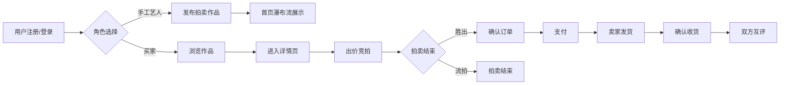

## 1. 产品概述

手工艺品线上拍卖平台，连接手工艺人与买家，实现作品发布、实时竞拍、订单管理和评价功能。
- 目标用户：手工艺创作者（卖家）和手工艺品爱好者（买家）
- 市场价值：为手工艺品提供专属拍卖渠道，提升作品价值和交易效率

## 2. 核心功能

### 2.1 用户角色

| 角色 | 注册方式 | 核心权限 |
|------|----------|----------|
| 手工艺人（卖家） | 用户名密码注册 | 发布拍卖作品、管理订单、更新物流、评价买家 |
| 买家 | 用户名密码注册 | 浏览作品、参与竞拍、确认订单、支付、评价卖家 |

### 2.2 功能模块

1. **首页**：作品瀑布流展示、导航栏、登录注册入口、发布作品入口
2. **作品详情页**：作品图片轮播、出价面板、出价记录列表、评价展示区
3. **订单管理页**：订单列表、收货地址编辑、订单状态流转、物流更新

### 2.3 页面详情

| 页面名称 | 模块名称 | 功能描述 |
|----------|----------|----------|
| 首页 | 瀑布流作品列表 | 卡片展示缩略图、名称、当前最高价、倒计时，实时更新 |
| 首页 | 发布作品弹窗 | 填写作品信息、上传图片（本地/URL）、设置起拍价和截止时间 |
| 作品详情页 | 出价模块 | 输入出价金额，验证高于当前最高价，出价后价格闪烁2秒绿色高亮 |
| 作品详情页 | 出价记录列表 | 按时间倒序展示所有出价记录，包含出价者昵称和金额 |
| 作品详情页 | 评价展示区 | 展示买卖双方互评内容 |
| 订单管理页 | 订单列表 | 展示用户所有订单，支持状态筛选 |
| 订单管理页 | 地址编辑 | 编辑收货地址、确认订单 |
| 订单管理页 | 物流更新 | 卖家更新订单物流状态 |

## 3. 核心流程

## 4. 用户界面设计

### 4.1 设计风格
- **主色调**：琥珀色渐变（#D97706 → #F59E0B）、米白色背景（#FEF3C7）、深棕色文字（#78350F）
- **按钮风格**：圆角8px，hover时放大1.05倍并加深颜色，过渡动画0.3s
- **字体**：标题使用 Noto Serif SC（衬线字体，体现手工艺品质感），正文使用 Noto Sans SC
- **布局风格**：卡片式设计，轻微阴影（box-shadow: 0 4px 12px rgba(120, 53, 15, 0.1)），圆角12px
- **图标风格**：线性图标，琥珀色填充，与整体暖色调协调

### 4.2 页面设计概述

| 页面名称 | 模块名称 | UI元素 |
|----------|----------|--------|
| 首页 | 导航栏 | 暖色调渐变背景，logo在左，登录/注册/发布按钮在右 |
| 首页 | 作品卡片 | 缩略图圆角裁剪，底部半透明信息条显示名称、价格、倒计时 |
| 首页 | 瀑布流布局 | 桌面端3列，平板2列，移动端单列，卡片间距20px |
| 作品详情页 | 图片轮播 | 支持多张图片切换，指示器琥珀色 |
| 作品详情页 | 出价按钮 | 琥珀色渐变背景，hover时放大加深，点击有涟漪效果 |
| 作品详情页 | 价格闪烁 | 出价成功后数字变绿色，放大1.2倍，2秒后恢复 |
| 订单管理页 | 状态标签 | 不同状态使用不同暖色（待付款-橙色，已完成-绿色） |

### 4.3 响应式设计
- 桌面端（≥1024px）：瀑布流3列布局，侧边栏显示用户信息
- 平板端（768px-1023px）：瀑布流2列布局，导航栏简化
- 移动端（<768px）：瀑布流单列布局，底部标签栏导航，触控按钮尺寸≥44px

### 4.4 动画效果
- 页面加载：卡片依次淡入（staggered animation，每个延迟100ms）
- 倒计时：每秒更新，最后10秒数字变红并轻微抖动
- 出价成功：价格数字从琥珀色变为绿色，放大1.2倍，2秒内平滑恢复
- 卡片hover：上移4px，阴影加深，过渡0.3s
