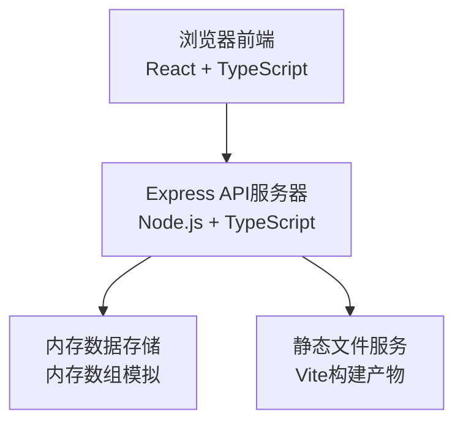
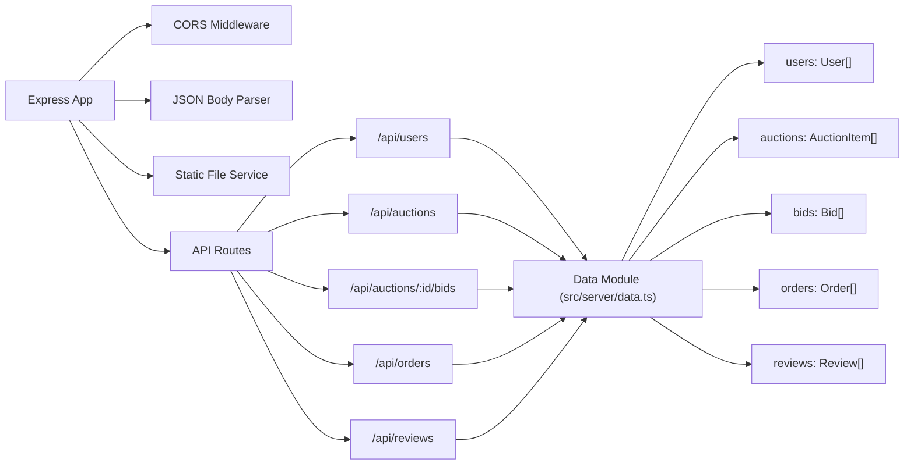
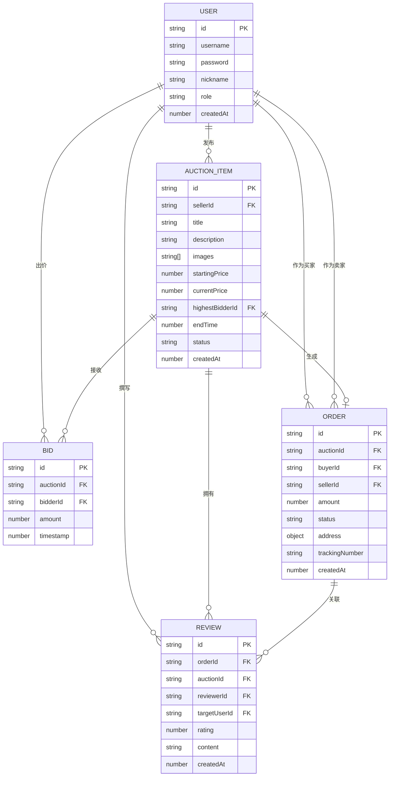

## 1. 架构设计



## 2. 技术描述

- **前端**：React 18 + TypeScript + Vite，使用CSS变量管理主题
- **构建工具**：Vite 5，支持React Fast Refresh和TypeScript
- **后端**：Express 4 + TypeScript，提供REST API
- **数据存储**：内存数组模拟数据库，使用uuid生成唯一ID
- **跨域处理**：cors中间件
- **状态管理**：React Context + useReducer进行全局状态管理

## 3. 路由定义

| 路由 | 页面 | 功能描述 |
|------|------|----------|
| / | 首页 | 瀑布流作品列表，登录/注册，发布作品 |
| /auction/:id | 作品详情页 | 作品信息、出价、出价记录、评价 |
| /orders | 订单管理页 | 订单列表、地址编辑、状态流转 |

## 4. API 定义

### 4.1 用户接口

```typescript
// 用户类型
interface User {
  id: string;
  username: string;
  password: string;
  nickname: string;
  role: 'seller' | 'buyer';
  avatar?: string;
  createdAt: number;
}

// POST /api/users/register
interface RegisterRequest {
  username: string;
  password: string;
  nickname: string;
  role: 'seller' | 'buyer';
}
interface RegisterResponse {
  success: boolean;
  user: Omit<User, 'password'>;
}

// POST /api/users/login
interface LoginRequest {
  username: string;
  password: string;
}
interface LoginResponse {
  success: boolean;
  user: Omit<User, 'password'>;
}
```

### 4.2 作品接口

```typescript
// 作品类型
interface AuctionItem {
  id: string;
  sellerId: string;
  sellerName: string;
  title: string;
  description: string;
  images: string[];
  startingPrice: number;
  currentPrice: number;
  highestBidderId?: string;
  highestBidderName?: string;
  endTime: number;
  status: 'active' | 'ended' | 'sold';
  createdAt: number;
}

// GET /api/auctions - 获取作品列表
// POST /api/auctions - 发布作品
interface CreateAuctionRequest {
  title: string;
  description: string;
  images: string[];
  startingPrice: number;
  endTime: number;
}
// GET /api/auctions/:id - 获取作品详情
```

### 4.3 出价接口

```typescript
// 出价记录类型
interface Bid {
  id: string;
  auctionId: string;
  bidderId: string;
  bidderName: string;
  amount: number;
  timestamp: number;
}

// POST /api/auctions/:id/bid - 出价
interface BidRequest {
  amount: number;
}
interface BidResponse {
  success: boolean;
  newPrice: number;
  bid: Bid;
}
// GET /api/auctions/:id/bids - 获取出价记录
```

### 4.4 订单接口

```typescript
// 订单类型
interface Order {
  id: string;
  auctionId: string;
  auctionTitle: string;
  auctionImage: string;
  buyerId: string;
  buyerName: string;
  sellerId: string;
  sellerName: string;
  amount: number;
  status: 'pending_payment' | 'paid' | 'pending_shipping' | 'shipped' | 'completed';
  address?: {
    name: string;
    phone: string;
    address: string;
  };
  trackingNumber?: string;
  createdAt: number;
  paidAt?: number;
  shippedAt?: number;
  completedAt?: number;
}

// GET /api/orders - 获取用户订单列表
// POST /api/orders - 创建订单（拍卖结束自动创建）
// PUT /api/orders/:id/address - 更新收货地址
// PUT /api/orders/:id/status - 更新订单状态
```

### 4.5 评价接口

```typescript
// 评价类型
interface Review {
  id: string;
  orderId: string;
  auctionId: string;
  reviewerId: string;
  reviewerName: string;
  reviewerRole: 'buyer' | 'seller';
  targetUserId: string;
  rating: number;
  content: string;
  createdAt: number;
}

// POST /api/reviews - 提交评价
// GET /api/auctions/:id/reviews - 获取作品评价
```

## 5. 服务器架构图



## 6. 数据模型

### 6.1 ER图



### 6.2 初始化数据

```typescript
// 初始化用户
const initialUsers: User[] = [
  { id: '1', username: 'seller1', password: '123456', nickname: '工匠老张', role: 'seller', createdAt: Date.now() },
  { id: '2', username: 'buyer1', password: '123456', nickname: '收藏家小李', role: 'buyer', createdAt: Date.now() },
  { id: '3', username: 'buyer2', password: '123456', nickname: '文艺青年小王', role: 'buyer', createdAt: Date.now() },
];

// 初始化拍卖作品
const initialAuctions: AuctionItem[] = [
  {
    id: '1',
    sellerId: '1',
    sellerName: '工匠老张',
    title: '手工紫砂茶壶',
    description: '传统工艺制作，选用宜兴紫砂泥，手工打造，泡茶绝佳。',
    images: ['https://images.unsplash.com/photo-1594631252845-29fc4cc8cde9?w=400', 'https://images.unsplash.com/photo-1578474846511-04ba529f0b88?w=400'],
    startingPrice: 200,
    currentPrice: 350,
    highestBidderId: '2',
    highestBidderName: '收藏家小李',
    endTime: Date.now() + 3600000 * 2,
    status: 'active',
    createdAt: Date.now() - 3600000,
  },
  // 更多初始作品...
];
```
