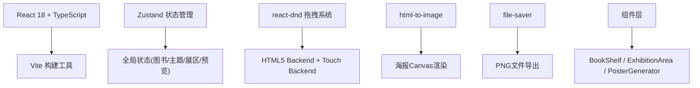

## 1. 架构设计


## 2. 技术描述
- **前端框架**: React@18 + TypeScript + Vite
- **状态管理**: Zustand (轻量级，性能优异)
- **拖拽功能**: react-dnd + react-dnd-html5-backend + react-dnd-touch-backend
- **海报导出**: html-to-image (DOM转Canvas) + file-saver (文件保存)
- **唯一标识**: uuid
- **样式方案**: 原生CSS + CSS变量 (不使用Tailwind，保持文艺风格定制化)

## 3. 项目结构
```
auto170/
├── index.html
├── vite.config.js
├── package.json
├── tsconfig.json
└── src/
    ├── main.tsx          # React根入口
    ├── App.tsx           # 主布局组件(三栏+响应式)
    ├── types.ts          # TypeScript类型定义
    ├── stores/
    │   └── store.ts      # Zustand全局状态
    ├── components/
    │   ├── BookShelf.tsx       # 左侧书库面板
    │   ├── ExhibitionArea.tsx  # 中央展区
    │   ├── PosterGenerator.tsx # 海报生成器
    │   ├── BookCard.tsx        # 书籍卡片组件
    │   ├── ThemeTag.tsx        # 主题标签组件
    │   └── HistoryPanel.tsx    # 右侧历史面板
    └── utils/
        ├── mockData.ts         # 模拟图书数据
        └── exportUtils.ts      # 导出工具函数
```

## 4. 类型定义 (src/types.ts)
```typescript
export interface IBook {
  id: string;
  title: string;
  author: string;
  price: number;
  cover: string;
  category: 'fiction' | 'non-fiction';
  genre: 'literature' | 'social' | 'art' | 'history' | 'science' | 'philosophy';
  description: string;
}

export interface ITheme {
  id: string;
  name: string;
  color: string;
  bookIds: string[];
}

export interface IExhibition {
  id: string;
  title: string;
  themes: ITheme[];
  uncategorizedBooks: string[];
  createdAt: string;
  updatedAt: string;
  status: 'draft' | 'published';
}

export interface IBookShelfState {
  books: IBook[];
  filterCategory: 'all' | 'fiction' | 'non-fiction';
  filterGenre: string;
}

export interface IExhibitionState {
  currentExhibition: IExhibition | null;
  exhibitions: IExhibition[];
  isPreviewOpen: boolean;
  isFullscreen: boolean;
}

export type ThemeColor = 
  | '#D85A5A' | '#36A2A2' | '#9B72AA' | '#D4A843'
  | '#B5795B' | '#F0E5D8' | '#6C8EB2' | '#C9A9C6';

export const THEME_COLORS: ThemeColor[] = [
  '#D85A5A', '#36A2A2', '#9B72AA', '#D4A843',
  '#B5795B', '#F0E5D8', '#6C8EB2', '#C9A9C6'
];
```

## 5. Zustand 状态设计 (src/stores/store.ts)
```typescript
import { create } from 'zustand';
import { IBook, IExhibition, ITheme, IBookShelfState, IExhibitionState } from '../types';

interface AppState extends IBookShelfState, IExhibitionState {
  // 书库操作
  setFilterCategory: (cat: 'all' | 'fiction' | 'non-fiction') => void;
  setFilterGenre: (genre: string) => void;
  getFilteredBooks: () => IBook[];
  
  // 展区操作
  createNewExhibition: (title: string) => void;
  addBookToExhibition: (bookId: string) => void;
  removeBookFromExhibition: (bookId: string) => void;
  addTheme: (name: string, color: string) => void;
  removeTheme: (themeId: string) => void;
  reorderThemes: (fromIndex: number, toIndex: number) => void;
  addBookToTheme: (themeId: string, bookId: string) => void;
  removeBookFromTheme: (themeId: string, bookId: string) => void;
  reorderBooksInTheme: (themeId: string, fromIndex: number, toIndex: number) => void;
  
  // 预览操作
  setPreviewOpen: (open: boolean) => void;
  setFullscreen: (fullscreen: boolean) => void;
  
  // 持久化操作
  saveExhibition: (status: 'draft' | 'published') => void;
  loadExhibition: (id: string) => void;
  deleteExhibition: (id: string) => void;
}
```

## 6. 核心组件职责

### 6.1 App.tsx
- 三栏式布局管理
- 响应式状态监听 (window.resize)
- 抽屉式面板切换控制(<900px)
- DndProvider 包装

### 6.2 BookShelf.tsx
- 分类筛选UI
- 图书卡片渲染
- useDrag 拖拽源配置
- 筛选逻辑

### 6.3 ExhibitionArea.tsx
- 虚线网格背景
- 主题标签创建与管理
- useDrop 放置目标配置
- 标签拖拽排序
- 书籍放入标签的脉冲动画
- 弹性过渡动画

### 6.4 PosterGenerator.tsx
- 海报布局渲染(800x600px)
- 瀑布流书单展示
- html-to-image 导出逻辑
- file-saver 保存PNG(1920x1440px)
- 全屏模式

### 6.5 HistoryPanel.tsx
- 历史书展列表滚动
- 状态徽标(草稿/已发布)
- 编辑/删除操作
- 删除确认对话框

## 7. 拖拽类型定义
```typescript
// 拖拽项类型常量
export const ItemTypes = {
  BOOK: 'book',
  THEME: 'theme',
};

// 拖拽载荷
interface BookDragItem {
  type: typeof ItemTypes.BOOK;
  bookId: string;
  source: 'shelf' | 'exhibition' | 'theme';
  themeId?: string;
}

interface ThemeDragItem {
  type: typeof ItemTypes.THEME;
  themeId: string;
  index: number;
}
```

## 8. 动画配置
```css
:root {
  --transition-fast: 0.2s ease;
  --transition-normal: 0.3s cubic-bezier(0.34, 1.56, 0.64, 1);
  --transition-slow: 0.4s ease;
  
  --book-card-shadow: 0 2px 8px rgba(0,0,0,0.06);
  --book-card-dragging-shadow: 0 8px 24px rgba(0,0,0,0.15), 0 0 0 3px rgba(212, 168, 67, 0.3);
  --theme-pulse-shadow: 0 0 0 4px rgba(255,255,255,0.4);
}

.book-card-dragging {
  transform: scale(1.05) rotate(2deg);
  box-shadow: var(--book-card-dragging-shadow);
  z-index: 1000;
}

.book-drop-animation {
  animation: dropBounce 0.3s cubic-bezier(0.34, 1.56, 0.64, 1);
}

@keyframes dropBounce {
  0% { transform: scale(1.05) rotate(2deg); opacity: 0.8; }
  100% { transform: scale(1) rotate(0deg); opacity: 1; }
}

.theme-pulse {
  animation: themePulse 0.4s ease-out;
}

@keyframes themePulse {
  0% { transform: scale(1); box-shadow: none; }
  50% { transform: scale(1.08); box-shadow: 0 0 0 4px rgba(255,255,255,0.4); }
  100% { transform: scale(1); box-shadow: none; }
}
```

## 9. 性能优化
1. **Zustand 选择器**：使用 shallow 比较避免不必要重渲染
2. **React.memo**：对 BookCard、ThemeTag 等频繁渲染组件包裹
3. **useCallback**：缓存拖拽回调函数
4. **CSS transforms**：动画使用 transform 而非 top/left 触发 GPU 加速
5. **will-change**：对拖拽元素添加 will-change: transform
6. **requestAnimationFrame**：导出时使用 RA 确保流畅

## 10. 依赖版本
```json
{
  "react": "^18.2.0",
  "react-dom": "^18.2.0",
  "typescript": "^5.3.0",
  "vite": "^5.0.0",
  "@vitejs/plugin-react": "^4.2.0",
  "zustand": "^4.4.7",
  "react-dnd": "^16.0.1",
  "react-dnd-html5-backend": "^16.0.1",
  "react-dnd-touch-backend": "^16.0.1",
  "file-saver": "^2.0.5",
  "html-to-image": "^1.11.11",
  "uuid": "^9.0.1",
  "@types/file-saver": "^2.0.7",
  "@types/uuid": "^9.0.7"
}
```
