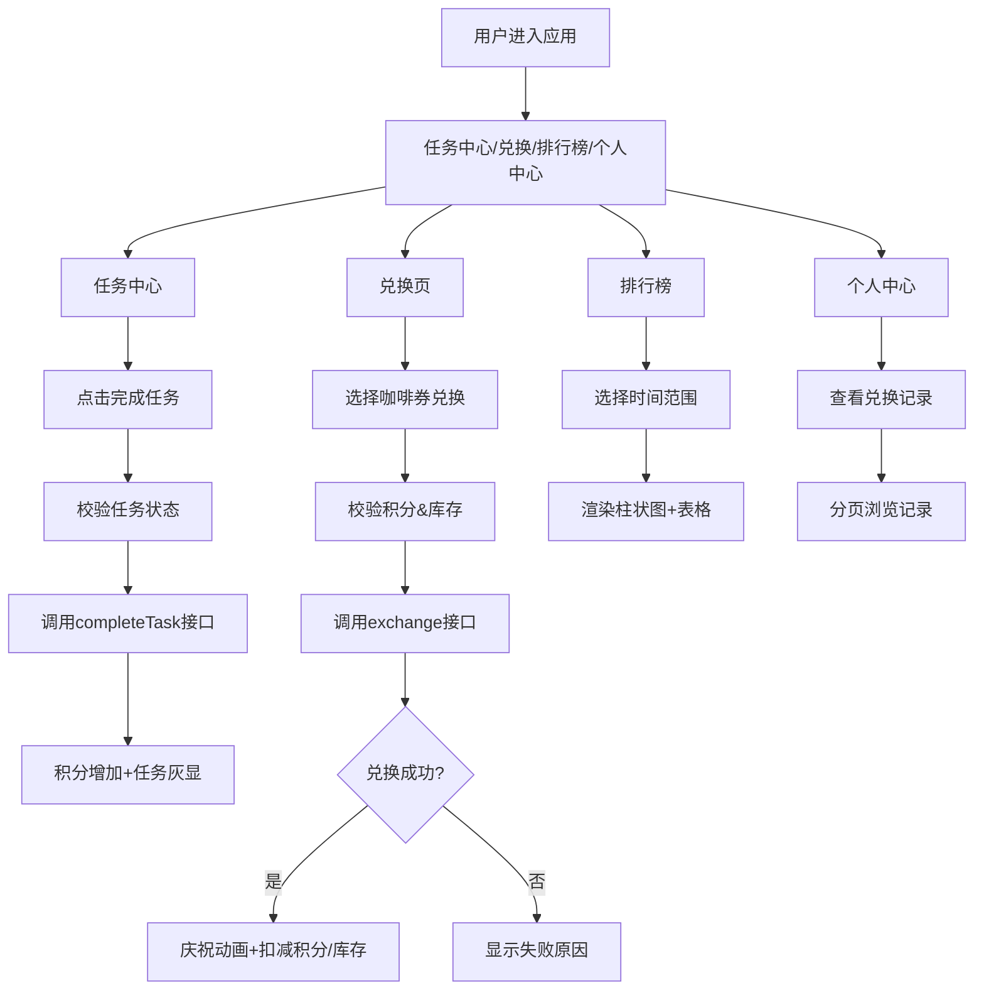

## 1. 产品概述

虚拟联名咖啡积分兑换与社区互动平台，用户通过完成社区任务赚取积分，兑换限定联名咖啡券，实时查看兑换排行榜和咖啡库存。

- 核心目标：提升社区用户活跃度，通过积分兑换机制激励用户参与社区互动
- 目标用户：社区注册用户，咖啡爱好者
- 市场价值：结合社区运营与虚拟商品兑换，增强用户粘性和归属感

## 2. 核心功能

### 2.1 用户角色

| 角色 | 注册方式 | 核心权限 |
|------|----------|----------|
| 普通用户 | 系统默认用户（模拟） | 完成任务赚取积分、兑换咖啡券、查看排行榜、查看兑换记录 |

### 2.2 功能模块

1. **任务中心页**：展示社区任务列表，用户点击完成任务获取积分
2. **咖啡兑换页**：展示联名咖啡券列表，用户使用积分兑换咖啡券
3. **排行榜页**：展示用户积分排行榜柱状图和当前用户排名
4. **个人中心页**：展示用户兑换记录和积分明细

### 2.3 页面详情

| 页面名称 | 模块名称 | 功能描述 |
|----------|----------|----------|
| 任务中心页 | 任务卡片列表 | 展示4种社区任务（每日签到、发表主题帖、评论10条、分享链接），每个任务显示图标、名称、积分奖励，完成后按钮灰显，次日0点重置 |
| 咖啡兑换页 | 咖啡券卡片网格 | 展示5种联名咖啡券（美式、拿铁、摩卡、冷萃、特调），每行3张卡片，显示品牌、口味、所需积分、剩余库存，库存为0时禁用兑换 |
| 排行榜页 | 柱状图+表格 | Recharts柱状图展示前10名用户积分（渐变蓝色#1890FF到#69C0FF），支持周/月/全部时间范围切换，表格显示当前用户排名 |
| 个人中心页 | 兑换记录表 | 展示最近20条兑换记录，包含兑换时间、咖啡名称、消耗积分，支持分页 |

## 3. 核心流程

### 3.1 任务积分流程

用户进入任务中心 → 浏览可完成任务 → 点击完成任务按钮 → 系统校验任务状态 → 调用服务端接口增加积分 → 本地状态更新 → 显示积分增加动画 → 任务按钮灰显

### 3.2 咖啡兑换流程

用户进入兑换页 → 浏览咖啡券卡片 → 选择咖啡券点击兑换 → 校验积分是否充足 → 校验库存是否充足 → 调用服务端兑换接口 → 扣减积分和库存 → 显示庆祝动画（彩屑飘落+勋章图标）或失败提示

### 3.3 排行榜查看流程

用户进入排行榜页 → 选择时间范围（周/月/全部） → 调用服务端获取排行数据 → 渲染柱状图和表格 → 高亮当前用户排名

## 4. 用户界面设计

### 4.1 设计风格

- **主色调**：暖橙色#D4A574、深咖啡色#6B4226
- **辅助色**：米白色#FFF8F0（背景）、浅卡其色#F5E6D3（卡片底色）
- **图表色**：渐变蓝色#1890FF到#69C0FF
- **按钮风格**：渐变色过渡，圆角8px，悬停放大效果
- **字体**：使用系统字体栈，标题加粗，正文清晰易读
- **布局风格**：左右分栏布局，左侧280px固定导航菜单，右侧主内容区
- **卡片风格**：box-shadow: 0 2px 8px rgba(0,0,0,0.1)，border-radius: 8px
- **图标风格**：使用Ant Design Icons，与咖啡/社区主题呼应

### 4.2 页面设计概述

| 页面名称 | 模块名称 | UI元素 |
|----------|----------|--------|
| 任务中心页 | 任务卡片列表 | 卡片网格布局（每行2张），每个卡片含图标、任务名称、积分奖励、完成按钮，淡入动画，悬停阴影加深 |
| 咖啡兑换页 | 咖啡券卡片网格 | 每行3张卡片，鼠标悬停放大1.05倍，显示兑换按钮，库存不足显示"已兑罄"，渐变色按钮 |
| 排行榜页 | 柱状图区域（60%）+ 表格区域（40%） | 顶部时间范围下拉选择器，柱状图X轴用户昵称Y轴积分，表格高亮当前用户 |
| 个人中心页 | 用户信息+兑换记录表 | 顶部显示用户头像昵称积分，下方表格展示兑换记录，分页器底部居中 |

### 4.3 响应式设计

- **桌面端（>768px）**：左右分栏布局，左侧导航280px固定宽度
- **移动端（≤768px）**：左侧导航折叠为汉堡菜单，点击展开全屏覆盖，内容区全宽显示，卡片网格自适应为单列
- **触摸优化**：按钮最小高度44px，间距充足，避免误触

### 4.4 动画与反馈

- 页面加载：任务图标和咖啡券图片淡入动画（fadeIn 0.5s）
- 积分变化：数字上弹动画
- 兑换成功：彩屑飘落动画+勋章图标弹窗
- 卡片悬停：transform: scale(1.05) 放大效果
- 按钮点击：轻微缩放反馈
