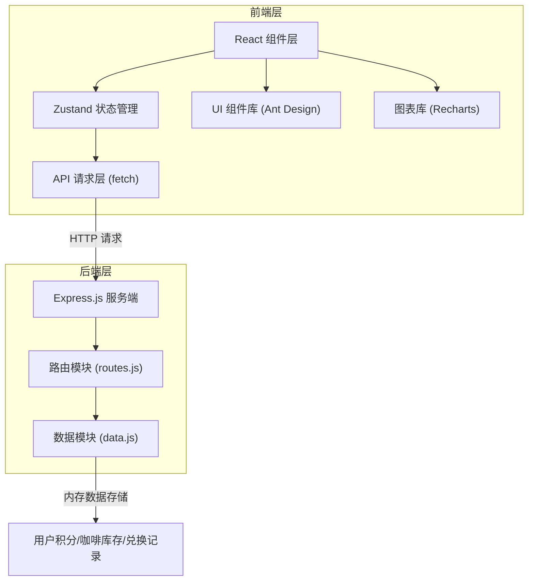
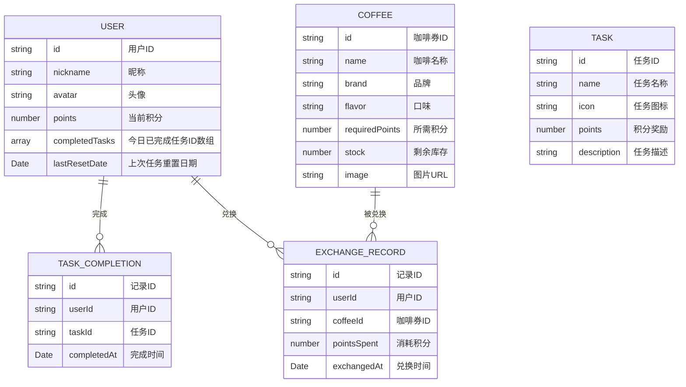

## 1. 架构设计



## 2. 技术描述

- **前端框架**：React 18 + TypeScript 5
- **构建工具**：Vite 5
- **UI组件库**：Ant Design 5 + @ant-design/icons
- **状态管理**：Zustand 4
- **图表库**：Recharts 2
- **后端服务**：Express.js 4
- **跨域处理**：cors 2
- **唯一ID生成**：uuid 9
- **并行启动**：concurrently 8
- **开发模式**：前后端同时启动，Vite代理API请求到Express服务

## 3. 项目目录结构

```
auto172/
├── package.json              # 项目依赖和脚本
├── vite.config.js            # Vite构建配置（含代理）
├── tsconfig.json             # TypeScript配置（严格模式）
├── index.html                # 入口HTML
├── server/
│   ├── data.js               # 模拟数据库（内存存储）
│   └── routes.js             # Express路由处理
└── src/
    ├── App.tsx               # 主应用组件（路由配置）
    ├── main.tsx              # 应用入口
    ├── pages/
    │   ├── TaskPage.tsx      # 任务中心页
    │   ├── ExchangePage.tsx  # 咖啡兑换页
    │   ├── RankPage.tsx      # 排行榜页
    │   └── ProfilePage.tsx   # 个人中心页
    ├── stores/
    │   └── store.ts          # Zustand全局状态管理
    ├── types/
    │   └── index.ts          # TypeScript类型定义
    └── utils/
        └── api.ts            # API请求封装
```

## 4. 路由定义

| 前端路由 | 页面组件 | 功能 |
|----------|----------|------|
| / | TaskPage | 任务中心页（默认首页） |
| /exchange | ExchangePage | 咖啡兑换页 |
| /rank | RankPage | 排行榜页 |
| /profile | ProfilePage | 个人中心页 |

| 后端API路由 | 请求方法 | 功能 |
|-------------|----------|------|
| /api/user | GET | 获取当前用户信息（积分、已完成任务） |
| /api/tasks | GET | 获取任务列表 |
| /api/completeTask | POST | 完成任务，增加积分 |
| /api/coffees | GET | 获取咖啡券列表（含库存） |
| /api/exchange | POST | 兑换咖啡券，扣减积分和库存 |
| /api/rank | GET | 获取排行榜数据（支持timeRange参数） |
| /api/exchangeRecords | GET | 获取当前用户兑换记录（分页） |

## 5. 数据模型定义



## 6. 核心数据流

### 6.1 任务完成数据流

```
用户点击任务完成按钮
    ↓
TaskPage组件调用store.completeTask(taskId)
    ↓
Zustand store发起fetch POST /api/completeTask
    ↓
Express routes.js接收请求
    ↓
调用data.js查询用户和任务数据
    ↓
校验任务是否已完成、更新用户积分、标记任务完成
    ↓
返回JSON响应{success, points, message}
    ↓
Zustand store更新本地状态{user.points, user.completedTasks}
    ↓
TaskPage组件重新渲染，按钮灰显，积分数字动画
```

### 6.2 兑换数据流

```
用户点击咖啡券兑换按钮
    ↓
ExchangePage组件调用store.exchangeCoffee(coffeeId)
    ↓
Zustand store发起fetch POST /api/exchange
    ↓
Express routes.js接收请求
    ↓
调用data.js查询用户积分和咖啡库存
    ↓
校验积分充足、库存充足、扣减积分和库存、创建兑换记录
    ↓
返回JSON响应{success, message, remainingStock}
    ↓
Zustand store更新本地状态{user.points, coffees[].stock}
    ↓
ExchangePage组件显示成功庆祝动画或失败提示
```

## 7. 性能约束实现

- **接口响应**：使用setTimeout 300-500ms模拟网络延迟
- **首次加载**：Vite代码分割，按需加载路由组件
- **图表渲染**：Recharts组件使用memo优化，避免不必要重渲染
- **动画性能**：CSS transform和opacity属性动画，保证60FPS
- **状态更新**：Zustand选择器优化订阅，减少不必要重渲染

## 8. TypeScript类型定义

```typescript
interface User {
  id: string;
  nickname: string;
  avatar: string;
  points: number;
  completedTasks: string[];
  lastResetDate: string;
}

interface Task {
  id: string;
  name: string;
  icon: string;
  points: number;
  description: string;
}

interface Coffee {
  id: string;
  name: string;
  brand: string;
  flavor: string;
  requiredPoints: number;
  stock: number;
  image: string;
}

interface ExchangeRecord {
  id: string;
  userId: string;
  coffeeId: string;
  coffeeName: string;
  pointsSpent: number;
  exchangedAt: string;
}

interface RankItem {
  userId: string;
  nickname: string;
  avatar: string;
  points: number;
  rank: number;
}

type TimeRange = 'week' | 'month' | 'all';
```
