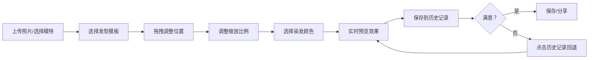

## 1. 产品概述
虚拟发型设计工作坊是一款在线发型试戴应用，用户可上传照片或使用内置模特，实时预览不同发型和发色的效果。
- 主要面向爱美人士、美发从业者，解决"想换发型但不确定效果的痛点，提供便捷的虚拟试戴体验，降低决策成本。
- 产品目标：打造日系清新风格的发型设计工具，让用户轻松发现适合自己的发型和发色。

## 2. 核心功能

### 2.1 功能模块
1. **主画布区**：800x600px 固定尺寸画布，照片上传与裁剪，发型叠加与拖拽调整
2. **发型选择面板**：5种预设发型（长发、短发、卷发、马尾、丸子头），缩放滑块调整大小
3. **发色选择面板**：12种染发色板，3x4网格排列
4. **历史记录面板**：记录每次应用的发型和颜色，支持回退和删除
5. **工具栏**：撤销、重置、拍照保存、分享

### 2.3 页面详情
| 页面名称 | 模块名称 | 功能描述 |
|-----------|-------------|---------------------|
| 主页面 | 照片画布 | 800x600px画布，支持照片上传裁剪，发型拖拽定位，像素级染发效果
| 主页面 | 发型面板 | 左侧280px宽度，发型列表+缩放滑块+色板网格
| 主页面 | 历史面板 | 右侧200px宽度，历史记录列表，点击回退，删除按钮
| 主页面 | 工具栏 | 画布顶部工具按钮，Material Design图标，悬停效果

## 3. 核心流程
用户上传照片或选择内置模特 → 在左侧面板选择发型 → 拖拽调整发型位置和大小 → 选择染发颜色 → 查看实时效果 → 可随时通过历史记录回退 → 满意后保存或分享

## 4. 用户界面设计

### 4.1 设计风格
- 主色调：米白#FFF8E1、浅灰蓝#B3D4E0
- 背景色：画布#F0F0F0，左侧面板#FAFAFA，右侧面板#F5F5F5
- 按钮和面板圆角统一12px
- 字体：Noto Sans SC 或系统无衬线体
- 图标风格：Material Design
- 交互过渡：所有交互持续0.3s ease-out

### 4.2 页面设计概述
| 页面名称 | 模块名称 | UI 元素 |
|-----------|-------------|-------------|
| 主页面 | 照片画布 | 800x600px浅灰背景，发型半透明PNG叠加，拖拽交互，脉动动画 |
| 主页面 | 发型面板 | 280px宽度，顶部2px阴影，发型卡片列表，色板3x4网格，缩放滑块 |
| 主页面 | 历史面板 | 200px宽度，历史记录项带删除按钮（红色#E53935，悬停放大1.2倍） |
| 主页面 | 工具栏 | 按钮悬停浅蓝#E3F2FD背景，Material Design图标 |

### 4.3 交互细节
- 发型调整时：opacity从0.8到1.0循环脉动，周期1.5秒
- 色板选中：3px白色边框+0.5倍放大shadow动画
- 无操作3秒后右下角浮现提示「试试拖拽发型位置吧」，0.5s渐入渐出
- 性能要求：重绘帧率≥50fps，照片上传到可交互≤1.5秒
