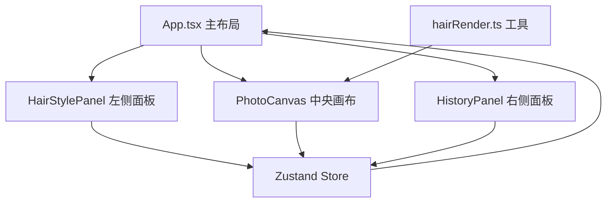

## 1. 架构设计



## 2. 技术描述
- 前端：React@18 + TypeScript + Vite
- 状态管理：Zustand
- 唯一ID：uuid
- 渲染：Canvas API 像素操作

## 3. 项目结构
```
d:\Pro\tasks\auto176\
├── package.json
├── vite.config.js
├── tsconfig.json
├── index.html
└── src/
    ├── App.tsx
    ├── store/
    │   └── useAppStore.ts
    ├── components/
    │   ├── PhotoCanvas.tsx
    │   ├── HairStylePanel.tsx
    │   └── HistoryPanel.tsx
    └── utils/
        └── hairRender.ts
```

## 4. 数据模型

### 4.1 Store 状态定义

```typescript
interface HairStyle {
  id: string;
  name: string;
  imageUrl: string;
}

interface HistoryItem {
  id: string;
  hairStyleId: string;
  color: string;
  position: { x: number; y: number };
  scale: number;
  timestamp: number;
}

interface AppState {
  photoDataUrl: string | null;
  currentHairStyle: HairStyle | null;
  hairPosition: { x: number; y: number };
  hairScale: number;
  currentColor: string | null;
  history: HistoryItem[];
  undoStack: HistoryItem[];
  redoStack: HistoryItem[];
}
```

### 4.2 Store Action

```typescript
interface AppActions {
  setPhoto: (dataUrl: string) => void;
  setHairStyle: (style: HairStyle) => void;
  setHairPosition: (pos: { x: number; y: number }) => void;
  setHairScale: (scale: number) => void;
  setColor: (color: string) => void;
  addToHistory: () => void;
  restoreHistory: (item: HistoryItem) => void;
  removeHistory: (id: string) => void;
  undo: () => void;
  redo: () => void;
  reset: () => void;
}
```

## 5. 核心模块说明

### 5.1 PhotoCanvas.tsx
- 维护 Canvas 渲染循环，保证 ≥50fps
- 处理鼠标拖拽事件
- 调用 hairRender 工具进行发型合成和像素着色
- 无操作提示动画

### 5.2 HairStylePanel.tsx
- 渲染5种发型模板列表
- 渲染12种发色3x4网格
- 缩放滑块（0.5-2.0，步长0.1）
- 选中状态动画

### 5.3 HistoryPanel.tsx
- 监听 history 变化
- 列表渲染历史项
- 回退和删除功能

### 5.4 hairRender.ts
- `applyHairOverlay`: Canvas 合成发型 PNG
- `applyDyeColor`: 像素操作替换颜色，保留纹理

## 6. 性能优化
- requestAnimationFrame 渲染循环
- 离屏 Canvas 缓存发型
- 像素操作使用 Uint32Array 批量处理
- 防抖处理高频事件
