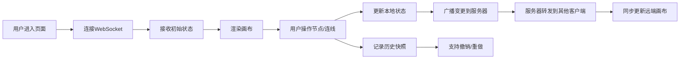

## 1. 产品概述

在线思维导图协作编辑工具，为在线教育场景设计，支持学生与教师围绕课程主题共同构建、梳理知识脉络。通过 Canvas 2D 实现高性能节点与连线渲染，结合 WebSocket 实现多人实时协作，帮助用户直观地组织和分享知识结构。

## 2. 核心功能

### 2.1 用户角色
| 角色 | 注册方式 | 核心权限 |
|------|----------|----------|
| 教师/学生 | 无需注册，直接访问 | 创建/编辑/删除节点和连线、实时协作、导出PNG、撤销/重做 |

### 2.2 功能模块
1. **画布编辑器**：Canvas 2D 渲染节点和连线，支持拖拽、缩放、平移
2. **工具栏**：添加根节点、撤销/重做、导出PNG、缩放控制
3. **属性面板**：编辑节点标签、修改颜色、添加子节点
4. **实时协作**：WebSocket 同步所有编辑操作，多人实时查看
5. **历史记录**：50步撤销/重做支持

### 2.3 页面详情
| 页面名称 | 模块名称 | 功能描述 |
|----------|----------|----------|
| 主编辑页 | Canvas 画布 | 节点渲染、连线渲染、拖拽移动、滚轮缩放、空格+拖拽平移 |
| 主编辑页 | 顶部工具栏 | 添加根节点、撤销/重做、导出PNG、缩放比例调整（25%-200%） |
| 主编辑页 | 右侧属性面板 | 编辑节点标签、选择背景色、添加子节点按钮 |
| 主编辑页 | 同步提示条 | 绿色提示条显示"已同步X条更新"，2秒后渐隐 |

## 3. 核心流程

用户进入页面 → 初始化空画布/加载同步状态 → 双击创建根节点 → 拖拽节点调整位置 → 从锚点拖拽创建连线 → 选中节点编辑属性 → 操作自动同步至协作者 → 可撤销/重做任意操作 → 导出为PNG

## 4. 用户界面设计

### 4.1 设计风格
- **主色调**：极简亮色风格，背景 #FAFAFA，画布 #FFFFFF
- **强调色**：选中边框 #2196F3，锚点青色 #00BCD4，连线 #78909C
- **按钮风格**：圆角矩形，图标+文字，悬停浅蓝 #E3F2FD，按下 #BBDEFB
- **字体**：14px 节点标签，颜色 #333333；12px 缩放提示，颜色 #78909C
- **布局**：顶部工具栏56px，左右面板320px，中心画布区域
- **图标**：Material Design 风格，使用 lucide-react 图标库

### 4.2 页面设计概述
| 页面名称 | 模块名称 | UI 元素 |
|----------|----------|---------|
| 主编辑页 | Canvas 画布 | 白色背景、浅灰边框1px、节点圆角矩形带阴影、贝塞尔曲线连线带箭头 |
| 主编辑页 | 顶部工具栏 | 白底、底部阴影0 1px 3px rgba(0,0,0,0.08)、按钮横向排列 |
| 主编辑页 | 右侧属性面板 | 320px宽、白色背景、输入框编辑标签、8色预设取色板 |
| 主编辑页 | 同步提示条 | 绿色背景 #E8F5E9、文字 #2E7D32、顶部悬浮、2秒渐隐 |

### 4.3 响应式
- **桌面端（≥1024px）**：右侧属性面板固定展开，宽度320px
- **移动端（<1024px）**：右侧面板折叠为侧边抽屉，从右侧滑入；右下角浮动按钮触发抽屉
- **触摸优化**：节点触摸区域扩大，支持双指缩放

### 4.4 动画效果
- 所有过渡动画时长 200ms ease-out
- 节点移动、面板展开/收起平滑过渡
- 缩放比例显示淡入动画
- 同步提示条渐隐动画
