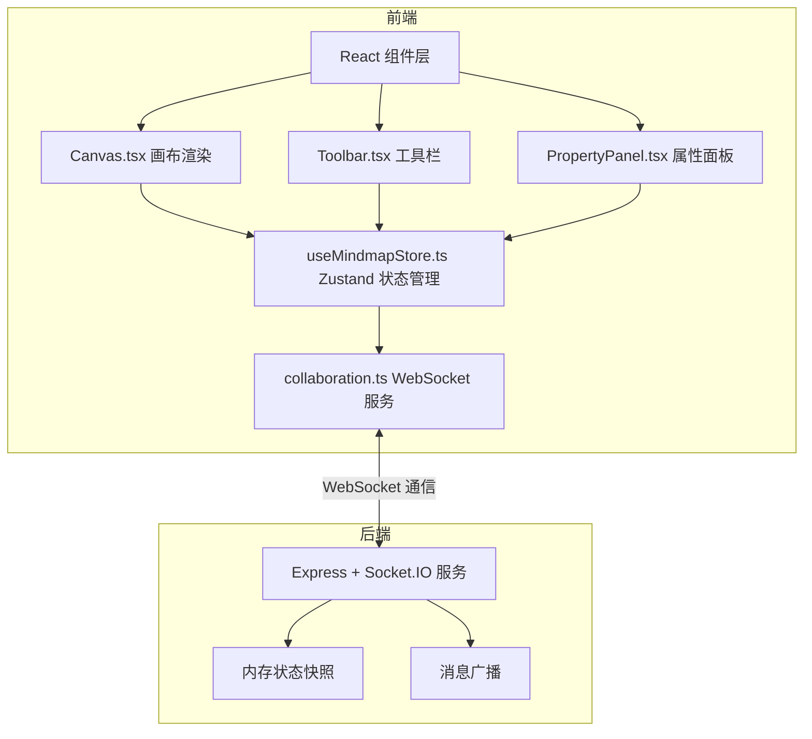
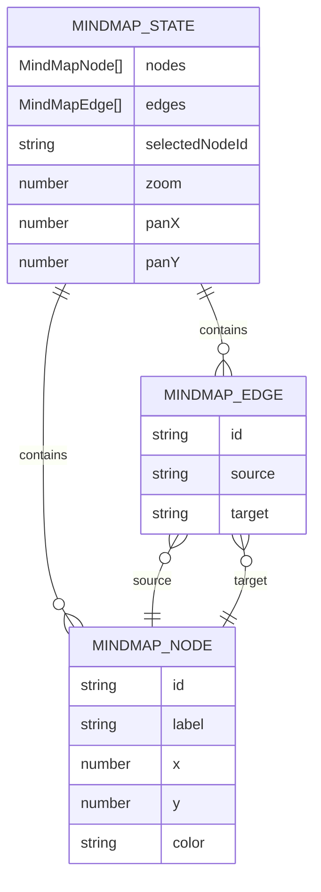

## 1. 架构设计



## 2. 技术描述

- **前端**：React@18 + TypeScript + Vite + Zustand + Socket.IO-Client + Canvas 2D
- **构建工具**：Vite 5，配置 React + TypeScript 支持，代理 /socket.io 到后端 3001 端口
- **状态管理**：Zustand，包含历史栈中间件实现撤销/重做
- **实时通信**：Socket.IO-Client 4.x，连接后端 3001 端口
- **后端**：Express@4 + Socket.IO@4，端口 3001，内存状态管理
- **图标库**：lucide-react

## 3. 目录结构

```
├── package.json
├── vite.config.js
├── tsconfig.json
├── index.html
├── src/
│   ├── main.tsx
│   ├── App.tsx
│   └── modules/
│       └── editor/
│           ├── components/
│           │   ├── Canvas.tsx          # 画布渲染组件
│           │   ├── Toolbar.tsx         # 顶部工具栏
│           │   └── PropertyPanel.tsx   # 右侧属性面板
│           ├── store/
│           │   └── useMindmapStore.ts  # Zustand 状态仓库
│           └── services/
│               └── collaboration.ts    # WebSocket 协作服务
└── server/
    └── index.ts                        # Express + Socket.IO 后端
```

## 4. 数据模型定义

### 4.1 节点 (Node)
```typescript
interface MindMapNode {
  id: string;           // UUID
  label: string;        // 节点文本
  x: number;            // X坐标
  y: number;            // Y坐标
  color: string;        // 背景色
  width?: number;       // 节点宽度（自动计算）
  height?: number;      // 节点高度（自动计算）
}
```

### 4.2 连线 (Edge)
```typescript
interface MindMapEdge {
  id: string;           // UUID
  source: string;       // 源节点ID
  target: string;       // 目标节点ID
}
```

### 4.3 导图状态 (MindMapState)
```typescript
interface MindMapState {
  nodes: MindMapNode[];
  edges: MindMapEdge[];
  selectedNodeId: string | null;
  zoom: number;         // 缩放比例 0.25 - 2.0
  panX: number;         // 平移X偏移
  panY: number;         // 平移Y偏移
}
```

### 4.4 ER 图


## 5. 核心模块数据流向

### 5.1 状态管理数据流
```
用户操作 → 组件调用 store action → 更新 state → 触发组件重新渲染
                              → 记录历史快照（用于撤销/重做）
                              → 触发 WebSocket 广播
```

### 5.2 协作同步数据流
```
本地变更 → store.subscribe → socket.emit('mindmap-update', state) 
                          → 服务器广播 → 其他客户端 socket.on → store.replaceState
```

### 5.3 画布渲染数据流
```
store state → Canvas 组件读取 nodes/edges → Canvas 2D 绘制
        ← 用户交互（拖拽/点击）→ store dispatch 更新坐标/选中状态
```

## 6. API 定义

### 6.1 WebSocket 事件
| 事件名称 | 方向 | 数据 | 说明 |
|----------|------|------|------|
| `mindmap-update` | 客户端→服务器 | `MindMapState` | 客户端状态变更广播 |
| `mindmap-update` | 服务器→客户端 | `MindMapState` | 服务器转发状态更新 |
| `mindmap-init` | 服务器→客户端 | `MindMapState` | 新连接初始化状态 |

### 6.2 Store Actions
| 方法名 | 参数 | 返回值 | 说明 |
|--------|------|--------|------|
| `addNode` | `(label: string, x: number, y: number)` | `void` | 添加新节点 |
| `moveNode` | `(id: string, x: number, y: number)` | `void` | 移动节点 |
| `updateNode` | `(id: string, updates: Partial<MindMapNode>)` | `void` | 更新节点属性 |
| `removeNode` | `(id: string)` | `void` | 删除节点及关联连线 |
| `addEdge` | `(source: string, target: string)` | `void` | 添加连线 |
| `removeEdge` | `(id: string)` | `void` | 删除连线 |
| `selectNode` | `(id: string \| null)` | `void` | 选中/取消选中节点 |
| `setZoom` | `(zoom: number)` | `void` | 设置缩放比例 |
| `setPan` | `(x: number, y: number)` | `void` | 设置平移偏移 |
| `undo` | - | `void` | 撤销上一步 |
| `redo` | - | `void` | 重做下一步 |
| `exportPNG` | - | `void` | 导出为PNG图片 |
