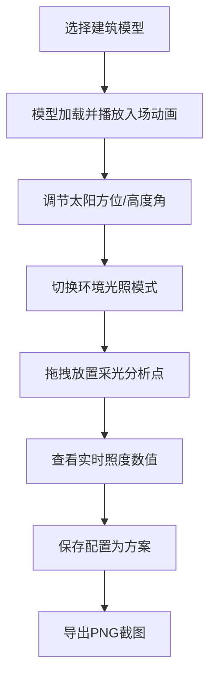

## 1. 产品概述
交互式3D建筑光照分析应用，帮助设计师和业主通过直观的3D场景探索建筑在自然光照下的光影变化与室内采光效果，解决传统方案评审中难以早期感受光照影响的问题。
- 主要用途：建筑设计方案的光照可视化分析与方案对比
- 目标用户：建筑设计师、业主方决策者、方案评审专家
- 产品价值：将抽象的采光数据转化为可交互的3D可视化体验，提升早期方案沟通效率

## 2. 核心功能

### 2.1 用户角色
| 角色 | 登录方式 | 核心权限 |
|------|----------|----------|
| 设计师/业主 | 无需登录（本地应用） | 使用全部功能，保存/导出方案 |

### 2.2 功能模块
1. **3D场景区**：建筑模型展示、实时光照渲染、采光点交互
2. **左侧控制面板**：模型选择、太阳方位/高度调节、环境光照模式切换
3. **右侧方案面板**：方案卡片列表、保存当前配置、导出截图

### 2.3 页面详情
| 页面名称 | 模块名称 | 功能描述 |
|----------|----------|----------|
| 主页面 | 3D场景区 | 展示建筑模型、支持旋转缩放、太阳方向光柱、采光点拖拽放置 |
| 主页面 | 左侧控制面板(320px) | 模型选择按钮组、太阳方位角/高度角滑块、环境模式切换按钮 |
| 主页面 | 右侧方案面板 | 方案卡片网格(200x120px)、保存按钮、导出按钮 |

## 3. 核心流程
用户从建筑模型库选择模型 → 调节太阳方位和高度观察光影变化 → 切换环境光照模式 → 拖拽放置采光分析点查看照度 → 保存满意配置为方案 → 导出PNG截图留档

## 4. 界面设计

### 4.1 设计风格
- **主色调**：暗色主题背景 #1A1A2E，墙体米白 #E8E0D8，屋顶深灰 #555555
- **强调色**：天蓝 #87CEEB（窗户）、淡黄 #FFD54F（光柱）、亮黄 #FFFF00（采光点）、紫色渐变 #4A00E0 → #8E2DE2（滑块）
- **按钮风格**：半透明磨砂玻璃，圆角，悬停透明度提升，阴影过渡
- **字体**：system-ui, sans-serif，文字颜色 #E0E0E0，标签字号 13px，照度数值 monospace 12px 白色描边
- **布局风格**：三栏水平布局，比例 70%（场景）: 20%（控制）: 10%（方案），固定分配宽度
- **图标风格**：使用 lucide-react 图标库，统一线性风格

### 4.2 页面设计概览
| 页面名称 | 模块名称 | UI元素 |
|----------|----------|--------|
| 主页面 | 3D场景区 | 暗色背景、网格参考平面、方向光柱、脉动采光立方体、实时照度标签 |
| 主页面 | 控制面板 | 毛玻璃背景、模型按钮组、渐变滑块（发光手柄）、模式按钮、悬停上浮阴影 |
| 主页面 | 方案面板 | 卡片列表 200x120px、圆角、悬停上浮 4px、保存/导出按钮 |

### 4.3 响应式设计
- 桌面端优先（1080p+），三栏固定比例布局
- 低分辨率下控制面板宽度自适应为280px，方案面板支持纵向滚动
- 3D场景区域始终保证最小 600x400px 可视区域

### 4.4 3D场景指导
- **环境与氛围**：暗色深空背景配合暖色光照，突出建筑轮廓与光影对比
- **光照设置**：方向光模拟太阳，支持多环境光预设（晴天/阴天/黄昏/室内）
- **相机设置**：PerspectiveCamera，初始距离约8单位，支持OrbitControls拖拽旋转Y轴、滚轮缩放
- **构图焦点**：模型居中展示，下方2x2半透明网格参考面
- **交互与动画**：入场3秒Y轴旋转一周动画；采光点脉动缩放；光照变化0.5秒lerp过渡
- **后处理**：无需特殊后处理，依赖Three.js基础光照与阴影计算
- **资源与性能**：纯代码构建几何体（纯色面片），零外部模型资源，采光点≤3个时≥50FPS
