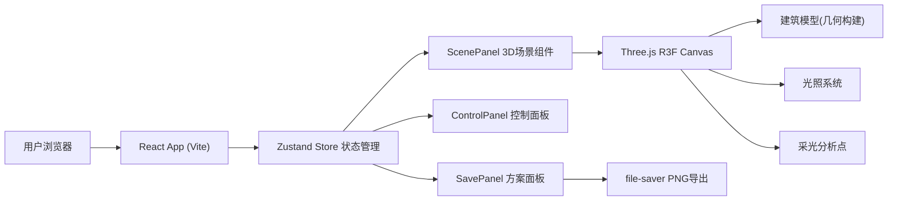

## 1. 架构设计



## 2. 技术栈描述
- **前端框架**：React 18 + TypeScript
- **构建工具**：Vite 5
- **3D渲染**：Three.js + @react-three/fiber + @react-three/drei
- **状态管理**：Zustand 4
- **工具库**：uuid（唯一ID）、file-saver（文件下载）
- **无后端服务**：纯前端单页应用，数据全部保存在浏览器内存

## 3. 路由定义
| 路由路径 | 页面功能 |
|----------|----------|
| / | 主应用页面，三栏布局（场景/控制/方案） |

## 4. 数据模型

### 4.1 核心数据结构

```typescript
interface BuildingModel {
  id: string;
  name: string;
  type: 'villa' | 'office' | 'museum';
  wallsColor: string;
  windowsColor: string;
  roofColor: string;
}

interface LightConfig {
  sunAzimuth: number;     // 0-360度
  sunElevation: number;   // 0-90度
  mode: 'sunny' | 'cloudy' | 'dusk' | 'indoor';
}

interface AnalysisPoint {
  id: string;
  position: { x: number; y: number; z: number };
  illuminance: number;
}

interface SavedScheme {
  id: string;
  name: string;
  timestamp: number;
  modelId: string;
  cameraPosition: [number, number, number];
  lightConfig: LightConfig;
  analysisPoints: AnalysisPoint[];
  thumbnail?: string;
}
```

### 4.2 Zustand Store 定义

| 状态字段 | 类型 | 说明 |
|----------|------|------|
| currentModelId | string | 当前选中的建筑模型ID |
| lightConfig | LightConfig | 太阳与环境光配置 |
| analysisPoints | AnalysisPoint[] | 采光分析点列表（≤3） |
| schemes | SavedScheme[] | 已保存的方案列表 |
| setCurrentModel | (id)=>void | 切换模型 |
| setSunAzimuth/Elevation | (n)=>void | 调节太阳参数 |
| setLightMode | (mode)=>void | 切换环境模式 |
| addAnalysisPoint | (point)=>void | 添加采光点（超量时替换最早） |
| removeAnalysisPoint | (id)=>void | 删除采光点 |
| saveScheme | (name, camera)=>void | 保存当前配置为方案 |
| loadScheme | (id)=>void | 加载方案配置 |
| deleteScheme | (id)=>void | 删除方案 |

## 5. 文件结构

```
auto180/
├── index.html              # 应用入口（全屏暗色背景）
├── package.json            # 依赖与脚本（npm run dev）
├── vite.config.js          # Vite React+TS 配置
├── tsconfig.json           # TS严格模式 ES2020
└── src/
    ├── main.tsx            # React根渲染
    ├── App.tsx             # 主布局（三栏：70/20/10）
    ├── types.ts            # 所有接口类型定义
    ├── store.ts            # Zustand 全局 Store
    └── components/
        ├── ScenePanel.tsx      # R3F Canvas + 模型/光照/采光点
        ├── ControlPanel.tsx    # 左侧控制面板（320px毛玻璃）
        └── SavePanel.tsx       # 右侧方案卡片面板
```

## 6. 关键实现要点

### 6.1 3D场景渲染
- 使用 `@react-three/fiber` 的 `<Canvas>` 承载 Three.js 场景
- 建筑模型由基础几何体（BoxGeometry、PlaneGeometry）组合构建，材质为 MeshStandardMaterial
- 入场动画：`useFrame` 钩子在3秒内绕Y轴旋转 2π 弧度后停止
- 光照过渡：保存目标值，useFrame 内用 `THREE.MathUtils.lerp` 在 0.5s 内平滑插值

### 6.2 采光分析点交互
- 通过 `useThree` + `raycaster` 实现点击拾取表面位置
- 拖拽：跟随鼠标世界坐标投影，绘制半透明虚线轨迹（Line + dashed material）
- 照度计算：基于光源方向与表面法线夹角（Lambert余弦定律）× 光源强度系数

### 6.3 方案导出截图
- 使用 `<Canvas gl={{ preserveDrawingBuffer: true }}/>` 保留缓冲区
- `gl.domElement.toDataURL('image/png')` 获取图片
- `file-saver` 的 `saveAs()` 触发下载，文件名格式：`方案名_YYYYMMDD_HHmmss.png`

### 6.4 性能优化
- 几何体复用（建筑各部位 geometry 缓存）
- 采光点限制最大3个
- useFrame 中避免每帧创建新对象
- OrbitControls 开启 enableDamping 提升手感

## 7. 质量标准
- 类型：TypeScript 严格模式，零 `any` 类型
- 性能：稳定 60FPS，3个采光点时 ≥ 50FPS
- 交互：所有操作 0.5s 内平滑响应，无卡顿
- 视觉：颜色与规格严格遵循设计规范
