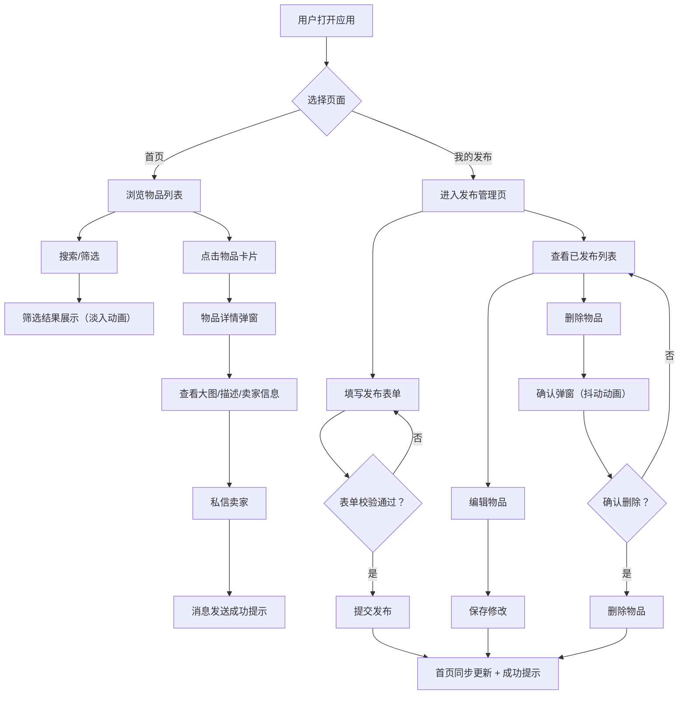

## 1. 产品概述

虚拟社区二手集市是一个面向社区居民的闲置物品交易平台，旨在促进社区内物品循环利用，方便居民发布、交换或出售闲置物品，并通过可视化热力图展示社区交易活跃度。

- **核心价值**：为社区居民提供便捷的二手交易渠道，增强社区互动，减少资源浪费
- **目标用户**：社区管理者、社区居民（卖家和买家）

## 2. 核心功能

### 2.1 用户角色
| 角色 | 权限说明 |
|------|----------|
| 普通用户 | 浏览物品、搜索筛选、查看物品详情、私信卖家、发布物品、管理已发布物品 |
| 社区管理者 | 上述所有权限，查看社区交易热力图 |

### 2.2 功能模块
1. **首页（HomePage）**：导航栏、搜索筛选区、物品列表卡片、社区交易热力图
2. **我的发布页（MyListingsPage）**：发布物品表单、已发布物品列表管理（编辑/删除）
3. **物品详情弹窗（Modal）**：物品大图、完整描述、卖家信息、私信功能

### 2.3 页面详情
| 页面名称 | 模块名称 | 功能描述 |
|---------|---------|----------|
| 首页 | 导航栏 | 品牌Logo、导航链接（首页/我的发布）、用户头像 |
| 首页 | 搜索筛选区 | 关键字搜索、类别下拉筛选（家具/电器/书籍/服装/其他）、价格范围滑块 |
| 首页 | 物品列表 | 卡片式展示（缩略图/名称/价格/用户头像/距离）、分页（每页20个）、淡入动画 |
| 首页 | 热力图 | Recharts热力图展示各区域交易活跃度（X轴时间/天，Y轴区域，颜色深浅表示交易量） |
| 我的发布页 | 发布表单 | 名称（必填/50字内）、类别（下拉）、描述（可选/500字内）、价格（必填/正整数）、图片URL（最多3张） |
| 我的发布页 | 已发布列表 | 查看自己的物品、编辑（修改价格和描述）、删除（带确认弹窗） |
| 物品详情弹窗 | 详情展示 | 大图轮播、完整描述、卖家用户名+注册时间 |
| 物品详情弹窗 | 私信功能 | 输入简短消息、提交后显示"已发送"提示 |

## 3. 核心流程

### 3.1 主要用户流程描述

1. **浏览物品流程**：用户进入首页 → 浏览物品卡片 → 使用搜索/分类/价格筛选 → 点击卡片查看详情 → 查看卖家信息 → 私信卖家
2. **发布物品流程**：用户进入"我的发布"页 → 填写表单（名称/类别/描述/价格/图片）→ 提交 → 首页立即显示新物品 → 成功提示
3. **管理物品流程**：用户进入"我的发布"页 → 查看已发布列表 → 编辑价格/描述 → 保存更新；或点击删除 → 确认弹窗 → 删除成功 → 首页同步更新

### 3.2 Mermaid流程图

## 4. 用户界面设计

### 4.1 设计风格

- **主色调**：暖色调，淡米色背景（#FFF8E7），深棕色导航栏（#5D4037）配白色文字
- **辅助色**：浅棕（#D7CCC8）、棕褐（#8D6E63）、中棕色（#8D6E63）
- **卡片样式**：白色背景（#FFFFFF），box-shadow: 0 2px 8px rgba(0,0,0,0.1)
- **卡片悬停**：阴影加深 + 轻微上移（transform: translateY(-4px)，transition 0.3s）
- **搜索栏**：淡入淡出焦点效果（border-color从#D7CCC8变为#8D6E63）
- **热力图配色**：从浅绿（#C8E6C9）到深红（#B71C1C）渐变
- **表单输入**：聚焦时浅棕色下划线动画
- **删除确认弹窗**：抖动动画效果
- **字体**：中文友好字体，优先使用系统字体栈
- **布局风格**：顶部导航 + 卡片网格布局

### 4.2 页面设计概述

| 页面名称 | 模块名称 | UI元素与动画 |
|---------|---------|-------------|
| 首页 | 导航栏 | 深棕色背景，白色文字，Logo左侧，导航链接居中，用户头像右侧，悬停高亮 |
| 首页 | 搜索筛选区 | 圆角搜索框，类别下拉菜单，双滑块价格范围，实时响应更新 |
| 首页 | 物品列表 | 响应式网格（桌面3列/平板2列/手机1列），卡片悬停上浮，新卡片淡入（opacity 0→1，translateY 10px→0，stagger动画） |
| 首页 | 热力图 | 固定高度400px，鼠标悬停显示具体交易数，响应式宽度100% |
| 我的发布页 | 发布表单 | 分组排列输入框，必填项标红星，提交按钮渐变背景，输入框聚焦下划线动画 |
| 我的发布页 | 列表管理 | 每行显示物品缩略图+基本信息，右侧编辑/删除按钮，删除确认弹窗居中显示带抖动 |
| 物品详情弹窗 | 详情内容 | 半屏高度Modal，左侧大图轮播，右侧详情信息，私信输入框在底部 |

### 4.3 响应式设计

- **设计优先级**：桌面优先（Desktop-first），移动端自适应
- **断点设置**：
  - 手机（< 768px）：物品列表单列堆叠，热力图全宽，导航栏简化
  - 平板（768px - 1024px）：物品列表两列，热力图全宽
  - 桌面（≥ 1024px）：物品列表三列，标准布局
- **触控优化**：按钮最小高度44px，卡片点击区域扩大，滑动手势支持
