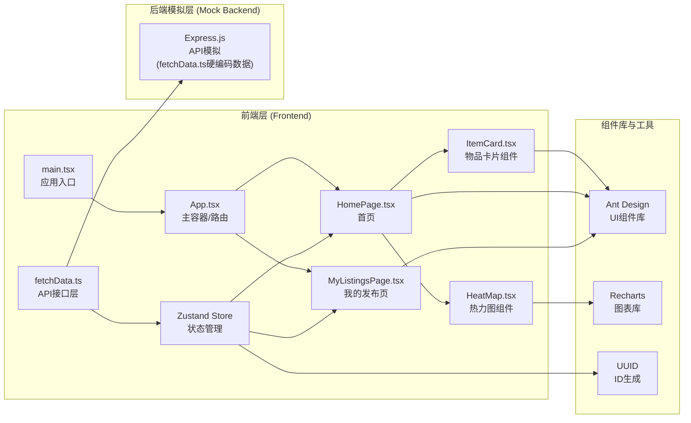

## 1. 架构设计



**调用关系与数据流向说明**：

| 调用关系 | 说明 |
|---------|------|
| main.tsx → App.tsx | 应用入口挂载主容器，提供全局Context |
| App.tsx → HomePage / MyListingsPage | 根据路由渲染对应页面，传递全局状态 |
| HomePage → fetchData.ts | 调用API获取物品列表和热力图数据 |
| HomePage → Zustand Store | 订阅状态变化，获取筛选条件和物品数据 |
| HomePage → ItemCard | 遍历物品列表，渲染卡片组件 |
| HomePage → HeatMap | 传入热力图数据，渲染图表组件 |
| MyListingsPage → fetchData.ts | 调用API发布/编辑/删除物品 |
| MyListingsPage → Zustand Store | 更新全局状态，触发首页同步更新 |
| ItemCard → HomePage | 点击事件回调，触发详情弹窗 |
| fetchData.ts → Express模拟 | 硬编码数据模拟后端响应（实际为纯函数） |

## 2. 技术描述

- **前端框架**：React 18 + TypeScript 5.x
- **构建工具**：Vite 5.x + @vitejs/plugin-react
- **UI组件库**：Ant Design 5.x + @ant-design/icons
- **图表库**：Recharts 2.x（热力图组件）
- **状态管理**：Zustand 4.x（轻量级状态管理）
- **工具库**：UUID 9.x（生成物品唯一ID）
- **后端模拟**：Express.js + CORS（数据硬编码在fetchData.ts中）
- **样式方案**：CSS Modules + 全局CSS变量
- **代码规范**：TypeScript严格模式（strict: true），target ES2020

## 3. 路由定义

| 路由路径 | 页面组件 | 说明 |
|---------|---------|------|
| / | HomePage | 首页，物品列表、搜索筛选、热力图 |
| /my-listings | MyListingsPage | 我的发布页，发布表单、已发布管理 |

**路由实现方式**：使用React Router DOM或App.tsx内的状态路由（根据当前激活导航项切换页面）。

## 4. API定义（fetchData.ts模拟接口）

### 4.1 TypeScript类型定义

```typescript
// 物品类别
export type ItemCategory = '家具' | '电器' | '书籍' | '服装' | '其他';

// 用户信息
export interface User {
  id: string;
  name: string;
  avatar: string;
  registerDate: string;
}

// 物品信息
export interface Item {
  id: string;
  name: string;
  category: ItemCategory;
  description: string;
  price: number;
  images: string[];
  sellerId: string;
  sellerName: string;
  sellerAvatar: string;
  sellerRegisterDate: string;
  distance: string;
  area: '东区' | '西区' | '南区' | '北区';
  createdAt: string;
}

// 热力图数据点
export interface HeatMapData {
  day: string;        // X轴：日期（如 6月1日）
  area: string;       // Y轴：区域（东区/西区/南区/北区）
  count: number;      // 交易数量
}

// 搜索筛选参数
export interface FilterParams {
  keyword: string;
  category: ItemCategory | '全部';
  minPrice: number;
  maxPrice: number;
}
```

### 4.2 API接口函数

| 函数名 | 参数 | 返回值 | 说明 |
|-------|------|--------|------|
| fetchItems | filter?: FilterParams | Promise\<Item\[\]\> | 获取物品列表，支持筛选 |
| fetchHeatMapData | - | Promise\<HeatMapData\[\]\> | 获取社区热力图数据 |
| createItem | data: Omit\<Item, 'id' \| 'createdAt'\> | Promise\<Item\> | 发布新物品 |
| updateItem | id: string, data: Partial\<Item\> | Promise\<Item\> | 更新物品信息 |
| deleteItem | id: string | Promise\<boolean\> | 删除物品 |
| sendMessage | itemId: string, message: string | Promise\<boolean\> | 发送私信（模拟） |
| fetchCurrentUser | - | Promise\<User\> | 获取当前登录用户信息 |

## 5. Zustand状态Store设计

```typescript
interface MarketplaceStore {
  // 数据状态
  items: Item[];
  heatMapData: HeatMapData[];
  currentUser: User | null;
  
  // 筛选状态
  filters: FilterParams;
  
  // 加载状态
  isLoading: boolean;
  currentPage: number;
  pageSize: number;
  
  // 操作方法
  setFilters: (filters: Partial<FilterParams>) => void;
  loadItems: () => Promise<void>;
  loadHeatMapData: () => Promise<void>;
  createItem: (data: any) => Promise<void>;
  updateItem: (id: string, data: any) => Promise<void>;
  deleteItem: (id: string) => Promise<void>;
  setPage: (page: number) => void;
}
```

## 6. 文件结构

```
d:\Pro\tasks\auto182\
├── package.json              # 项目依赖与脚本配置
├── vite.config.js            # Vite构建配置
├── tsconfig.json             # TypeScript配置
├── index.html                # 入口HTML
├── server.js                 # Express后端模拟服务
└── src/
    ├── main.tsx              # React应用入口
    ├── App.tsx               # 主容器组件（路由+全局状态）
    ├── index.css             # 全局样式（CSS变量、主题色）
    ├── store/
    │   └── useMarketplaceStore.ts   # Zustand状态管理
    ├── types/
    │   └── index.ts          # TypeScript类型定义
    ├── api/
    │   └── fetchData.ts      # API接口层（模拟后端）
    ├── pages/
    │   ├── HomePage.tsx      # 首页组件
    │   └── MyListingsPage.tsx # 我的发布页组件
    └── components/
        ├── ItemCard.tsx      # 物品卡片组件
        ├── HeatMap.tsx       # 热力图组件
        ├── ItemDetailModal.tsx # 物品详情弹窗
        └── Navbar.tsx        # 导航栏组件
```

## 7. 性能优化方案

### 7.1 物品列表渲染优化
- **分页机制**：每页显示20个物品，使用分页器切换
- **淡入动画**：使用CSS @keyframes实现卡片进入动画，配合stagger延迟
- **React优化**：使用React.memo()包裹ItemCard组件，避免不必要重渲染
- **key优化**：使用item.id作为列表key而非索引

### 7.2 搜索筛选优化
- **防抖处理**：搜索关键字输入使用300ms防抖（useDebounce hook）
- **缓存机制**：筛选结果使用useMemo缓存，依赖项变化时才重新计算
- **状态批处理**：多个筛选条件变化合并为一次状态更新

### 7.3 热力图优化
- **数据懒加载**：组件可见时再加载热力图数据（Intersection Observer）
- **图表复用**：Recharts组件使用纯组件优化
