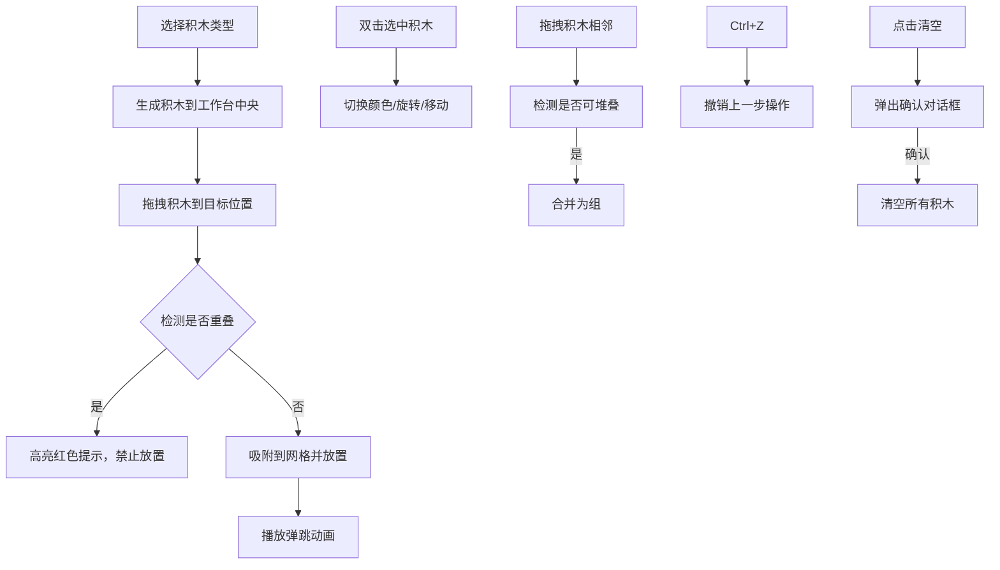

## 1. 产品概述

交互式乐高积木搭建模拟器，让用户在虚拟工作台上通过拖拽、拼接不同颜色和形状的积木块，自由构建模型并实时预览效果。

- 主要用途：提供沉浸式的虚拟积木搭建体验，满足创意构建和模型设计需求
- 目标用户：乐高爱好者、创意设计师、教育工作者及学生
- 产品价值：零成本、无空间限制的创意搭建平台，支持模型预览和分享

## 2. 核心功能

### 2.1 功能模块

1. **工作台场景**：Canvas 2D渲染的虚拟搭建区域，支持网格吸附、积木渲染
2. **工具栏**：积木类型选择、颜色选取、操作控制（撤销/清空）
3. **积木交互**：拖拽放置、旋转、颜色切换、堆叠合并
4. **状态管理**：积木列表、选中状态、操作历史（撤销栈）
5. **信息展示**：实时统计积木数量、占用网格数

### 2.2 页面详情

| 页面名称 | 模块名称 | 功能描述 |
|-----------|-------------|---------------------|
| 主页面 | 工具栏 | 提供5种积木类型选择（2x2、2x4、2x8、1x1、1x2），12种颜色切换，撤销和清空操作按钮 |
| 主页面 | Canvas工作台 | 渲染浅米色背景和网格线，处理鼠标事件实现积木拖拽、放置、旋转、删除等交互 |
| 主页面 | 信息条 | 右下角半透明信息条，实时显示积木总数量和占用网格数 |
| 主页面 | 确认对话框 | 清空工作台时弹出带淡入动画的确认对话框 |

## 3. 核心流程

### 用户操作流程

1. 用户从工具栏选择积木类型，点击后在工作台中央生成红色积木
2. 用户拖拽积木到目标位置，自动吸附到20x20px网格
3. 系统检测重叠，若重叠则高亮红色提示禁止放置
4. 双击已放置积木可选中，通过颜色选择器切换颜色
5. 选中积木后按R键可逆时针旋转90度
6. 拖拽积木与相邻积木堆叠可自动合并为组
7. Ctrl+Z可撤销操作，最多20步历史
8. 点击清空按钮弹出确认对话框，确认后清空所有积木

## 4. 用户界面设计

### 4.1 设计风格

- **主色调**：浅米色#F5F0E8（工作台背景）、白色#FFFFFF（工具栏背景）
- **辅助色**：浅蓝#E3F2FD（悬停）、红色#D32F2F（默认积木色/重叠提示）
- **网格线**：#D4C9B8（主网格）、#E0E0E0（次网格）
- **按钮风格**：40x40px圆角方形，悬停上移2px，带过渡动画
- **字体**：系统默认无衬线字体，平面化设计风格
- **动效**：拖拽半透明（opacity 0.7）、放置弹跳（scale 0.9→1.0，0.2s）、旋转过渡（0.15s ease）、对话框淡入

### 4.2 页面设计概述

| 页面名称 | 模块名称 | UI元素 |
|-----------|-------------|-------------|
| 主页面 | 工具栏 | 左侧240px宽度，白色背景带右侧2px深灰阴影#BDBDBD，积木类型图标按钮，颜色选择器，撤销/清空按钮 |
|主页面 | Canvas工作台 | 浅米色背景，20x20px网格线，积木块渲染，选中状态高亮，拖拽预览 |
| 主页面 | 信息条 | 右下角固定，半透明黑色#00000060背景，白色文字显示统计信息 |
| 主页面 | 确认对话框 | 居中显示，半透明遮罩，淡入动画，确认/取消按钮 |

### 4.3 响应式

- 桌面端优先设计，适配主流分辨率（1280px及以上）
- Canvas区域自适应剩余空间，工具栏固定宽度
- 不支持移动端触控操作（桌面端鼠标交互为主）

### 4.4 性能要求

- 拖拽和旋转帧率不低于55FPS
- 撤销清空操作响应延迟低于100ms
- Canvas渲染优化，避免不必要的重绘
