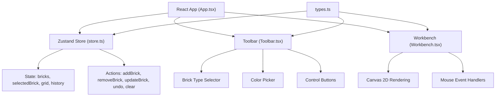

## 1. 架构设计



## 2. 技术描述

- **前端框架**：React 18 + TypeScript 5
- **构建工具**：Vite 5 + @vitejs/plugin-react
- **状态管理**：Zustand 4
- **渲染引擎**：Canvas 2D API
- **唯一标识**：uuid 9
- **包管理器**：npm
- **开发服务器**：Vite dev server

## 3. 项目文件结构

| 文件路径 | 用途说明 |
|----------|----------|
| `package.json` | 项目依赖和脚本配置 |
| `vite.config.js` | Vite构建配置 |
| `tsconfig.json` | TypeScript严格模式配置 |
| `index.html` | 应用入口页面 |
| `src/types.ts` | 积木形状、颜色、位置等接口类型定义 |
| `src/store.ts` | Zustand状态管理，包含积木列表、选中状态、网格状态、撤销栈 |
| `src/App.tsx` | 主应用组件，布局管理，状态初始化 |
| `src/components/Workbench.tsx` | Canvas工作台组件，处理拖拽、放置、旋转、删除交互 |
| `src/components/Toolbar.tsx` | 工具栏组件，积木类型选择、颜色选取、撤销清空功能 |

## 4. 数据模型定义

### 4.1 核心类型定义

```typescript
// 积木类型枚举
type BrickType = '1x1' | '1x2' | '2x2' | '2x4' | '2x8';

// 积木尺寸映射（以网格单位计）
const BRICK_DIMENSIONS: Record<BrickType, { width: number; height: number }> = {
  '1x1': { width: 1, height: 1 },
  '1x2': { width: 2, height: 1 },
  '2x2': { width: 2, height: 2 },
  '2x4': { width: 4, height: 2 },
  '2x8': { width: 8, height: 2 },
};

// 12种基础颜色
const COLORS = [
  '#D32F2F', // 红
  '#F57C00', // 橙
  '#FBC02D', // 黄
  '#388E3C', // 绿
  '#1976D2', // 蓝
  '#7B1FA2', // 紫
  '#FFFFFF', // 白
  '#616161', // 灰
  '#212121', // 黑
  '#795548', // 棕
  '#EC407A', // 粉
  '#00BCD4', // 青
];

// 积木接口
interface Brick {
  id: string;
  type: BrickType;
  x: number;      // 网格X坐标
  y: number;      // 网格Y坐标
  width: number;  // 网格宽度单位
  height: number; // 网格高度单位
  rotation: 0 | 90 | 180 | 270;
  color: string;
  groupId?: string; // 所属组ID（可选）
  isDragging?: boolean;
  isAnimating?: boolean;
}

// 操作历史记录
interface HistoryEntry {
  type: 'add' | 'remove' | 'move' | 'rotate' | 'color' | 'clear';
  previous: Brick[];
  next: Brick[];
}

// Store状态
interface StoreState {
  bricks: Brick[];
  selectedBrickId: string | null;
  currentTool: BrickType;
  currentColor: string;
  history: HistoryEntry[];
  historyIndex: number;
  showClearDialog: boolean;
  
  // Actions
  addBrick: (type: BrickType, x: number, y: number) => void;
  removeBrick: (id: string) => void;
  moveBrick: (id: string, x: number, y: number) => void;
  rotateBrick: (id: string) => void;
  changeBrickColor: (id: string, color: string) => void;
  selectBrick: (id: string | null) => void;
  setCurrentTool: (tool: BrickType) => void;
  setCurrentColor: (color: string) => void;
  undo: () => void;
  clearBricks: () => void;
  confirmClear: () => void;
  cancelClear: () => void;
  checkOverlap: (brick: Brick, excludeId?: string) => boolean;
  mergeBricks: (brickId1: string, brickId2: string) => void;
}
```

### 4.2 常量配置

```typescript
// 网格配置
const GRID_SIZE = 20;           // 每格20px
const GRID_COLOR = '#D4C9B8';   // 网格线颜色
const CANVAS_BG = '#F5F0E8';    // 工作台背景

// 动画配置
const DRAG_OPACITY = 0.7;
const ROTATE_TRANSITION = '0.15s ease';
const PLACE_ANIMATION_DURATION = 200; // ms

// 撤销配置
const MAX_HISTORY = 20;

// 工具栏配置
const TOOLBAR_WIDTH = 240;
const BUTTON_SIZE = 40;
const BUTTON_RADIUS = 8;
```

## 5. 核心功能实现要点

### 5.1 Canvas渲染优化

- 使用requestAnimationFrame确保60FPS渲染
- 分层渲染：先绘制背景和网格，再绘制积木，最后绘制选中高亮和拖拽预览
- 只在状态变化时重绘，避免不必要的渲染循环

### 5.2 交互逻辑

- **拖拽**：mousedown记录起始位置，mousemove更新位置（半透明预览），mouseup检测重叠并吸附网格
- **旋转**：keydown监听R键，对选中积木应用旋转，更新宽高（旋转90度时宽高互换）
- **堆叠检测**：放置时检测与其他积木是否相邻且接触面匹配，自动合并组
- **撤销**：每次操作前保存快照，最多保留20步

### 5.3 碰撞检测算法

```
对于待放置积木A，遍历所有已放置积木B：
  获取A和B的边界矩形（考虑旋转）
  检测是否重叠：
    A.x < B.x + B.width AND
    A.x + A.width > B.x AND
    A.y < B.y + B.height AND
    A.y + A.height > B.y
  若有任一重叠，返回true（禁止放置）
```
