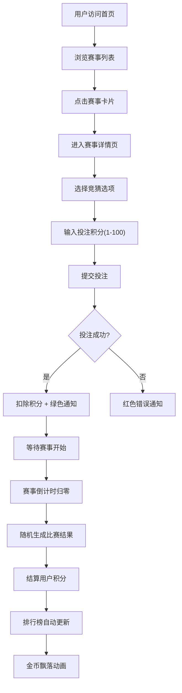

## 1. 产品概述

体育赛事竞猜积分排行榜应用，为用户提供虚拟赛事投注体验与实时排名跟踪。
- 核心目标：打造沉浸式的赛事竞猜娱乐平台，让用户通过积分投注体验竞技乐趣
- 目标用户：体育爱好者、电竞粉丝、休闲娱乐用户

## 2. 核心功能

### 2.1 用户角色

| 角色 | 注册方式 | 核心权限 |
|------|----------|----------|
| 普通用户 | 模拟内置账户 | 浏览赛事、进行投注、查看排行榜 |

### 2.2 功能模块

1. **首页**：赛事列表展示、赛事卡片导航、用户积分显示
2. **赛事详情页**：赛事详情、竞猜选项、投注表单、结果展示
3. **排行榜页**：用户积分排名、柱状图统计、排名刷新动画

### 2.3 页面详情

| 页面名称 | 模块名称 | 功能描述 |
|----------|----------|----------|
| 首页 | 导航栏 | Logo展示、页面导航、用户积分计数器动画 |
| 首页 | 赛事列表 | 两列网格布局、赛事卡片（名称、倒计时、赔率）、悬停阴影效果 |
| 首页 | 赛事卡片 | 赔率渐变色彩、投注标记标签、弹跳动画效果 |
| 赛事详情页 | 赛事信息 | 赛事名称、开赛时间、当前状态 |
| 赛事详情页 | 投注区域 | 竞猜选项选择、积分输入（1-100）、提交按钮加载状态 |
| 赛事详情页 | 结果反馈 | 成功/失败通知提示 |
| 排行榜页 | 排名列表 | 金银铜背景色、入场淡入动画、用户信息展示 |
| 排行榜页 | 柱状图 | Recharts积分可视化、结算填充动画 |
| 排行榜页 | 刷新提示 | 闪烁"更新中"文字动画、5秒自动刷新 |

## 3. 核心流程

用户打开应用 → 浏览赛事列表 → 点击赛事进入详情 → 选择竞猜选项 → 输入投注积分 → 提交投注 → 等待结果 → 赛事结束结算 → 查看排行榜

## 4. 用户界面设计

### 4.1 设计风格

- 主色调：暗色主题 #141414 背景，内容区域 #1f1f1f
- 文字颜色：白色和浅灰 #d9d9d9
- 装饰色：金色 #ffd700（第1名）、银色 #c0c0c0（第2名）、铜色 #cd7f32（第3名）
- 赔率渐变色：从 #52c41a（绿）到 #faad14（橙）
- 按钮风格：圆角、悬停缩放 transform: scale(1.05)、0.2s 过渡
- 布局风格：卡片式布局（圆角 8px）、顶部固定导航栏（64px高度）
- 动效风格：弹跳动画、淡入动画、填充动画、粒子效果

### 4.2 页面设计概览

| 页面名称 | 模块名称 | UI 元素 |
|----------|----------|---------|
| 首页 | 导航栏 | 固定顶部、64px高度、Logo左对齐、导航链接居中、用户积分右对齐 |
| 首页 | 赛事列表 | 最大宽度1200px、两列网格（响应式单列≥320px）、16px间距 |
| 首页 | 赛事卡片 | 背景#f0f2f5、悬停阴影0 6px 12px rgba(0,0,0,0.15)、赔率渐变数字 |
| 赛事详情页 | 投注表单 | Ant Design 表单、选项单选框、数字输入框、提交按钮带加载状态 |
| 排行榜页 | 排名表格 | 金银铜背景色、入场淡入动画延迟、积分条填充动画 |
| 排行榜页 | 柱状图 | Recharts BarChart、动态颜色、动画效果 |

### 4.3 响应式设计

- 桌面端优先设计，最大宽度 1200px 居中展示
- 赛事列表：两列网格布局，屏幕 < 640px 时自适应单列（最小宽度 320px）
- 导航栏：移动端自动调整间距，保证点击区域足够

### 4.4 空状态与错误状态

- 空状态：使用 Ant Design Empty 组件配合插图提示
- 错误状态：使用红色警告通知，提供重试按钮
- 加载状态：骨架屏 + 旋转加载图标
