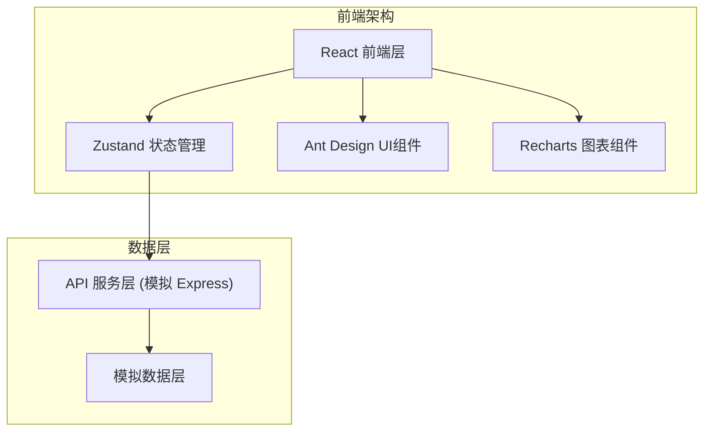
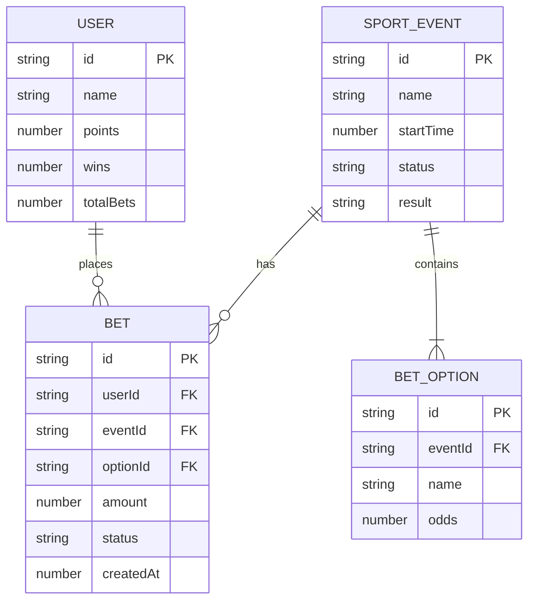

## 1. 架构设计



## 2. 技术说明

- 前端框架：React 18 + TypeScript + Vite
- UI组件库：Ant Design 5 + @ant-design/icons
- 图表库：Recharts
- 状态管理：Zustand
- 后端模拟：Express.js + CORS
- 工具库：uuid（ID生成）
- 构建工具：Vite

## 3. 路由定义

| 路由 | 用途 |
|------|------|
| / | 首页 - 赛事列表展示 |
| /event/:id | 赛事详情页 - 投注交互 |
| /leaderboard | 排行榜页 - 积分排名展示 |

## 4. API 定义

### 4.1 类型定义

```typescript
// 赛事状态
type EventStatus = 'upcoming' | 'live' | 'finished';

// 竞猜选项
interface BetOption {
  id: string;
  name: string;
  odds: number;
}

// 赛事
interface SportEvent {
  id: string;
  name: string;
  startTime: number;
  status: EventStatus;
  options: BetOption[];
  result?: string;
}

// 用户投注记录
interface Bet {
  id: string;
  userId: string;
  eventId: string;
  optionId: string;
  amount: number;
  status: 'pending' | 'won' | 'lost';
  createdAt: number;
}

// 用户
interface User {
  id: string;
  name: string;
  points: number;
  wins: number;
  totalBets: number;
}
```

### 4.2 REST 接口

| 方法 | 路径 | 描述 | 响应 |
|------|------|------|------|
| GET | /api/events | 获取赛事列表 | `{ events: SportEvent[] }` |
| GET | /api/events/:id | 获取单场赛事详情 | `{ event: SportEvent }` |
| POST | /api/bets | 提交投注 | `{ success: boolean, bet: Bet }` |
| GET | /api/leaderboard | 获取排行榜 | `{ users: User[] }` |
| GET | /api/user/:id | 获取用户信息 | `{ user: User }` |

## 5. 项目结构

```
├── package.json
├── vite.config.js
├── tsconfig.json
├── index.html
├── src/
│   ├── types.ts          # 类型定义
│   ├── api.ts            # API服务层（含Express模拟）
│   ├── store.ts          # Zustand状态管理
│   ├── App.tsx           # 主应用组件
│   ├── main.tsx          # 入口文件
│   └── components/
│       ├── EventCard.tsx      # 赛事卡片
│       ├── EventDetail.tsx    # 赛事详情
│       ├── Leaderboard.tsx    # 排行榜
│       └── Navigation.tsx     # 导航栏
```

## 6. 数据模型

### 6.1 ER图



### 6.2 初始模拟数据

- 内置5场虚拟赛事（国际马拉松、篮球联赛、电竞总决赛等）
- 内置多个虚拟用户用于排行榜展示
- 赔率动态生成，总和大于1
- 用户初始积分：1000分
