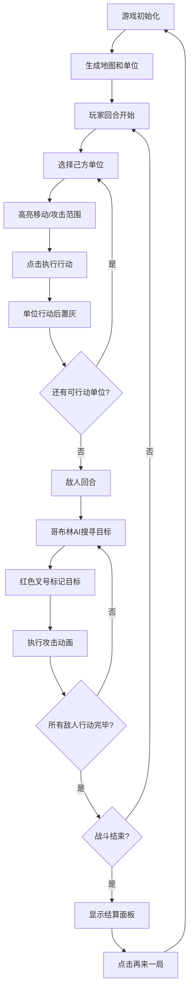

## 1. 产品概述

回合制小队战术战斗模拟器，让桌游设计师在浏览器中体验经典RPG战斗系统。玩家可实时管理4人小队的技能、装备和状态，在六边形网格地图上与哥布林敌人进行自动战斗流程。

- 目标用户：桌游设计师、策略游戏爱好者
- 核心价值：将桌面RPG战斗数字化，提供直观的可视化战术体验

## 2. 核心特性

### 2.1 角色系统
| 角色 | 生命值 | 攻击力 | 移动力 | 特殊能力 |
|------|--------|--------|--------|----------|
| 战士 | 150 | 20 | 4格 | 近战高血量 |
| 游侠 | 100 | 15 | 6格 | 可射击2格内敌人 |
| 法师 | 80 | 25 | 3格 | 法术范围2格 |
| 牧师 | 90 | 10 | 4格 | 治疗15HP，冷却2回合 |
| 哥布林 | 60 | 12 | 4格 | AI自动搜寻最近玩家 |

### 2.2 功能模块
1. **战场地图**：12x10六边形网格，Canvas 2D渲染，含障碍物和草丛
2. **战斗系统**：回合制，玩家行动→敌人AI行动循环
3. **控制面板**：右侧280px面板，显示角色状态、技能、操作按钮
4. **结算系统**：战斗结束显示存活角色、回合数、击杀数

### 2.3 页面详情
| 页面名称 | 模块名称 | 功能描述 |
|-----------|-------------|---------------------|
| 主战斗界面 | 战场地图 | Canvas渲染六边形网格、单位、障碍物、行动范围高亮 |
| 主战斗界面 | 控制面板 | 角色状态展示、技能列表、回合操作、重置按钮 |
| 主战斗界面 | 回合提示 | 屏幕顶部中央淡入显示当前回合归属 |
| 主战斗界面 | 战斗结算 | 战斗结束时弹出结算面板，显示战绩与再来一局按钮 |

## 3. 核心流程

玩家选择己方单位→高亮可移动/可攻击区域→点击执行移动或攻击→单位行动后置灰→玩家结束回合→敌人AI依次行动（搜寻目标→红色叉号标记→攻击/抖动动画→伤害飘字）→回合切换闪烁→循环直至一方全灭→显示结算面板。

## 4. 用户界面设计

### 4.1 设计风格
- **主色调**：暗色主题，主背景#1A1A1A，次要背景#2E2E2E
- **高亮色**：#42A5F5（蓝色，选中/可移动），#80CBC4（水绿，移动范围）
- **危险色**：#F44336（红色，攻击范围/低血量），#EF9A9A（淡红，攻击覆盖）
- **成功色**：#4CAF50（绿色，草丛/高血量）
- **按钮风格**：圆角24px，按下时scale(0.95)→1回弹动画0.15s
- **字体**：Lato/sans-serif，确保WCAG AA对比度

### 4.2 页面设计概览
| 页面名称 | 模块名称 | UI元素 |
|-----------|-------------|-------------|
| 主战斗界面 | 战场地图 | 六边形网格、岩石障碍物、草丛、角色单位、脉动选中光环、半透明行动范围 |
| 主战斗界面 | 控制面板 | 顶部标题栏58px、角色头像、HP进度条（颜色随血量变化）、技能图标（冷却数字）、操作按钮 |
| 主战斗界面 | 回合提示 | 顶部中央淡入文字，白色24px加粗 |
| 主战斗界面 | 战斗结算 | 全屏80%黑色遮罩、400x300圆角面板、战绩列表、橙色再来一局按钮 |

### 4.3 响应式设计
- 桌面端：左侧地图占60%宽度，右侧控制面板固定280px
- 移动端（<900px）：控制面板折叠到底部（高度280px，宽度100%），地图区域缩放至剩余高度

### 4.4 动画与微交互
- 角色入场：屏幕外滑入，随机延迟0.2-0.6秒，弹跳至初始位置
- 选中单位：底部脉动蓝色光环，周期1.5秒
- 回合切换：屏幕快速闪烁白色（opacity 0.1，0.2秒）
- 敌人攻击：目标脚下红色闪烁叉号（0.5秒），命中抖动（5px位移，3次振荡，0.4秒），未命中MISS文字
- 伤害飘字：红色向上飘动20px，0.8秒消失，暴击放大1.5倍加黄色发光
