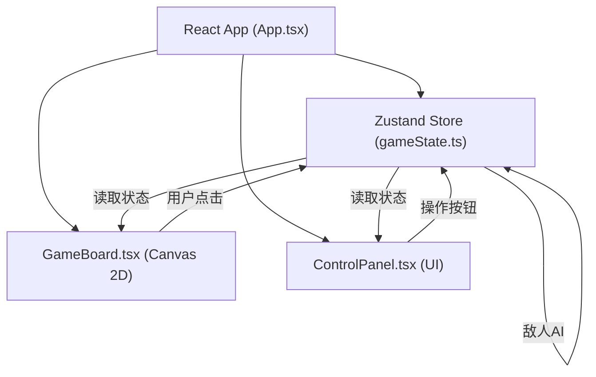

## 1. 架构设计



## 2. 技术描述
- **前端**：React@18 + TypeScript@5 + Vite@5 + Zustand@4
- **渲染**：Canvas 2D API绘制六边形网格战场
- **状态管理**：Zustand创建全局游戏状态store
- **依赖包**：uuid（唯一ID生成）、@vitejs/plugin-react
- **无后端**：纯前端游戏，所有逻辑在浏览器端执行

## 3. 文件结构与调用关系
```
src/
├── main.tsx              # React入口 → 渲染App
├── App.tsx               # 顶层组件 → 初始化状态，渲染GameBoard+ControlPanel
├── gameState.ts          # Zustand Store → 管理角色、地图、回合、行动队列
├── GameBoard.tsx         # Canvas组件 → 从store读取地图/单位，渲染并处理点击
├── ControlPanel.tsx      # UI组件 → 从store读取状态，提供操作按钮
└── types/
    └── game.ts           # 类型定义 → Unit, Tile, Skill, GameState等
```

**数据流向**：
- 初始化：App.tsx → gameState.ts (initGame)
- 渲染：gameState.ts → GameBoard.tsx + ControlPanel.tsx (订阅状态)
- 交互：GameBoard.tsx (点击) / ControlPanel.tsx (按钮) → gameState.ts (actions)
- AI：gameState.ts (enemyTurn) → 自动执行敌人行动

## 4. 数据模型

### 4.1 类型定义

```typescript
// 六边形坐标（axial坐标系）
interface HexCoord { q: number; r: number; }

// 单位技能
interface Skill {
  id: string;
  name: string;
  icon: string;
  range: number;
  damage?: number;
  heal?: number;
  cooldown: number;
  currentCooldown: number;
  type: 'attack' | 'heal' | 'ranged_attack';
}

// 战斗单位
interface Unit {
  id: string;
  name: string;
  team: 'player' | 'enemy';
  class: 'warrior' | 'ranger' | 'mage' | 'priest' | 'goblin';
  hp: number;
  maxHp: number;
  attack: number;
  moveRange: number;
  position: HexCoord;
  hasActed: boolean;
  skills: Skill[];
  isAnimating?: boolean;
}

// 地图瓦片
interface Tile {
  coord: HexCoord;
  type: 'grass' | 'rock' | 'bush';
  evasionBonus?: number; // 草丛+20%闪避
}

// 视觉效果
interface VisualEffect {
  id: string;
  type: 'damage' | 'miss' | 'target_mark' | 'shake';
  position: HexCoord;
  value?: number;
  isCrit?: boolean;
  startTime: number;
  duration: number;
}

// 游戏状态
interface GameState {
  phase: 'player_turn' | 'enemy_turn' | 'battle_end';
  turn: number;
  units: Unit[];
  tiles: Map<string, Tile>;
  selectedUnitId: string | null;
  moveRange: HexCoord[];
  attackRange: HexCoord[];
  effects: VisualEffect[];
  winner: 'player' | 'enemy' | null;
  killCount: number;
  turnBanner: { text: string; showTime: number } | null;
}
```

## 5. 核心算法

### 5.1 六边形网格系统
- 使用axial坐标系（q, r）存储位置
- 外接圆半径30px，pointy-top布局
- 像素坐标转换：`x = size * sqrt(3) * (q + r/2)`，`y = size * 3/2 * r`
- 邻居计算：6个方向向量`[+1,0],[-1,0],[+1,-1],[0,-1],[-1,+1],[0,+1]`
- 距离计算：`(abs(q1-q2) + abs(q1+r1-q2-r2) + abs(r1-r2)) / 2`

### 5.2 BFS寻路（移动范围）
- 从单位位置出发，广度优先搜索
- 每步消耗1移动力，障碍物不可通行
- 搜索深度≤移动力

### 5.3 敌人AI
- 遍历所有敌人单位
- 对每个敌人，计算到所有玩家单位的距离
- 选择最近目标，若在攻击范围内则攻击
- 否则向目标方向移动（BFS找最短路径）

### 5.4 性能优化
- Canvas帧率保持≥50fps
- requestAnimationFrame循环中跳过超过16ms的帧
- 点击高亮计算（BFS）在5ms内完成（最多8个单位）
- 地图瓦片使用Map缓存，避免重复计算
