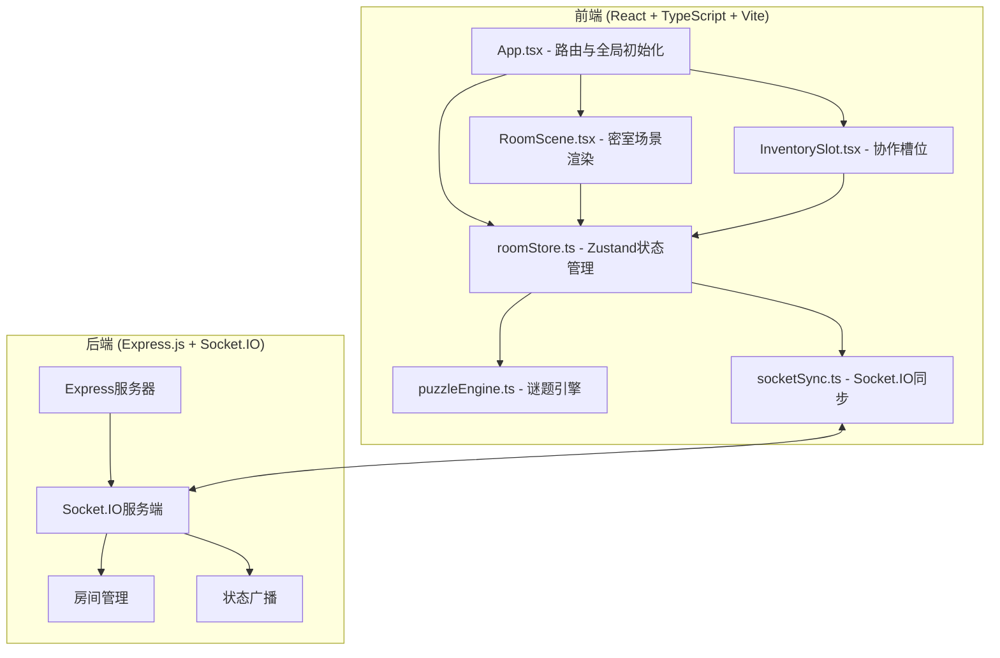
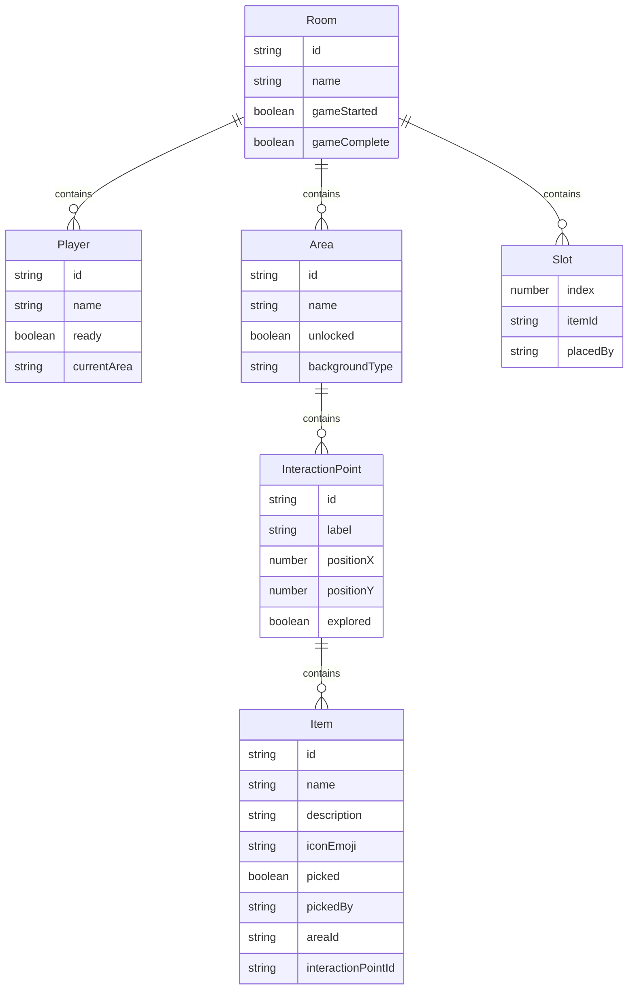

## 1. 架构设计



## 2. 技术说明

- **前端**：React@18 + TypeScript + Vite + Zustand + Socket.IO Client
- **后端**：Express.js + Socket.IO + CORS
- **状态管理**：Zustand（管理房间状态、区域可见性、道具清单、协作组合状态）
- **实时通信**：Socket.IO（WebSocket协议，事件驱动广播）
- **音效**：Web Audio API（正弦波生成叮当音效）
- **构建工具**：Vite + @vitejs/plugin-react

## 3. 路由定义

| 路由 | 用途 |
|------|------|
| `/` | 大厅页面，创建/加入房间 |
| `/room/:roomId` | 密室场景页面 |

## 4. Socket.IO 事件定义

### 4.1 客户端 → 服务端

| 事件名 | 数据结构 | 描述 |
|--------|----------|------|
| `join-room` | `{ roomId: string, playerName: string }` | 加入房间 |
| `player-ready` | `{ roomId: string }` | 玩家准备 |
| `pick-item` | `{ roomId: string, itemId: string, areaId: string }` | 拾取道具 |
| `place-slot` | `{ roomId: string, itemId: string, slotIndex: number }` | 放置道具到槽位 |
| `remove-slot` | `{ roomId: string, slotIndex: number }` | 从槽位移除道具 |
| `combine-items` | `{ roomId: string, itemIds: [string, string] }` | 组合道具 |
| `unlock-area` | `{ roomId: string, areaId: string }` | 解锁新区域 |

### 4.2 服务端 → 客户端

| 事件名 | 数据结构 | 描述 |
|--------|----------|------|
| `room-state` | `RoomState` | 全量房间状态同步 |
| `player-joined` | `{ playerId: string, playerName: string }` | 新玩家加入 |
| `player-left` | `{ playerId: string }` | 玩家离开 |
| `item-picked` | `{ itemId: string, playerId: string }` | 道具被拾取 |
| `slot-updated` | `{ slots: SlotState[] }` | 槽位状态更新 |
| `items-combined` | `{ newItemId: string, removedItems: [string, string] }` | 道具组合结果 |
| `area-unlocked` | `{ areaId: string }` | 新区域解锁 |
| `game-complete` | `{}` | 游戏通关 |

## 5. 服务端架构图

```mermaid
graph LR
    "Socket.IO Controller" --> "Room Service"
    "Room Service" --> "内存状态存储"
```

- 服务端为无状态内存存储，房间数据在内存中维护
- 每个房间独立管理状态，通过 Socket.IO 广播变更

## 6. 数据模型

### 6.1 数据模型定义



## 7. 文件结构

```
├── package.json
├── vite.config.js
├── tsconfig.json
├── index.html
├── server/
│   └── index.ts              # Express + Socket.IO 服务端
├── src/
│   ├── App.tsx                # 主应用组件
│   ├── main.tsx               # 入口文件
│   ├── modules/
│   │   ├── room/
│   │   │   ├── components/
│   │   │   │   ├── RoomScene.tsx    # 密室场景渲染
│   │   │   │   └── InventorySlot.tsx # 协作槽位
│   │   │   └── store/
│   │   │       └── roomStore.ts    # Zustand store
│   │   ├── puzzle/
│   │   │   └── puzzleEngine.ts      # 谜题引擎
│   │   └── sync/
│   │       └── socketSync.ts       # Socket.IO同步
│   └── styles/
│       └── global.css               # 全局样式
```
