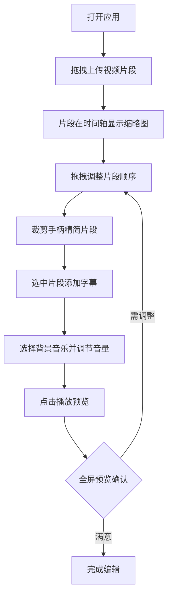

## 1. 产品概述

ClipFlow 是一款基于浏览器的在线视频剪辑工具，专为影视剪辑师和短视频创作者设计，解决传统剪辑软件启动慢、操作复杂、无法在移动端预览和协同的问题。通过拖拽上传、时间轴编辑、实时预览、字幕添加和背景音乐混音等功能，让用户在任何设备上快速完成视频剪辑工作。

- 目标用户：影视剪辑师、短视频创作者、自媒体运营者
- 核心价值：零安装、轻量化、跨平台、实时预览的视频剪辑体验

## 2. 核心功能

### 2.1 用户角色

| 角色 | 注册方式 | 核心权限 |
|------|----------|----------|
| 普通用户 | 无需注册 | 上传视频、编辑时间轴、添加字幕和音乐、预览导出 |

### 2.2 功能模块

1. **编辑器主页面**：视频上传区、时间轴、预览窗口、详情面板

### 2.3 页面详情

| 页面名称 | 模块名称 | 功能描述 |
|----------|----------|----------|
| 编辑器主页面 | 视频上传区 | 拖拽上传多个视频片段（mp4/webm），实时显示上传进度条（淡蓝色#42A5F5） |
| 编辑器主页面 | 时间轴 | 底部时间轴显示片段缩略图（120x68px，圆角4px，1px深灰#757575边框），缩略图下方显示文件名和时长（白色#FFFFFF，12px）；支持左右拖拽调整顺序（拖拽时半透明+阴影）；裁剪手柄（10px白色圆形#FFFFFF，悬停变蓝#2196F3）调整片段时长（最短0.5s，最长原时长）；片段间自动吸附（0.2s弹性动画） |
| 编辑器主页面 | 详情面板 | 右侧320px宽面板（背景#FAFAFA，2px底部阴影）；添加字幕（白色#FFFFFF字体、黑色半透明背景、24px、预览画面底部居中）；选择背景音乐（5种风格：轻快、舒缓、悬疑、激昂、浪漫，各30s循环音频）；音频波形图（绿色#4CAF50，动态振幅）；音量滑块（0-100%） |
| 编辑器主页面 | 预览播放 | 顶部播放按钮（40px圆形，深灰#424242背景，悬停变蓝#1976D2，播放/暂停图标切换）；全屏预览模式（黑色#000000背景）；Esc或X退出；右上角播放进度（mm:ss / mm:ss，白色#FFFFFF，16px） |

## 3. 核心流程

用户打开应用 → 拖拽上传视频片段 → 片段在时间轴上显示缩略图 → 拖拽调整片段顺序 → 使用裁剪手柄精简片段 → 选中片段添加字幕 → 选择背景音乐并调节音量 → 点击播放预览整体效果 → 全屏预览确认 → 完成编辑

## 4. 用户界面设计

### 4.1 设计风格

- 主色调：深色主题，主背景#1E1E1E，工具栏#2C2C2C，时间轴#333333
- 强调色：蓝色系（#42A5F5上传进度、#2196F3交互高亮、#1976D2悬停）
- 辅助色：绿色#4CAF50音频波形、白色#FFFFFF文字和手柄
- 按钮风格：统一圆角8px、过渡动画transition 0.2s ease
- 字体：系统无衬线字体
- 布局风格：顶部工具栏（60px）+ 中间预览区 + 右侧详情面板（320px）+ 底部时间轴（180px）

### 4.2 页面设计概览

| 页面名称 | 模块名称 | UI元素 |
|----------|----------|--------|
| 编辑器主页面 | 顶部工具栏 | 高60px，背景#2C2C2C，播放按钮（40px圆形，深灰#424242，悬停蓝#1976D2），标题文字 |
| 编辑器主页面 | 预览区域 | 黑色背景，视频播放器，字幕叠加层（白色24px文字+黑色半透明背景，底部居中），音频波形可视化 |
| 编辑器主页面 | 详情面板 | 宽320px，背景#FAFAFA，2px底部阴影；字幕输入框；音乐风格选择卡片（5种）；音量滑块；响应式折叠为底部抽屉 |
| 编辑器主页面 | 时间轴 | 高180px，背景#333333；片段缩略图（120x68px，圆角4px，1px边框#757575）；文件名+时长（白色12px）；裁剪手柄；音频波形图（绿色#4CAF50） |
| 编辑器主页面 | 上传区域 | 拖拽提示区，进度条（#42A5F5） |

### 4.3 响应式设计

- 桌面端优先（>=768px）：标准三栏布局（时间轴+预览+详情面板）
- 移动端（<768px）：右侧详情面板折叠为底部弹出抽屉（slide up），带40%背景透明度遮罩
- 触摸优化：裁剪手柄和拖拽区域适配触摸操作

### 4.4 3D场景指导

不适用
