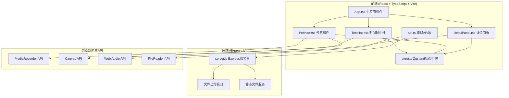
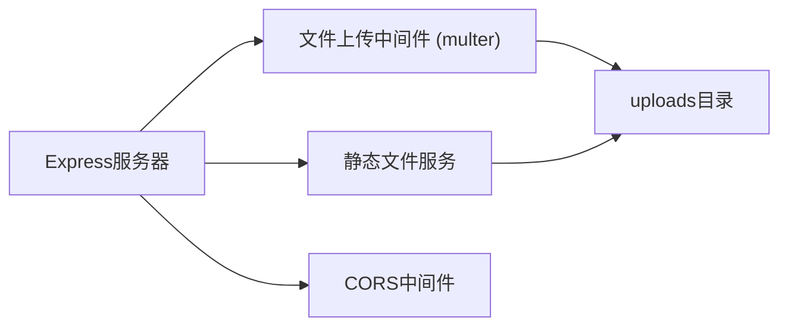
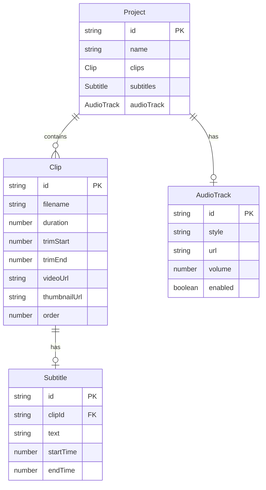

## 1. 架构设计



## 2. 技术说明

- 前端：React@18 + TypeScript + Vite + Ant Design + Zustand
- 初始化工具：vite-init（react-express-ts模板）
- 后端：Express.js（运行于localhost:3001）
- 数据库：无（前端Zustand状态管理，模拟数据）
- 视频处理：浏览器原生 MediaRecorder + Canvas API
- 音频混音：Web Audio API
- 样式：SCSS + CSS Variables（深色主题）

## 3. 路由定义

| 路由 | 用途 |
|------|------|
| / | 编辑器主页面，包含上传、时间轴、预览和详情面板 |

## 4. API定义

### 4.1 视频上传接口

```typescript
// POST /api/upload
interface UploadRequest {
  file: File;
}

interface UploadResponse {
  id: string;
  filename: string;
  duration: number;
  url: string;
  thumbnailUrl: string;
}
```

### 4.2 音频预加载接口

```typescript
// GET /api/audio/:style
interface AudioResponse {
  style: 'light' | 'soothing' | 'suspense' | 'intense' | 'romantic';
  url: string;
  duration: number;
}
```

### 4.3 静态文件服务

```typescript
// GET /uploads/:filename - 返回上传的视频文件
// GET /audio/:filename - 返回音频文件
```

## 5. 服务器架构图



## 6. 数据模型

### 6.1 数据模型定义



### 6.2 前端状态定义（Zustand Store）

```typescript
interface Clip {
  id: string;
  filename: string;
  duration: number;
  trimStart: number;
  trimEnd: number;
  videoUrl: string;
  thumbnailUrl: string;
  order: number;
}

interface Subtitle {
  id: string;
  clipId: string;
  text: string;
  startTime: number;
  endTime: number;
}

interface AudioTrack {
  style: 'light' | 'soothing' | 'suspense' | 'intense' | 'romantic';
  url: string;
  volume: number;
  enabled: boolean;
}

interface ProjectState {
  clips: Clip[];
  subtitles: Subtitle[];
  audioTrack: AudioTrack | null;
  selectedClipId: string | null;
  isPlaying: boolean;
  currentTime: number;

  addClip: (clip: Clip) => void;
  removeClip: (id: string) => void;
  trimClip: (id: string, trimStart: number, trimEnd: number) => void;
  reorderClips: (fromIndex: number, toIndex: number) => void;
  setAudio: (track: AudioTrack | null) => void;
  setSelectedClip: (id: string | null) => void;
  setPlaying: (playing: boolean) => void;
  setCurrentTime: (time: number) => void;
  addSubtitle: (subtitle: Subtitle) => void;
  removeSubtitle: (id: string) => void;
  updateSubtitle: (id: string, text: string) => void;
}
```
