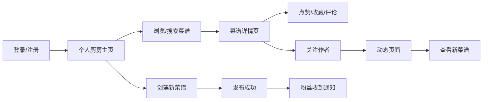

## 1. 产品概述

"美味厨房"是一个在线食谱分享与社交平台，让美食爱好者可以分享自创菜谱、收藏优质作品、关注其他厨师并收到更新通知，打造一个活跃的美食创作社区。

- **核心价值**：连接美食创作者与爱好者，提供便捷的菜谱分享、发现和互动平台
- **目标用户**：家庭厨师、美食爱好者、烹饪新手
- **解决问题**：菜谱分享分散、缺乏互动、难以追踪喜欢的厨师更新

## 2. 核心功能

### 2.1 用户角色
| 角色 | 注册方式 | 核心权限 |
|------|----------|----------|
| 普通用户 | 用户名+密码注册 | 浏览菜谱、收藏、点赞、评论、关注、创建菜谱 |

### 2.2 功能模块
1. **登录注册**：用户注册、登录、个人信息管理
2. **个人厨房**：浏览所有公开菜谱、搜索、瀑布流展示
3. **菜谱详情**：食材列表、步骤说明、评论、点赞、收藏
4. **创建菜谱**：菜名、封面图、食材、步骤、时长、难度、标签
5. **动态页面**：关注者新菜谱、时间倒序、新动态提示
6. **关注系统**：关注/取消关注、粉丝列表、动态推送

### 2.3 页面详情
| 页面名称 | 模块名称 | 功能描述 |
|---------|----------|----------|
| 登录注册页 | 表单模块 | 用户名密码输入、登录/注册切换、表单验证 |
| 个人厨房页 | 瀑布流卡片 | 菜谱列表、搜索框、筛选、懒加载 |
| 菜谱详情页 | 详情展示 | 食材、步骤、评论区、点赞收藏按钮 |
| 创建菜谱页 | 表单模块 | 动态食材行、拖拽排序步骤、标签选择 |
| 动态页面 | 动态列表 | 关注者新菜谱、时间倒序、淡入动画、新消息提示 |

## 3. 核心流程

用户打开网站 → 注册/登录 → 进入个人厨房浏览菜谱 → 点击卡片查看详情 → 点赞/收藏/评论 → 创建自己的菜谱 → 关注其他厨师 → 查看动态页面获取更新

## 4. 用户界面设计

### 4.1 设计风格
- **主色调**：暖色调，米黄色背景(#FFF8E7)、棕褐色(#8B6914)作为主色
- **辅助色**：森林绿(#2E7D32)作为点缀色，用于按钮和交互元素
- **收藏高亮**：红色(#E53935)实心图标
- **按钮风格**：圆角按钮，点击时水波纹反馈效果
- **卡片风格**：圆角卡片，悬停时轻微上浮和阴影加深
- **字体**：标题使用衬线体增强温馨感，正文使用清晰易读的无衬线体
- **图标风格**：线性图标，交互时填充变色

### 4.2 页面设计概述
| 页面名称 | 模块名称 | UI 元素 |
|---------|----------|---------|
| 个人厨房页 | 导航栏 | 半透明固定顶部，滚动时背景模糊，登录状态显示，通知红点 |
| 个人厨房页 | 搜索框 | 圆角设计，放大镜图标悬停动画，输入时边框高亮 |
| 个人厨房页 | 瀑布流卡片 | 菜名、缩略图、作者头像、时长、点赞数，3列桌面布局 |
| 菜谱详情页 | 详情内容 | 大图封面、食材清单、步骤序号、评论区、操作按钮组 |
| 创建菜谱页 | 动态表单 | 食材可增删行、步骤可拖拽排序、星级难度选择、标签多选 |
| 动态页面 | 动态列表 | 淡入上滑过渡动画、时间倒序排列、新动态红点提示 |

### 4.3 响应式设计
- **桌面端**：3列瀑布流，侧边筛选栏
- **平板端**：2列瀑布流
- **手机端**：单列布局，底部导航，触摸优化的按钮尺寸
- **交互适配**：支持触摸滑动，按钮最小44x44px可点击区域

### 4.4 动画与交互
- 页面加载：元素错落淡入(animation-delay)
- 卡片悬停：向上浮动4px，阴影由浅变深
- 点赞交互：数字弹跳动画 +1 效果
- 收藏图标：空心→实心红色填充动画
- 水波纹：按钮点击时从中心扩散的圆形波纹
- 无限滚动：滚动到底部自动加载下一页12张卡片
- 新动态提示：左上角红色圆点呼吸动画，点击刷新
