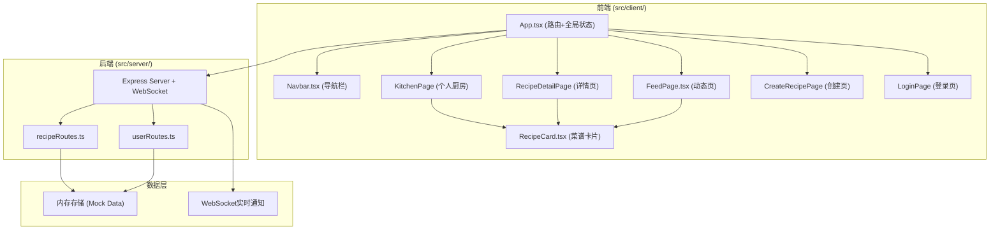
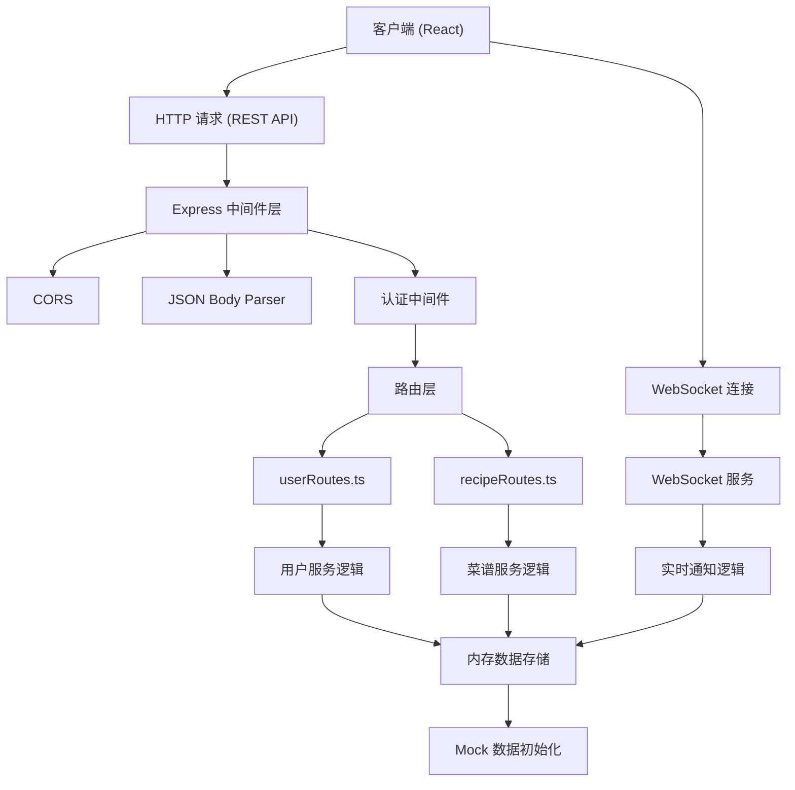
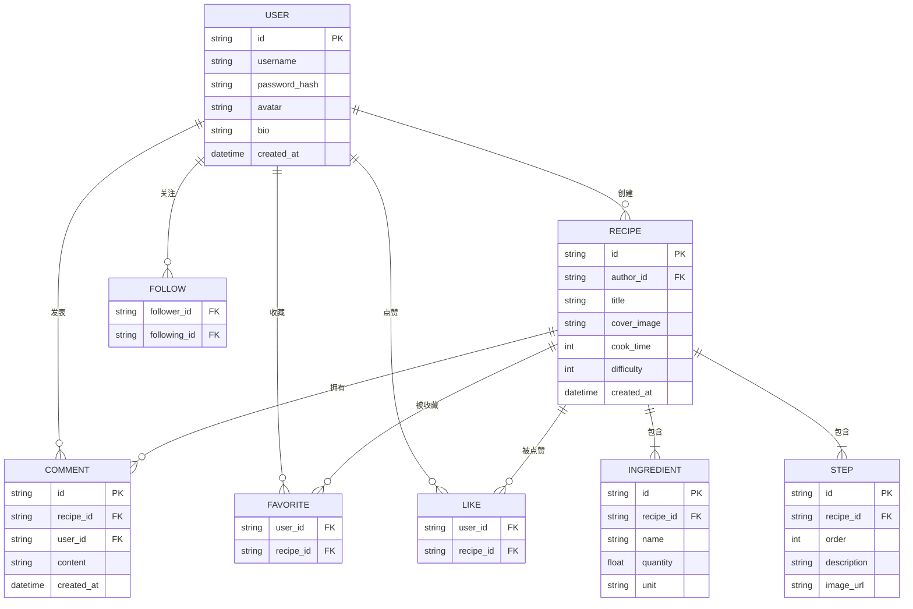

## 1. 架构设计



## 2. 技术描述

- **前端框架**：React@18 + TypeScript
- **构建工具**：Vite@5
- **状态管理**：Zustand (全局状态) + React Hooks (组件状态)
- **路由**：React Router DOM@6
- **样式**：TailwindCSS@3 + CSS动画
- **图标**：lucide-react
- **HTTP客户端**：原生 fetch API
- **后端框架**：Express@4 + TypeScript
- **实时通信**：WebSocket (ws库)
- **数据存储**：内存存储 + Mock数据 (uuid生成ID)
- **密码加密**：bcryptjs
- **跨域**：cors中间件

## 3. 路由定义

| 前端路由 | 页面 | 说明 |
|----------|------|------|
| /login | LoginPage | 登录注册页 |
| / | KitchenPage | 个人厨房主页（需登录） |
| /recipe/:id | RecipeDetailPage | 菜谱详情页 |
| /create | CreateRecipePage | 创建菜谱页 |
| /feed | FeedPage | 动态页面 |

| 后端API路由 | 方法 | 说明 |
|-------------|------|------|
| /api/user/register | POST | 用户注册 |
| /api/user/login | POST | 用户登录 |
| /api/user/follow | POST | 关注用户 |
| /api/user/unfollow | POST | 取消关注 |
| /api/user/feed | GET | 获取用户动态 |
| /api/user/:id | GET | 获取用户信息 |
| /api/recipe | POST | 创建菜谱 |
| /api/recipe | GET | 获取菜谱列表（分页） |
| /api/recipe/search | GET | 搜索菜谱 |
| /api/recipe/:id | GET | 获取菜谱详情 |
| /api/recipe/:id/like | POST | 点赞菜谱 |
| /api/recipe/:id/favorite | POST | 收藏/取消收藏 |
| /api/recipe/:id/comment | POST | 添加评论 |

## 4. API 定义

### TypeScript 类型定义

```typescript
// 用户类型
interface User {
  id: string;
  username: string;
  password?: string;
  avatar: string;
  bio?: string;
  followers: string[];
  following: string[];
  createdAt: Date;
}

// 食材项
interface Ingredient {
  id: string;
  name: string;
  quantity: number;
  unit: string;
}

// 烹饪步骤
interface Step {
  id: string;
  order: number;
  description: string;
  imageUrl?: string;
}

// 评论
interface Comment {
  id: string;
  userId: string;
  username: string;
  avatar: string;
  content: string;
  createdAt: Date;
}

// 菜谱
interface Recipe {
  id: string;
  authorId: string;
  authorName: string;
  authorAvatar: string;
  title: string;
  coverImage: string;
  ingredients: Ingredient[];
  steps: Step[];
  cookTime: number;
  difficulty: 1 | 2 | 3 | 4 | 5;
  tags: string[];
  likes: string[];
  favorites: string[];
  comments: Comment[];
  createdAt: Date;
}

// 动态
interface FeedItem {
  id: string;
  recipeId: string;
  recipeTitle: string;
  recipeCover: string;
  authorId: string;
  authorName: string;
  authorAvatar: string;
  publishedAt: Date;
}
```

### 请求/响应示例

```typescript
// 登录请求
interface LoginRequest {
  username: string;
  password: string;
}

// 登录响应
interface LoginResponse {
  success: boolean;
  user: Omit<User, 'password'>;
  token: string;
}

// 创建菜谱请求
interface CreateRecipeRequest {
  title: string;
  coverImage: string;
  ingredients: Omit<Ingredient, 'id'>[];
  steps: Omit<Step, 'id'>[];
  cookTime: number;
  difficulty: 1 | 2 | 3 | 4 | 5;
  tags: string[];
}

// 菜谱列表响应
interface RecipeListResponse {
  recipes: Recipe[];
  hasMore: boolean;
  total: number;
}
```

## 5. 服务器架构图



## 6. 数据模型

### 6.1 数据模型 ER 图



### 6.2 初始数据

系统启动时自动注入 Mock 数据，包含：
- 3个示例用户（厨师小王、美食达人、烘焙爱好者）
- 15个示例菜谱，涵盖川菜、家常菜、甜点等分类
- 预置关注关系和点赞收藏数据
- 示例评论内容

性能优化策略：
- 瀑布流分页：每次加载12条
- 图片懒加载：使用 Intersection Observer
- 搜索防抖：300ms delay
- 前端缓存：已加载数据本地缓存
- WebSocket 仅推送新动态通知，数据仍走 REST API
