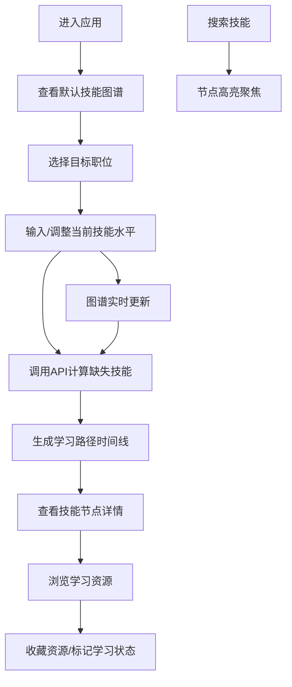

## 1. 产品概述

在线个人技能图谱构建与职业发展路径规划应用，帮助技术人员可视化展示技能体系、评估技能水平，并基于目标职位智能生成个性化学习路径。

- 核心目的：通过技能图谱可视化和AI路径规划，帮助用户清晰了解自身技能短板，制定科学的职业发展计划
- 目标用户：软件开发工程师、DevOps工程师、技术从业者及在校计算机相关专业学生
- 产品价值：降低职业规划门槛，提供数据驱动的技能提升建议，加速职业成长

## 2. 核心功能

### 2.1 用户角色

| 角色 | 注册方式 | 核心权限 |
|------|----------|----------|
| 普通用户 | 无需注册，直接使用 | 查看技能图谱、评估技能水平、生成学习路径、收藏学习资源 |

### 2.2 功能模块

1. **技能图谱展示**：力导向布局可视化技能节点，支持拖拽、缩放、悬停详情
2. **技能评估**：手动调整技能熟练度，实时更新图谱显示
3. **职业路径规划**：选择目标职位，智能计算缺失技能并生成学习时间线
4. **学习资源管理**：查看技能推荐资源，支持收藏和状态标记
5. **搜索功能**：快速定位技能节点，高亮显示并自动聚焦

### 2.3 页面详情

| 页面名称 | 模块名称 | 功能描述 |
|----------|----------|----------|
| 主页面 | 导航栏 | 应用Logo、职位选择下拉菜单、重置图谱按钮 |
| 主页面 | 技能图谱区域 | D3.js力导向图，节点拖拽缩放，悬停显示详情浮窗 |
| 主页面 | 右侧面板 | 搜索框、学习路径时间线卡片列表 |
| 主页面 | 资源详情模态框 | 半屏对话框，展示资源详情、收藏功能 |
| 主页面 | 熟练度调整组件 | 滑块或百分比输入，实时更新节点大小和颜色 |

## 3. 核心流程

用户进入应用后，默认展示包含30+技能节点的完整技能图谱。用户可选择目标职位并评估当前技能水平，系统计算缺失技能后生成分阶段学习路径。用户可点击节点查看详情、调整熟练度、浏览学习资源并收藏。搜索功能支持快速定位技能，调整熟练度后自动重新计算学习路径。

## 4. 用户界面设计

### 4.1 设计风格

- **主色调**：暗色主题，背景`#1a1a2e`，卡片`#16213e`，强调色`#0f3460`和`#e94560`
- **节点颜色分类**：前端蓝色、后端绿色、数据库橙色、DevOps紫色
- **进度条颜色梯度**：从红色（低熟练度）渐变到绿色（高熟练度）
- **按钮风格**：圆角矩形，悬停时有微放大和阴影效果
- **字体**：使用现代无衬线字体，标题使用更有设计感的字体
- **布局风格**：左右分栏布局，左侧70%图谱区域，右侧320px固定面板
- **图标风格**：使用lucide-react图标库，统一线性风格

### 4.2 页面设计概述

| 页面名称 | 模块名称 | UI元素 |
|----------|----------|----------|
| 主页面 | 导航栏 | 深色背景，Logo居左，职位选择居中，重置按钮居右 |
| 主页面 | 技能图谱 | 深色画布，彩色节点，带箭头的连接线，悬停浮窗 |
| 主页面 | 右侧面板 | 搜索框在上，路径时间线在下，卡片垂直排列 |
| 主页面 | 资源模态框 | 半屏滑入，顶部标题，详情列表，收藏按钮 |
| 主页面 | 时间线卡片 | 左侧时间线，右侧卡片，状态切换淡入动画 |

### 4.3 响应式设计

- **桌面端（≥768px）**：左右分栏布局，图谱占70%宽度，右侧面板320px固定宽度
- **移动端（<768px）**：上下排列布局，图谱高度缩放50%，节点标签隐藏，右侧面板全宽
- **触摸优化**：增加点击区域，支持触摸拖拽和双指缩放

### 4.4 交互动效

- **节点拖拽**：拖拽时节点放大1.2倍，释放后弹性回弹
- **搜索聚焦**：0.5秒平滑动画过渡到目标节点
- **状态切换**：学习状态标记时200ms淡入动画
- **悬停效果**：节点悬停时轻微放大，显示浮窗
- **颜色过渡**：熟练度调整时节点颜色平滑渐变
