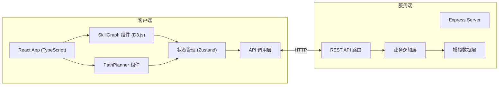
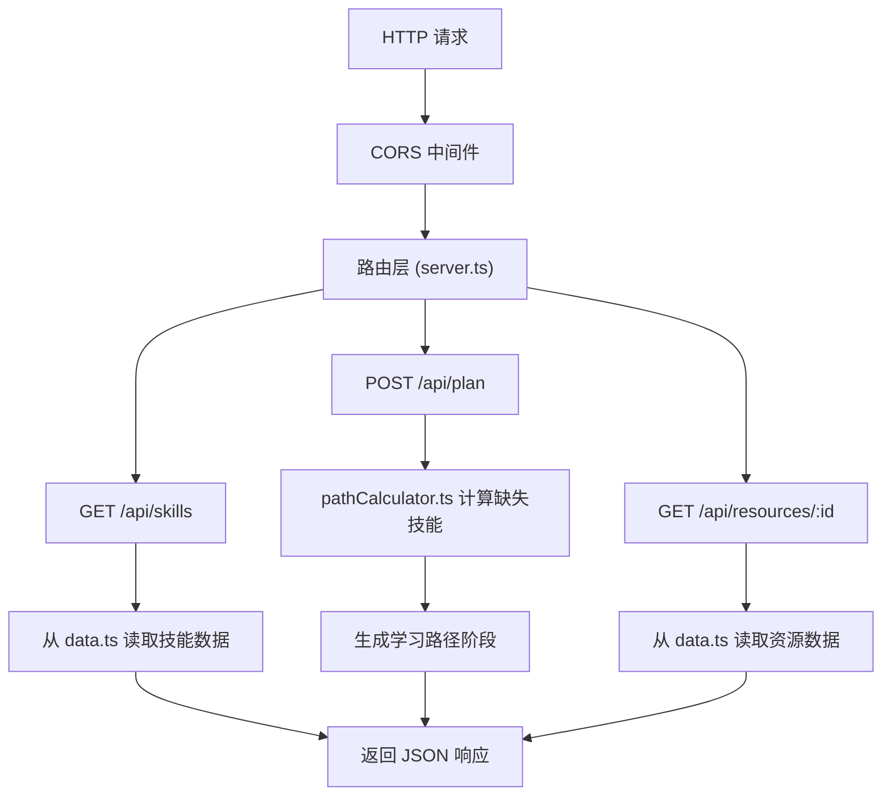
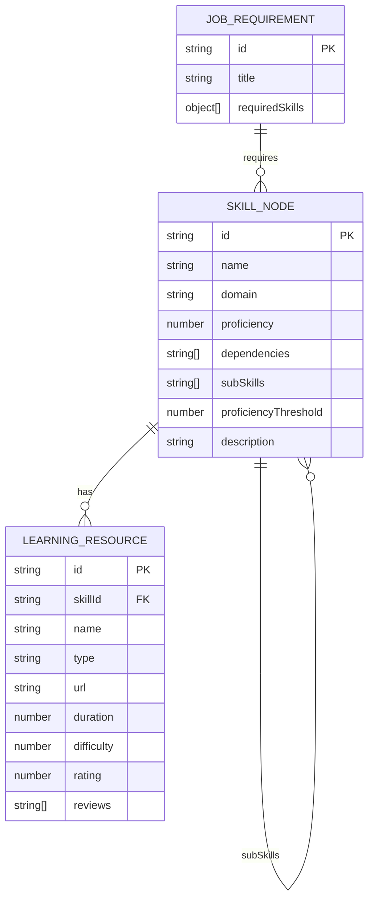

## 1. 架构设计



## 2. 技术描述

- **前端**：React 18 + TypeScript + Vite + Zustand + D3.js v7 + lucide-react
- **构建工具**：Vite 5.x，支持 React 和 TypeScript
- **后端**：Node.js + Express 4.x + TypeScript
- **数据层**：内存模拟数据（src/server/data.ts），无真实数据库
- **状态管理**：Zustand，管理技能数据、学习路径、收藏资源等状态
- **样式方案**：CSS Modules + CSS 变量，支持暗色主题
- **API 通信**：RESTful API，CORS 跨域支持

## 3. 目录结构

```
├── src/
│   ├── client/
│   │   ├── App.tsx              # 主组件，整体布局和路由
│   │   ├── SkillGraph.tsx       # 技能图谱组件 (D3.js)
│   │   ├── PathPlanner.tsx      # 职业路径规划组件
│   │   ├── components/          # 子组件
│   │   │   ├── SearchBar.tsx    # 搜索框组件
│   │   │   ├── ResourceModal.tsx # 资源详情模态框
│   │   │   ├── SkillTooltip.tsx # 节点悬停浮窗
│   │   │   ├── ProficiencySlider.tsx # 熟练度滑块
│   │   │   └── TimelineCard.tsx # 学习路径卡片
│   │   ├── store/
│   │   │   └── useSkillStore.ts # Zustand 状态管理
│   │   ├── types/
│   │   │   └── index.ts         # TypeScript 类型定义
│   │   ├── utils/
│   │   │   └── api.ts           # API 调用封装
│   │   └── styles/
│   │       └── globals.css      # 全局样式
│   └── server/
│       ├── server.ts            # Express 服务器入口
│       ├── data.ts              # 模拟数据库
│       ├── types.ts             # 后端类型定义
│       └── utils/
│           └── pathCalculator.ts # 学习路径计算逻辑
├── package.json
├── vite.config.js
├── tsconfig.json
└── index.html
```

## 4. API 定义

### 类型定义

```typescript
// 技能领域
type SkillDomain = 'frontend' | 'backend' | 'database' | 'devops';

// 技能节点
interface SkillNode {
  id: string;
  name: string;
  domain: SkillDomain;
  proficiency: number; // 0-100
  dependencies: string[];
  subSkills?: string[];
  proficiencyThreshold: number;
  description: string;
}

// 学习资源
interface LearningResource {
  id: string;
  skillId: string;
  name: string;
  type: 'document' | 'video' | 'course';
  url: string;
  duration: number; // 小时
  difficulty: number; // 1-5星
  rating: number;
  reviews: string[];
}

// 职位要求
interface JobRequirement {
  id: string;
  title: string;
  requiredSkills: { skillId: string; minProficiency: number }[];
}

// 学习路径阶段
interface PathStage {
  id: string;
  skillId: string;
  skillName: string;
  estimatedDuration: number; // 小时
  resources: LearningResource[];
  status: 'not-started' | 'in-progress' | 'completed';
  order: number;
}

// API 请求/响应
interface PlanRequest {
  targetJobId: string;
  currentSkills: { skillId: string; proficiency: number }[];
}

interface PlanResponse {
  jobTitle: string;
  totalEstimatedHours: number;
  stages: PathStage[];
  missingSkills: string[];
}
```

### 接口列表

| 方法 | 路径 | 描述 | 请求体 | 响应 |
|------|------|------|--------|------|
| GET | `/api/skills` | 获取技能树数据 | 无 | `SkillNode[]` |
| POST | `/api/plan` | 生成学习路径 | `PlanRequest` | `PlanResponse` |
| GET | `/api/resources/:skillId` | 获取技能的学习资源 | 无 | `LearningResource[]` |

## 5. 服务端架构



## 6. 数据模型

### 6.1 实体关系图



### 6.2 初始数据配置

- **技能节点**：30+ 节点，涵盖前端（HTML/CSS/JavaScript/React/Vue/TypeScript/Webpack等）、后端（Node.js/Express/Python/Django/Java/Spring等）、数据库（MySQL/PostgreSQL/MongoDB/Redis等）、DevOps（Docker/Kubernetes/GitLab CI/AWS/Nginx等）
- **职位要求**：全栈工程师、DevOps专家、前端架构师、后端工程师等
- **学习资源**：每个技能配备 2-3 个模拟资源，包含文档、视频、课程类型

## 7. 性能优化策略

1. **D3.js 力导向图优化**：
   - 使用 Canvas 渲染大量节点（备选方案，SVG 默认渲染 50+ 节点）
   - 节点拖拽时使用 requestAnimationFrame 确保 30fps+
   - 缩放时使用 transform 而非重绘

2. **搜索优化**：
   - 前端建立技能名称索引，使用模糊匹配算法
   - 搜索结果过滤时间控制在 200ms 内

3. **API 响应优化**：
   - 学习路径计算使用异步处理，模拟计算时间不超过 500ms
   - 数据预加载，减少重复请求

4. **动画优化**：
   - 使用 CSS transition 和 transform 实现硬件加速
   - 搜索聚焦动画使用 D3 transition，时长 500ms
