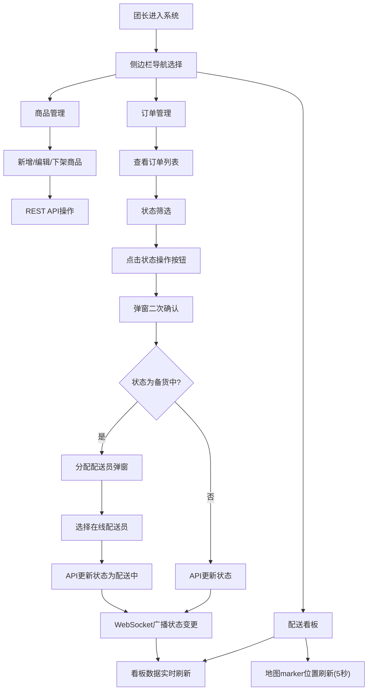

## 1. 产品概述

社区团购团长管理面板，为团长提供商品上架管理、订单状态流转处理、配送员任务分配以及实时配送进度可视化的一体化管理工具。解决现有工具在订单状态流转不清晰和配送员协调效率低的核心痛点。

- 目标用户：社区团购团长
- 核心价值：实时数据驱动的配送全流程可视化管理，提升团长运营效率

## 2. 核心功能

### 2.1 用户角色

| 角色 | 登录方式 | 核心权限 |
|------|----------|----------|
| 团长 | 本地登录（演示无鉴权） | 商品管理、订单全流程管理、配送员分配、数据看板查看 |

### 2.2 功能模块

1. **商品管理页面**：商品新增、商品卡片网格展示、商品编辑、商品下架
2. **订单管理页面**：订单列表表格、状态筛选、状态流转操作、配送员分配弹窗
3. **配送看板页面**：实时统计卡片、在线配送员列表、配送进度地图（Leaflet）

### 2.3 页面详情

| 页面名称 | 模块名称 | 功能描述 |
|----------|----------|----------|
| 商品管理 | 新增商品表单 | 填写名称、价格、库存、图片URL，提交后刷新列表 |
| 商品管理 | 商品卡片网格 | 显示商品图片、名称、价格、库存，含编辑/下架按钮 |
| 商品管理 | 编辑商品弹窗 | 回填原数据，允许修改所有字段 |
| 订单管理 | 订单表格 | 显示订单号、商品清单、总价、下单时间、状态、配送员、操作列 |
| 订单管理 | 状态筛选栏 | 全部/待确认/备货中/配送中/已完成 筛选 |
| 订单管理 | 状态流转按钮 | 点击后弹窗确认，确认后调用API更新状态 |
| 订单管理 | 配送员分配弹窗 | 展示在线配送员列表，选择后自动设为配送中 |
| 配送看板 | 统计卡片组 | 当日订单总数、配送中数量、已完成数量、在线配送员数 |
| 配送看板 | 配送地图 | Leaflet地图，配送员marker显示位置，点击显示信息框 |

## 3. 核心流程

团长登录系统后，通过侧边栏导航进入不同模块。商品管理模块完成商品上下架；订单管理模块处理订单从待确认→备货中→配送中→已完成的状态流转，并在备货完成后分配在线配送员；配送看板实时展示统计数据和配送员位置，所有状态变更通过WebSocket实时推送刷新。

## 4. 用户界面设计

### 4.1 设计风格
- **主色调**：卡其色(#C4B896) + 深绿色(#2D5A3D)，象征自然和新鲜感
- **辅助色**：状态色 - 待确认灰(#9CA3AF)、备货中黄(#F59E0B)、配送中蓝(#3B82F6)、已完成绿(#10B981)
- **按钮风格**：圆角8px，按下时scale(0.95)过渡0.2秒，深绿色主按钮配卡其色悬停态
- **字体**：主标题 Noto Serif SC（典雅衬线体），正文 PingFang SC / Microsoft YaHei
- **布局风格**：左侧固定侧边栏 + 右侧内容区，卡片式布局
- **看板特殊效果**：玻璃拟态（backdrop-filter: blur(12px)，半透明背景rgba(255,255,255,0.7)）
- **图标**：lucide-react 线性图标，与自然清新风格匹配

### 4.2 页面设计概述

| 页面名称 | 模块名称 | UI元素 |
|----------|----------|--------|
| 全局 | 侧边栏导航 | 固定宽度240px深绿色背景，卡其色文字图标，hover时卡其色背景高亮，响应式≤768px收起为汉堡菜单 |
| 全局 | 顶部面包屑 | 卡其色浅色背景，显示当前路径 |
| 商品管理 | 新增商品表单 | 卡片式表单，顶部深绿色标题栏，输入框圆角8px带边框 |
| 商品管理 | 商品卡片网格 | 3列网格，卡片阴影hover加深，图片16:9圆角裁剪，编辑/下架按钮底部对齐 |
| 订单管理 | 筛选栏 | 状态标签胶囊式按钮组，选中态深绿色填充 |
| 订单管理 | 订单表格 | 斑马纹行背景，状态圆点带1.5秒旋转圆环动画，操作按钮组横向排列 |
| 订单管理 | 确认弹窗 | 居中模态框，遮罩半透明黑，标题深绿色，确认/取消按钮对比色 |
| 配送看板 | 统计卡片 | 4列玻璃拟态卡片，配送中卡片背景色随数量从蓝渐变橙，大数字+小字标签，icon右上角 |
| 配送看板 | 配送地图 | 下方60%高度区域，Leaflet默认样式，配送员marker用圆形头像，点击弹出信息框 |

### 4.3 响应式设计
- **设计优先级**：桌面端优先(≥1280px)，自适应平板(768px-1279px)和手机(<768px)
- **断点策略**：
  - ≥1280px：侧边栏240px展开，商品3列网格
  - 768px-1279px：侧边栏200px，商品2列网格，看板统计卡片2×2
  - <768px：侧边栏收起为汉堡菜单，商品单列，看板统计卡片竖向堆叠，地图高度降至50%
- **触摸优化**：移动端按钮最小44px点击区域，表格支持横向滚动

### 4.4 动效规范
- 状态圆点旋转：`@keyframes spin-ring { from{transform:rotate(0)} to{transform:rotate(360deg)} }`，duration 1.5s
- 按钮按下弹起：`:active { transform: scale(0.95); transition: transform 0.2s ease; }`
- 页面切换：内容区淡入，opacity 0→1 过渡0.3s
- 数字变化：统计卡片数值变化时轻微弹跳效果（scale 1.05→1，0.2s）
- Marker刷新：位置过渡平滑，Leaflet moveTo 动画
