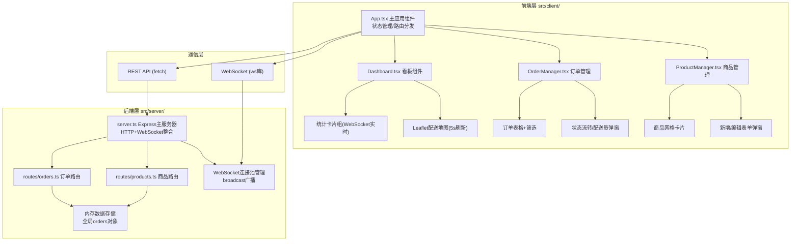
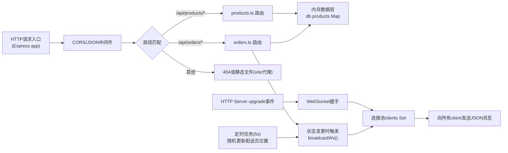

## 1. 架构设计



## 2. 技术描述

- **前端框架**：React@18 + TypeScript@5，严格模式
- **构建工具**：Vite@5（vite.config.js配置React+TS）
- **状态管理**：App.tsx内useState+useReducer集中管理，WebSocket消息驱动状态更新
- **路由方案**：无react-router，采用App.tsx内部视图切换state（3个视图规模，无需路由）
- **UI样式**：原生CSS Modules（全局theme.css + 组件级.module.css），不引入tailwind（用户指定文件结构未要求）
- **地图组件**：Leaflet@1.9 + react-leaflet@4.2（带类型声明@types/leaflet）
- **HTTP客户端**：原生fetch API（async/await封装）
- **WebSocket客户端**：原生WebSocket API + 自动重连机制
- **图标库**：lucide-react@latest
- **后端框架**：Express@4 + TypeScript@5，ts-node/tsx运行
- **WebSocket服务端**：ws@8库，挂载于Express同一个HTTP server
- **ID生成**：uuid@9库
- **跨域处理**：cors@2.8中间件
- **数据持久化**：内存对象（演示用途），启动时生成mock数据

## 3. 前端状态与视图定义

App.tsx管理的全局状态：

| 状态字段 | 类型 | 说明 |
|----------|------|------|
| currentView | 'products' \| 'orders' \| 'dashboard' | 当前视图，默认'dashboard' |
| products | Product[] | 商品列表 |
| orders | Order[] | 订单列表 |
| couriers | Courier[] | 配送员列表（含在线状态和位置） |
| sidebarOpen | boolean | 移动端侧边栏展开状态 |

视图切换通过setCurrentView触发，无URL路由。

## 4. API 定义

### 4.1 类型定义

```typescript
// 共享类型 - 前后端一致
interface Product {
  id: string;
  name: string;
  price: number;
  stock: number;
  imageUrl: string;
  isActive: boolean;
  createdAt: string;
}

type OrderStatus = 'pending' | 'preparing' | 'delivering' | 'completed';

interface OrderItem {
  productId: string;
  productName: string;
  quantity: number;
  unitPrice: number;
}

interface Order {
  id: string;
  orderNo: string;
  items: OrderItem[];
  totalAmount: number;
  status: OrderStatus;
  createdAt: string;
  courierId?: string;
  courierName?: string;
}

interface Courier {
  id: string;
  name: string;
  avatar: string;
  isOnline: boolean;
  lat: number;
  lng: number;
  currentOrderId?: string;
}

// WebSocket消息
type WsMessage = 
  | { type: 'order:updated'; data: Order }
  | { type: 'order:created'; data: Order }
  | { type: 'courier:updated'; data: Courier }
  | { type: 'stats:updated'; data: StatsPayload };

interface StatsPayload {
  totalOrders: number;
  deliveringCount: number;
  completedCount: number;
  onlineCouriers: number;
}
```

### 4.2 REST 端点

| 方法 | 路径 | 请求体 | 响应 | 说明 |
|------|------|--------|------|------|
| GET | /api/products | - | Product[] | 查询全部商品 |
| POST | /api/products | {name,price,stock,imageUrl} | Product | 新增商品 |
| PATCH | /api/products/:id | Partial<Product> | Product | 更新商品（编辑/下架） |
| GET | /api/orders | ?status= | Order[] | 查询订单列表，支持status筛选 |
| PATCH | /api/orders/:id/status | {status: OrderStatus, courierId?: string} | Order | 更新订单状态，可选分配配送员 |

所有接口成功响应2xx，失败返回`{ error: string }`。

### 4.3 WebSocket 协议

- 连接地址：`ws://host:port/ws`（通过server.ts中upgrade事件区分）
- 客户端→服务端：无需发送消息，纯订阅模式
- 服务端→客户端：JSON格式的WsMessage，见类型定义
- 连接管理：新连接建立时发送全量orders+couriers快照

## 5. 后端服务器架构



后端核心模块职责：
- **server.ts**：创建HTTP server，挂载Express和WebSocket，启动定时位置更新任务
- **routes/orders.ts**：订单查询和状态更新，状态流转校验（不允许跳步、不允许回退）
- **routes/products.ts**：商品CRUD，下架操作设置isActive=false

## 6. 文件结构规范

```
auto25/
├── package.json          # 统一依赖和脚本(npm run dev)
├── vite.config.js        # Vite配置：React+TS，代理/api和/ws到后端3001
├── tsconfig.json         # 严格模式，client/server双目录
├── index.html            # Vite入口，挂载#root，引入Leaflet CSS CDN
└── src/
    ├── client/
    │   ├── App.tsx               # 主组件，状态中心+视图切换
    │   ├── App.module.css        # 全局布局样式（侧边栏等）
    │   ├── theme.css             # 全局CSS变量、字体、重置样式
    │   ├── types.ts              # 前端类型定义（与后端对齐）
    │   ├── api.ts                # fetch封装的API调用函数
    │   ├── websocket.ts          # WebSocket客户端单例封装
    │   └── components/
    │       ├── Dashboard.tsx          # 配送看板
    │       ├── Dashboard.module.css
    │       ├── OrderManager.tsx       # 订单管理
    │       ├── OrderManager.module.css
    │       ├── ProductManager.tsx     # 商品管理
    │       ├── ProductManager.module.css
    │       ├── Sidebar.tsx            # 侧边栏导航（复用）
    │       ├── Modal.tsx              # 通用弹窗组件
    │       └── StatCard.tsx           # 看板统计卡片
    └── server/
        ├── server.ts             # 入口：Express+WS整合
        ├── db.ts                 # 内存数据存储+mock数据生成
        ├── ws.ts                 # WebSocket连接池+广播
        └── routes/
            ├── orders.ts         # 订单路由
            └── products.ts       # 商品路由
```

## 7. 性能保障措施

1. **订单列表渲染优化**：
   - 100条数据使用React.memo包裹表格行组件，避免全量重渲染
   - 状态变更只更新对应行，key使用order.id
   - 筛选使用useMemo缓存计算结果

2. **WebSocket更新优化**：
   - 消息推送只发送增量（单条order/courier变更），客户端局部更新
   - 使用useReducer批量处理多条连续消息，500ms内合并渲染

3. **地图marker刷新优化**：
   - 位置更新使用Leaflet marker.setLatLng()而非重建marker
   - 5秒刷新间隔足够长，避免频繁重绘
   - 地图容器固定高度，避免重排

4. **开发/生产构建**：
   - Vite开发模式快速HMR
   - 后端使用tsx运行支持TS源文件直接执行，无需预编译
   - 单命令dev脚本：使用concurrently同时启动Vite和后端tsx
