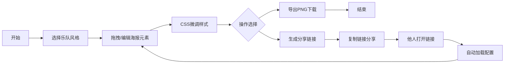

## 1. 产品概述

虚拟乐队音乐会海报生成器是一款面向音乐爱好者和独立乐队的在线设计工具，让用户无需专业设计技能即可快速创建高质量的演出海报。通过预设乐队主题、可视化拖拽编辑和一键导出分享，极大降低了海报制作门槛。

## 2. 核心功能

### 2.1 用户角色
| 角色 | 注册方式 | 核心权限 |
|------|---------|---------|
| 普通用户 | 无需注册 | 选择乐队、编辑海报、导出PNG、生成分享链接 |

### 2.2 功能模块
1. **主编辑器页面**：乐队选择、元素拖拽画布、属性调整面板、导出与分享
2. **海报预览模块**：1920x1080实时画布、CSS渲染、拖拽交互
3. **导出分享模块**：PNG高清导出、短链接生成与加载

### 2.3 页面详情
| 页面名称 | 模块名称 | 功能描述 |
|---------|---------|---------|
| 主编辑器 | 乐队选择面板 | 展示4种风格乐队卡片，点击切换主题配色和背景 |
| 主编辑器 | 画布区域 | 16:9比例实时预览，支持拖拽移动、缩放、选中元素 |
| 主编辑器 | 属性面板 | 调整选中元素的字体、颜色、字号、内容文本 |
| 主编辑器 | CSS编辑器 | 代码编辑器中自定义CSS样式并实时预览 |
| 主编辑器 | 导出分享区 | 导出PNG按钮（进度条+完成动画）、生成分享链接 |
| 分享加载页 | 海报展示 | 通过URL参数加载配置后跳转到编辑器 |

## 3. 核心流程

用户选择乐队风格 → 调整海报元素位置和样式 → 在CSS编辑器中微调细节 → 点击导出PNG下载 → 生成分享链接并复制 → 他人通过链接打开相同海报继续编辑

## 4. 用户界面设计

### 4.1 设计风格
- **主色调**：深灰背景 `#1a1a2e`，主色点缀霓虹青 `#00d4ff`，辅助色霓虹粉 `#ff006e`
- **按钮风格**：圆角8px，渐变背景，hover时发光效果
- **字体**：标题使用 Space Grotesk 或 Orbitron，正文使用 JetBrains Mono
- **布局风格**：三栏式（左工具面板 + 中央画布 + 右导出区），卡片式容器
- **动效风格**：赛博朋克科技感，拖拽0.3s弹性过渡，选中元素蓝色发光边框

### 4.2 页面设计概览
| 页面名称 | 模块名称 | UI元素 |
|---------|---------|--------|
| 主编辑器 | 顶栏 | Logo、项目名称、汉堡菜单（移动端） |
| 主编辑器 | 左侧面板 | 乐队卡片网格、元素列表、属性表单（字体/颜色/字号选择器）、CSS代码编辑器 |
| 主编辑器 | 中央画布 | 1920x1080缩放宽屏，渐变背景+纹理，可拖拽文本元素，选中发光边框 |
| 主编辑器 | 右侧面板 | 导出PNG按钮（进度条）、生成链接按钮、链接展示框、复制按钮 |

### 4.3 响应式设计
- **桌面端（≥1024px）**：三栏完整布局，左280px + 中央自适应 + 右260px
- **平板端（768-1024px）**：左右面板折叠为抽屉式，画布占满宽度
- **移动端（<768px）**：顶栏汉堡菜单展开面板，画布等比缩放至屏幕宽度

### 4.4 交互细节
- 元素拖拽：0.3s `cubic-bezier(0.34, 1.56, 0.64, 1)` 弹性过渡
- 选中状态：`box-shadow: 0 0 0 2px #00d4ff, 0 0 20px rgba(0, 212, 255, 0.5)` 蓝色发光边框
- 导出进度：0→100%进度条动画，完成时绿色✓弹跳动画
- 面板切换：抽屉式滑入滑出，遮罩层淡入淡出
