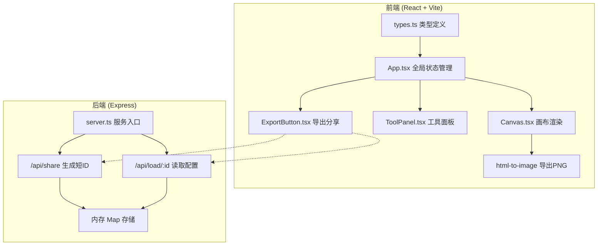

## 1. 架构设计



## 2. 技术栈说明

- **前端框架**：React@18 + TypeScript@5
- **构建工具**：Vite@5
- **状态管理**：React useState + useCallback（轻量级场景，无需zustand）
- **导出库**：html-to-image
- **文件保存**：file-saver
- **HTTP请求**：fetch API（原生）
- **后端框架**：Express@4
- **ID生成**：uuid（短码截取）
- **跨域**：cors

## 3. 路由定义

| 路由 | 用途 |
|-----|------|
| / | 主编辑器页面，含URL参数时自动加载配置 |
| /api/share (POST) | 提交海报配置JSON，返回短ID |
| /api/load/:id (GET) | 根据短ID返回完整海报配置 |

## 4. API定义

### POST /api/share
请求体：
```typescript
interface ShareRequest {
  bandId: string;
  elements: ElementConfig[];
  customCss: string;
}
```
响应体：
```typescript
interface ShareResponse {
  success: boolean;
  id: string;
  url: string;
}
```

### GET /api/load/:id
响应体：
```typescript
interface LoadResponse {
  success: boolean;
  data?: {
    bandId: string;
    elements: ElementConfig[];
    customCss: string;
  };
  error?: string;
}
```

## 5. 类型定义（types.ts）

```typescript
export interface BandTheme {
  id: string;
  name: string;
  genre: string;
  primaryColor: string;
  secondaryColor: string;
  accentColor: string;
  background: {
    type: 'gradient' | 'pattern';
    gradient?: { from: string; to: string; angle: number };
    pattern?: string;
  };
  textures?: string[];
}

export interface ElementConfig {
  id: string;
  type: 'title' | 'date' | 'venue' | 'price' | 'custom';
  content: string;
  x: number;
  y: number;
  width: number;
  height: number;
  fontSize: number;
  fontFamily: string;
  color: string;
  fontWeight: number;
  textAlign: 'left' | 'center' | 'right';
  zIndex: number;
}

export interface PosterConfig {
  bandId: string;
  elements: ElementConfig[];
  customCss: string;
}
```

## 6. 预置乐队数据

| 乐队ID | 名称 | 风格 | 主色调 |
|-------|-----|------|-------|
| jazz-night | 午夜爵士三重奏 | 爵士 | 深棕金配色 |
| thunder-strike | 雷霆重击 | 重金属 | 黑红配色 |
| neon-pulse | 霓虹脉冲 | 电子乐 | 青紫霓虹配色 |
| indie-dream | 独立梦境 | 独立摇滚 | 梦幻紫粉配色 |

## 7. 性能指标保障

- **拖拽帧率**：使用 transform/translate 定位而非 top/left，GPU 加速合成层，避免 layout thrashing
- **导出速度**：html-to-image 配置 pixelRatio=2，缓存canvas，目标≤2秒
- **渲染优化**：React.memo 包裹 Canvas 内元素，useCallback 传递事件处理函数
