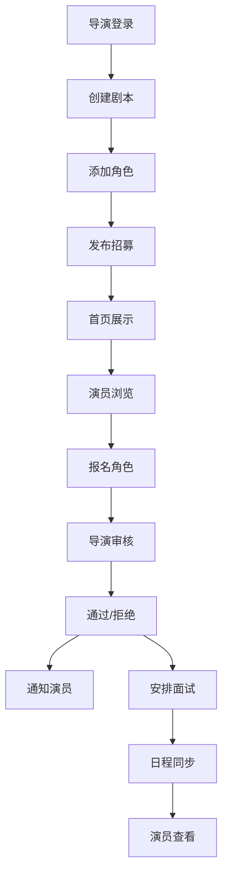

## 1. 产品概述

戏剧社演员招募与角色匹配系统，解决业余戏剧社运营中剧本招募、演员筛选、面试安排等依赖零散聊天记录导致的低效问题。目标用户为戏剧社导演和演员，提供一站式线上协作平台。

产品价值：提升戏剧社运营效率300%，实现招募流程标准化、角色匹配智能化、面试安排可视化。

## 2. 核心功能

### 2.1 用户角色
| 角色 | 注册方式 | 核心权限 |
|------|----------|----------|
| 演员 | 邮箱注册 | 浏览剧本、报名角色、查看面试安排、接收通知 |
| 导演 | 邮箱注册 | 创建剧本、管理角色、审核报名、安排面试、发送通知 |

### 2.2 功能模块
1. **首页**：剧本卡片网格展示、搜索过滤、分页加载
2. **剧本详情页**：剧本信息展示、角色卡片列表、报名操作、演员资质查看
3. **剧本管理页**：创建/编辑剧本、角色管理（添加/编辑/删除/拖拽排序）
4. **日程视图**：日历展示面试安排、拖拽创建时段、演员分配
5. **通知中心**：消息列表、未读标记、跳转关联页面

### 2.3 页面详情
| 页面名称 | 模块名称 | 功能描述 |
|----------|----------|----------|
| 首页 | 剧本卡片网格 | 展示封面、标题、作者、角色数量、截止倒计时，支持分页、搜索、筛选 |
| 首页 | 导航边栏 | Logo、菜单项（首页、我的剧本、我的报名、日程、通知） |
| 剧本详情页 | 剧本信息区 | Markdown渲染剧情简介、基础信息展示 |
| 剧本详情页 | 角色卡片列表 | 角色名、性别、年龄范围、台词片段、报名人数，支持报名操作 |
| 剧本详情页 | 报名管理区 | 导演查看报名列表、通过/拒绝操作、已选演员展示 |
| 剧本管理页 | 剧本表单 | 标题、作者、封面URL、剧情简介（Markdown编辑器） |
| 剧本管理页 | 角色管理 | 角色表单、拖拽排序、实时预览 |
| 日程视图 | 日历组件 | 月/周视图切换、拖拽创建时段、演员头像槽位 |
| 日程视图 | 未安排演员列表 | 右侧边栏、拖拽分配演员 |
| 通知中心 | 通知下拉框 | 最新5条通知、未读badge、一键已读、页面跳转 |
| 登录/注册页 | 认证表单 | 邮箱密码登录、角色选择、注册表单 |

## 3. 核心流程

### 3.1 导演发布剧本流程
导演登录 → 创建剧本（填写信息）→ 添加角色（多个角色，可拖拽排序）→ 保存发布 → 首页展示 → WebSocket推送通知所有在线用户

### 3.2 演员报名流程
演员浏览首页 → 点击剧本卡片 → 查看角色详情 → 点击报名 → 填写自我介绍 → 提交 → 按钮变灰 → 导演收到WebSocket通知

### 3.3 导演审核流程
导演进入剧本详情 → 查看角色报名列表 → 点击通过/拒绝 → 演员收到WebSocket推送通知 → 角色卡片显示已选演员头像

### 3.4 面试安排流程
导演进入日程视图 → 拖拽创建面试时段 → 从右侧列表拖拽演员到时段 → 保存 → 演员收到通知 → 日历实时更新

## 4. 用户界面设计

### 4.1 设计风格
- **主色调**：深酒红 #722F37（主导航、按钮、重要标识）
- **辅助色**：金色 #D4AF37（点缀、高亮、选中状态）
- **背景色**：深灰 #1A1A2E（页面背景）、深褐 #2D2D3A（卡片背景）
- **文字色**：米白 #F5F5F5（主文字）、浅灰 #A0A0A0（次要文字）
- **按钮风格**：圆角8px、渐变背景、悬停放大效果
- **字体**：标题用 Playfair Display（戏剧感衬线字体），正文用 Lato（现代无衬线）
- **布局风格**：左侧固定窄边栏 + 右侧卡片式主内容区
- **图标风格**：Lucide图标，统一线性风格

### 4.2 页面设计概述
| 页面名称 | 模块名称 | UI元素 |
|----------|----------|--------|
| 首页 | 剧本卡片网格 | 3列网格、卡片圆角12px、浅阴影、悬停浮起（translateY -4px）、0.3s过渡 |
| 首页 | 倒计时 | 等宽字体、金色数字、每分钟更新 |
| 剧本详情页 | 角色卡片 | 报名按钮点击微震动（CSS keyframes左右抖动） |
| 日程视图 | 拖拽时段 | 半透明金色描边、拖拽平滑跟随 |
| 所有页面 | 入场动画 | 初始opacity 0、向上平移20px、0.5s渐入 |
| 导航边栏 | 菜单项 | 悬停金色底强调、平滑过渡 |

### 4.3 响应式
- **桌面端（>768px）**：左侧边栏展开、3列卡片网格、月视图日历
- **移动端（≤768px）**：边栏收叠为汉堡菜单、1列卡片网格、周视图日历
- **触摸优化**：按钮最小高度44px、点击区域放大

### 4.4 动效设计
- **页面加载**：元素依次渐入（staggered reveal，每个元素延迟0.1s）
- **卡片悬停**：transform translateY(-4px) + box-shadow加深，0.3s ease-out
- **按钮点击**：scale(0.95) + 微震动，0.15s
- **通知badge**：脉冲动画（pulse），2s循环
- **WebSocket更新**：新数据从顶部滑入，0.3s ease-out

## 5. 性能约束
- 列表分页：每页12条，滚动到底自动加载
- WebSocket推送：100ms内到达前端
- 搜索过滤：响应时间 ≤ 200ms
- 首屏加载：≤ 2秒，无阻塞资源
- 图片懒加载：Intersection Observer API
