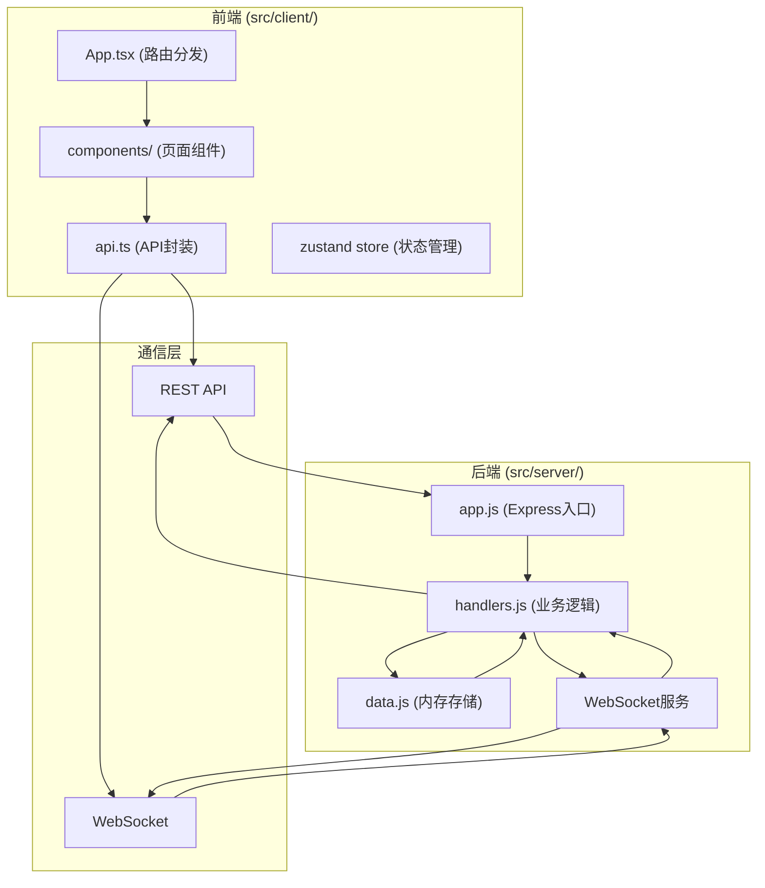
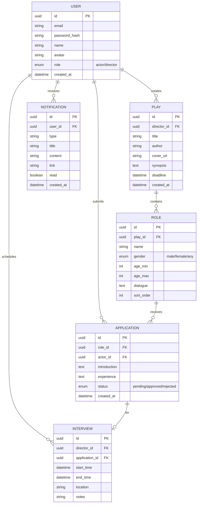

## 1. 架构设计



## 2. 技术描述

### 2.1 技术栈
- **前端**：React@18 + TypeScript + Vite + TailwindCSS@3 + Zustand
- **后端**：Node.js + Express@4 + ws (WebSocket)
- **核心依赖**：
  - react, react-dom (UI框架)
  - express (后端服务)
  - ws (WebSocket通信)
  - uuid (唯一ID生成)
  - cors (跨域处理)
  - bcryptjs (密码加密)
  - jsonwebtoken (身份认证)
  - react-big-calendar (日历组件)
  - lucide-react (图标库)
  - react-router-dom (路由)
  - @dnd-kit/core (拖拽排序)
  - marked (Markdown渲染)

### 2.2 项目初始化
- 使用 Vite + React + TypeScript 模板初始化
- 后端使用 Express 手动搭建
- 前后端统一在一个 package.json 管理，使用 concurrently 同时启动

## 3. 目录结构

```
auto28/
├── package.json              # 项目依赖和脚本
├── vite.config.js            # Vite构建配置
├── tsconfig.json             # TypeScript配置（严格模式）
├── index.html                # 入口HTML
├── src/
│   ├── client/               # 前端代码
│   │   ├── App.tsx           # 根组件，路由分发
│   │   ├── main.tsx          # 入口文件
│   │   ├── api.ts            # API和WebSocket封装
│   │   ├── store/            # Zustand状态管理
│   │   │   └── useStore.ts
│   │   ├── types/            # TypeScript类型定义
│   │   │   └── index.ts
│   │   ├── hooks/            # 自定义Hooks
│   │   │   ├── useAuth.ts
│   │   │   ├── useWebSocket.ts
│   │   │   └── useInfiniteScroll.ts
│   │   ├── components/       # 页面和UI组件
│   │   │   ├── Layout/       # 布局组件
│   │   │   │   ├── Sidebar.tsx
│   │   │   │   ├── Header.tsx
│   │   │   │   └── NotificationCenter.tsx
│   │   │   ├── Home.tsx      # 首页
│   │   │   ├── PlayDetail.tsx # 剧本详情
│   │   │   ├── PlayEditor.tsx # 剧本编辑
│   │   │   ├── ScheduleView.tsx # 日程视图
│   │   │   ├── Login.tsx     # 登录页
│   │   │   ├── Register.tsx  # 注册页
│   │   │   ├── MyApplications.tsx # 我的报名
│   │   │   ├── MyPlays.tsx   # 我的剧本
│   │   │   └── ui/           # 通用UI组件
│   │   │       ├── PlayCard.tsx
│   │   │       ├── RoleCard.tsx
│   │   │       ├── ApplicationModal.tsx
│   │   │       └── CountdownTimer.tsx
│   │   ├── utils/            # 工具函数
│   │   │   ├── format.ts
│   │   │   └── validators.ts
│   │   └── index.css         # 全局样式
│   └── server/               # 后端代码
│       ├── app.js            # Express入口
│       ├── handlers.js       # 业务逻辑处理器
│       ├── data.js           # 内存数据存储
│       └── middleware/       # 中间件
│           ├── auth.js
│           └── cors.js
└── .trae/
    └── documents/            # 项目文档
```

## 4. 路由定义

### 4.1 前端路由 (React Router)
| 路由路径 | 页面组件 | 权限要求 | 说明 |
|----------|----------|----------|------|
| /login | Login | 未登录 | 登录页面 |
| /register | Register | 未登录 | 注册页面 |
| / | Home | 公开 | 首页，剧本列表 |
| /play/:id | PlayDetail | 公开 | 剧本详情页 |
| /play/create | PlayEditor | 导演 | 创建新剧本 |
| /play/edit/:id | PlayEditor | 导演 | 编辑剧本 |
| /schedule | ScheduleView | 登录用户 | 面试日程 |
| /my-plays | MyPlays | 导演 | 我的剧本 |
| /my-applications | MyApplications | 演员 | 我的报名 |

### 4.2 后端API路由 (REST)
| 方法 | 路径 | 说明 | 权限 |
|------|------|------|------|
| POST | /api/auth/register | 用户注册 | 公开 |
| POST | /api/auth/login | 用户登录 | 公开 |
| GET | /api/plays | 获取剧本列表（分页） | 公开 |
| GET | /api/plays/:id | 获取剧本详情 | 公开 |
| POST | /api/plays | 创建剧本 | 导演 |
| PUT | /api/plays/:id | 更新剧本 | 导演 |
| DELETE | /api/plays/:id | 删除剧本 | 导演 |
| POST | /api/plays/:id/roles | 添加角色 | 导演 |
| PUT | /api/plays/:id/roles/:roleId | 更新角色 | 导演 |
| DELETE | /api/plays/:id/roles/:roleId | 删除角色 | 导演 |
| PUT | /api/plays/:id/roles/reorder | 角色排序 | 导演 |
| POST | /api/roles/:roleId/apply | 报名角色 | 演员 |
| GET | /api/roles/:roleId/applications | 获取报名列表 | 导演 |
| PUT | /api/applications/:id/status | 审核报名（通过/拒绝） | 导演 |
| GET | /api/interviews | 获取面试列表 | 登录用户 |
| POST | /api/interviews | 创建面试 | 导演 |
| PUT | /api/interviews/:id | 更新面试 | 导演 |
| DELETE | /api/interviews/:id | 删除面试 | 导演 |
| GET | /api/notifications | 获取通知列表 | 登录用户 |
| PUT | /api/notifications/read | 标记已读 | 登录用户 |

## 5. WebSocket消息协议

### 5.1 消息格式
```typescript
interface WSMessage {
  type: 'notification' | 'application_update' | 'interview_update' | 'play_update';
  payload: any;
  timestamp: number;
}
```

### 5.2 消息类型
| 类型 | 触发场景 | 接收方 | 数据内容 |
|------|----------|--------|----------|
| play_update | 新剧本发布/更新 | 所有在线用户 | 剧本基本信息 |
| application_update | 新报名提交 | 导演 | 报名信息 |
| application_status | 报名审核结果 | 演员 | 审核状态 |
| interview_update | 面试安排变更 | 相关演员/导演 | 面试详情 |
| notification | 通用通知 | 特定用户 | 通知内容 |

## 6. 数据模型

### 6.1 实体关系图


### 6.2 TypeScript类型定义
```typescript
export type UserRole = 'actor' | 'director';

export interface User {
  id: string;
  email: string;
  name: string;
  avatar: string;
  role: UserRole;
  createdAt: string;
}

export interface Play {
  id: string;
  directorId: string;
  director?: User;
  title: string;
  author: string;
  coverUrl: string;
  synopsis: string;
  deadline: string;
  createdAt: string;
  roles: Role[];
}

export interface Role {
  id: string;
  playId: string;
  name: string;
  gender: 'male' | 'female' | 'any';
  ageMin: number;
  ageMax: number;
  dialogue: string;
  sortOrder: number;
  applicationCount: number;
  selectedActorId?: string;
  selectedActor?: User;
}

export interface Application {
  id: string;
  roleId: string;
  actorId: string;
  actor?: User;
  introduction: string;
  experience: string;
  status: 'pending' | 'approved' | 'rejected';
  createdAt: string;
}

export interface Interview {
  id: string;
  directorId: string;
  applicationId: string;
  application?: Application;
  startTime: string;
  endTime: string;
  location: string;
  notes: string;
}

export interface Notification {
  id: string;
  userId: string;
  type: 'application_approved' | 'application_rejected' | 'interview_scheduled' | 'interview_updated' | 'new_play';
  title: string;
  content: string;
  link: string;
  read: boolean;
  createdAt: string;
}
```

## 7. 数据流说明

### 7.1 数据流方向
```
前端组件 → api.ts → Express路由 → handlers.js → data.js → handlers.js → WebSocket → 前端
```

### 7.2 核心数据流向
1. **剧本创建**：PlayEditor.tsx → api.ts → POST /api/plays → handlers.createPlay → data.addPlay → WebSocket广播 → 所有客户端Home.tsx更新
2. **演员报名**：PlayDetail.tsx → api.ts → POST /api/roles/:id/apply → handlers.applyRole → data.addApplication → WebSocket通知导演 → PlayDetail.tsx更新
3. **审核报名**：PlayDetail.tsx → api.ts → PUT /api/applications/:id/status → handlers.updateApplicationStatus → data.updateApplication → WebSocket通知演员 → 演员端收到通知
4. **安排面试**：ScheduleView.tsx → api.ts → POST /api/interviews → handlers.createInterview → data.addInterview → WebSocket通知演员 → 演员端日程更新

## 8. 性能优化策略

1. **分页加载**：剧本列表每页12条，使用Intersection Observer实现无限滚动
2. **虚拟列表**：长列表使用react-window虚拟化渲染
3. **图片懒加载**：封面图使用loading="lazy"和Intersection Observer
4. **请求防抖**：搜索输入使用debounce 200ms
5. **缓存策略**：静态资源设置Cache-Control，API请求使用ETag
6. **WebSocket优化**：消息合并发送，避免频繁小消息
7. **代码分割**：按路由动态导入组件
8. **Tree Shaking**：Vite自动摇树优化

## 9. 安全措施

1. **密码加密**：bcryptjs哈希存储密码
2. **JWT认证**：登录后返回token，API请求携带Authorization头
3. **CORS配置**：限制允许的域名
4. **输入验证**：所有用户输入进行XSS过滤和格式验证
5. **权限中间件**：后端验证用户角色和资源所有权
6. **WebSocket鉴权**：连接时验证token
