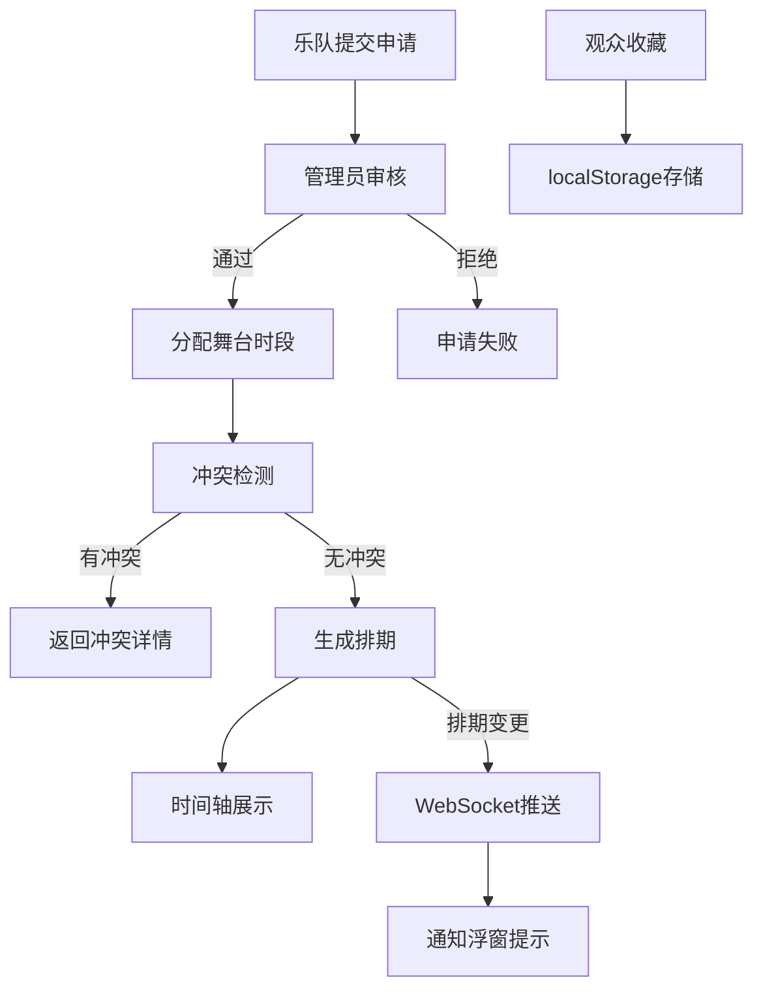

## 1. 产品概述

音乐节乐队报名与舞台排期管理应用，为小型音乐节组织者提供高效的乐队报名管理、演出安排和舞台时间表可视化功能，同时为观众提供收藏提醒服务。

- 主要目的：解决乐队时间冲突管理和观众信息滞后问题
- 目标用户：音乐节组织者（管理员）、报名乐队、观众
- 市场价值：提升音乐节组织效率，改善观众体验

## 2. 核心功能

### 2.1 用户角色

| 角色 | 注册方式 | 核心权限 |
|------|----------|----------|
| 观众 | 无需登录 | 浏览排期、收藏乐队、接收通知 |
| 乐队 | 填写申请表单 | 提交报名申请、查看审核状态 |
| 管理员 | 管理员登录 | 审核乐队、分配舞台时段、管理排期 |

### 2.2 功能模块

1. **乐队申请页**：表单填写、提交验证、状态提示
2. **管理员审核面板**：待审核列表、通过/拒绝操作、状态标签
3. **排期管理页**：舞台分配、时段选择、冲突检测
4. **日程时间轴**：甘特图展示、舞台筛选、悬停详情
5. **观众收藏系统**：心形收藏、localStorage持久化、WebSocket通知

### 2.3 页面详情

| 页面名称 | 模块名称 | 功能描述 |
|----------|----------|----------|
| 首页/日程页 | 时间轴组件 | 甘特图风格排期展示，按舞台筛选，悬停详情 |
| 乐队申请页 | 申请表单 | 收集乐队信息，表单验证，提交状态反馈 |
| 管理员审核页 | 审核卡片列表 | 待审核乐队卡片，通过/拒绝按钮，状态标签 |
| 排期管理页 | 排期表单 | 选择乐队、舞台、时段，冲突检测，提交分配 |
| 导航栏 | 全局导航 | 固定顶部，毛玻璃效果，页面跳转 |

## 3. 核心流程

### 3.1 乐队报名流程
乐队用户访问申请页 → 填写乐队信息表单 → 提交验证 → 后端存储申请 → 显示"等待审核"提示

### 3.2 管理员审核流程
管理员登录 → 查看待审核列表 → 点击通过/拒绝 → 后端更新状态 → 列表实时刷新

### 3.3 排期分配流程
管理员选择已审核乐队 → 选择舞台和时段 → 后端检测冲突 → 冲突则返回详情 / 成功则更新排期 → 时间轴即时更新

### 3.4 观众收藏提醒流程
观众点击心形收藏 → 存储到localStorage → 监听WebSocket消息 → 排期变化时右上角通知浮窗提示

## 4. 用户界面设计

### 4.1 设计风格
- **主题**：深色星空主题
- **背景色**：#0b0e1a，辅以紫蓝色渐变
- **主色调**：#6c63ff（紫蓝）、#f9a826（金黄）
- **布局风格**：居中对齐卡片式设计
- **导航栏**：固定顶部，半透明毛玻璃效果
- **按钮风格**：渐变提交按钮，悬停放大并轻微上移
- **卡片风格**：微妙阴影，入场淡入动画（0.3秒）
- **排期块**：柔和圆角，同色系渐变

### 4.2 页面设计概览

| 页面名称 | 模块名称 | UI元素 |
|----------|----------|--------|
| 日程页 | 时间轴 | 横向滚动容器，甘特图风格，舞台筛选下拉，心形收藏图标 |
| 申请页 | 表单 | 圆角输入框，渐变提交按钮，验证提示，成功状态提示 |
| 审核页 | 卡片列表 | 卡片布局，状态标签，通过/拒绝按钮，淡入动画 |
| 排期页 | 分配表单 | 乐队下拉选择，舞台选择，时间选择器，冲突提示弹窗 |

### 4.3 响应式设计
- **大屏（≥1024px）**：时间轴全宽展示
- **平板（≥768px）**：双排舞台布局
- **手机（<768px）**：纵向时间线布局，组件间距自动伸缩

### 4.4 交互动效
- 冲突提示弹窗：从顶部滑入，带抖动动画
- 排期块：悬停放大效果
- 收藏按钮：心形填充动画
- 通知浮窗：右上角滑入，自动消失

## 5. 性能约束

- 时间轴渲染响应时间 ≤ 200ms（模拟50个排期块）
- WebSocket消息推送延迟 ≤ 500ms
- 页面首屏加载时间 ≤ 2s
